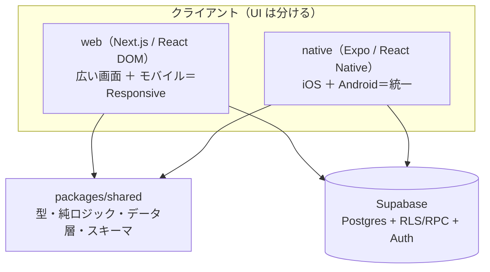

# アーキテクチャ概要

triplot のアーキテクチャ俯瞰（クライアント構成 ＋ 外部サービス）。詳細な機能設計は
[`import-flow.md`](./design/import-flow.md)・[`timezone.md`](./design/timezone.md) などの
個別ドキュメントを参照。

## クライアント構成（web ＋ ネイティブ）

triplot は **1 バックエンド（Supabase）＋ 複数クライアント**。方針は「**同じ描画ターゲット内では統一し、
ターゲットをまたぐ境界では分ける**」（**Discord と同じ思想**）。web を捨てて 1 UI に畳むことはしない。

- **web（広い画面＝PC/iPad ・ 狭い画面＝モバイル）** … Next.js 16（React DOM ＋ Tailwind）。Responsive で
  出し分ける（モバイル＝ボトムシート、広い画面＝ポップオーバー等）。この 2 つは **同一コードベース**。
- **ネイティブ（iOS ＋ Android）** … **Expo（React Native）** で UI を別実装。iOS/Android はここで **統一**
  （1 モバイルコードベース）。地図は react-native-maps（native）。
- **共有するもの** … 型・純ロジック（`settlement` 等）・データアクセス層・Zod スキーマを `packages/shared`
  に置き web/native 双方から import（モノレポ）。**backend（Supabase の RLS/RPC）は全クライアント共通**。
- **共有しないもの** … UI。React DOM（web）と RN の native 部品（mobile）は描画層が別物なので **統一しない**
  （`react-native-web` で web まで畳むのは、良くできた既存 web を作り直す割に劣化するため不採用）。

> 「完全 1 コードベース」の意味は **(a) iOS＋Android の統一（RN）** と **(b) ロジック共有**であって、
> **web まで含めた 1 UI ではない**。Discord も web/desktop＝React DOM（Electron）、mobile＝RN で、有名な
> 「90% 共有」は iOS↔Android 間の話。triplot も同様に web は残す。

**移行の段取り（未着手）**: ① モノレポ化して `packages/shared` にロジック抽出 → ② Expo アプリ雛形＋Supabase 接続
→ ③ タブ（日程/地図/費用/TODO）を 1 つずつ移植。変更系は今 Next.js の server action 中心なので、RN からも
使えるよう「Supabase client を受け取る共有関数」か API エンドポイントに出すのが要点。

## サービス構成

## 役割

| サービス | 役割 | 補足 |
|---|---|---|
| **Dynadot** | ドメインのレジストラ（`triplot.app` の登録・更新） | ネームサーバは Cloudflare に委任済み。DNS 自体は触らない |
| **Cloudflare** | DNS（ネームサーバ）＋ メール受信（Email Routing → Email Worker）＋ リトライ心拍（Cron Worker・毎分） | レシート転送メールを受けて Vercel に push。毎分 retry エンドポイントを叩く |
| **Vercel** | Next.js 16 アプリのホスティング＋ Cron | リージョン `hnd1`（東京）に固定。`main` への push で自動デプロイ |
| **Supabase** | Postgres（+ RLS）＋ Auth | 東京 `ap-northeast-1`。Vercel と同一都市圏に co-locate（RTT 削減） |
| **Vercel AI Gateway** | LLM アクセス（レシート抽出・マージ判定） | 既定モデル `google/gemini-2.5-flash`。将来は BYOK（ユーザのキー）も |

## ドメインとルーティング

- 本番ドメイン: `https://triplot.app`（apex が canonical、`www` は apex へ 308 リダイレクト）。
- Vercel 向けレコードは Cloudflare 上で **DNS only（グレー雲）**。`*.vercel.app` もフォールバック/プレビュー用に残置。
- コードは origin 追従でドメイン非依存（URL のハードコード無し）。Supabase Auth の Site URL は `https://triplot.app`。

## デプロイとリージョン

- **デプロイ**: GitHub `main` への push がトリガーの自動デプロイ。`vercel` CLI の手動デプロイは使わない。
- **リージョン**: Vercel 関数 `hnd1` × Supabase `ap-northeast-1` を東京に揃え、サーバ側 Supabase クエリの太平洋越え RTT 積み上げを避ける。複数の独立クエリは `Promise.all` で並列化する方針。

## 定期実行（2系統）

| 駆動 | パス | 間隔 | 役割 |
|---|---|---|---|
| **Vercel Cron** | `/api/cron/expire-inbound` | 日次 | 90日経った未確定/失敗/合体の受信メール行を削除（保持最小化） |
| **Cloudflare Cron Worker** | `/api/cron/retry-extract` | **毎分** | 保留中の抽出を reconcile（期限の来た error を再試行＋枠の空いた over_quota を再抽出） |

> **なぜ2系統か**: Vercel Hobby の Cron は各1日1回（プラン全体）なので、分単位が要る
> リトライは Cloudflare の Cron Worker（毎分・無料・プラン非依存）に逃がす。心拍 Worker は
> 状態を持たず `/api/cron/retry-extract` を叩くだけの独立ユニット（メール Worker とは別物）。
> リトライの設計は [`import-flow.md`](./design/import-flow.md) のリトライ節を参照。

## 人手の定期メンテナンス

上記はシステムが自動で回す定期実行。以下は外部プラットフォームの制約で**人手の対応が定期的に要るもの**（BACKLOG には置かない — 完了して消える残件ではなく恒久的に繰り返す運用作業のため）:

| 対象 | 周期 | 対応 |
|---|---|---|
| Apple Sign in の client_secret（JWT） | 最大6ヶ月（Apple の仕様上限） | Apple Developer の同じ Key（.p8）から JWT を再生成し、Supabase Dashboard（Auth → Providers → Apple → Secret Key）に貼り直す。現在の失効日はこの表に書かず、都度 Supabase Dashboard の表示で確認する |
