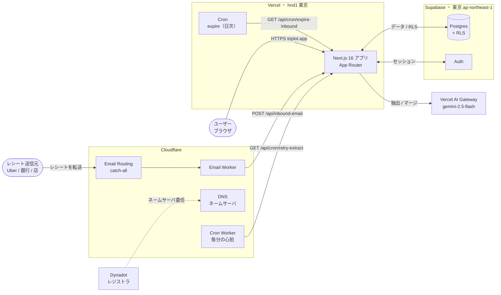

# アーキテクチャ概要

triplot がどの外部サービスをどう使っているかの俯瞰図。詳細な機能設計は
[`import-flow.md`](./import-flow.md) などの個別ドキュメントを参照。

## サービス構成

## 役割

| サービス | 役割 | 補足 |
|---|---|---|
| **Dynadot** | ドメインのレジストラ（`triplot.app` の登録・更新） | ネームサーバは Cloudflare に委任済み。DNS 自体は触らない |
| **Cloudflare** | DNS（ネームサーバ）＋ メール受信（Email Routing → Email Worker）＋ リトライ心拍（Cron Worker・毎分） | レシート転送メールを受けて Vercel に push。毎分 retry エンドポイントを叩く |
| **Vercel** | Next.js 16 アプリのホスティング＋ Cron | リージョン `hnd1`（東京）に固定。`main` への push で自動デプロイ |
| **Supabase** | Postgres（+ RLS）＋ Auth | 東京 `ap-northeast-1`。Vercel と同一都市圏に co-locate（RTT 削減） |
| **Vercel AI Gateway** | LLM アクセス（レシート抽出・マージ判定） | 既定モデル `google/gemini-2.5-flash`。将来は BYOK（ユーザのキー）も |

## ドメインとルーティング

- 本番ドメイン: `https://triplot.app`（apex が canonical、`www` は apex へ 308 リダイレクト）。
- Vercel 向けレコードは Cloudflare 上で **DNS only（グレー雲）**。`*.vercel.app` もフォールバック/プレビュー用に残置。
- コードは origin 追従でドメイン非依存（URL のハードコード無し）。Supabase Auth の Site URL は `https://triplot.app`。

## デプロイとリージョン

- **デプロイ**: GitHub `main` への push がトリガーの自動デプロイ。`vercel` CLI の手動デプロイは使わない。
- **リージョン**: Vercel 関数 `hnd1` × Supabase `ap-northeast-1` を東京に揃え、サーバ側 Supabase クエリの太平洋越え RTT 積み上げを避ける。複数の独立クエリは `Promise.all` で並列化する方針。

## 定期実行（2系統）

| 駆動 | パス | 間隔 | 役割 |
|---|---|---|---|
| **Vercel Cron** | `/api/cron/expire-inbound` | 日次 | 90日経った未確定/失敗/合体の受信メール行を削除（保持最小化） |
| **Cloudflare Cron Worker** | `/api/cron/retry-extract` | **毎分** | 保留中の抽出を reconcile（期限の来た error を再試行＋枠の空いた over_quota を再抽出） |

> **なぜ2系統か**: Vercel Hobby の Cron は各1日1回（プラン全体）なので、分単位が要る
> リトライは Cloudflare の Cron Worker（毎分・無料・プラン非依存）に逃がす。心拍 Worker は
> 状態を持たず `/api/cron/retry-extract` を叩くだけの独立ユニット（メール Worker とは別物）。
> リトライの設計は [`import-flow.md`](./import-flow.md) のリトライ節を参照。
