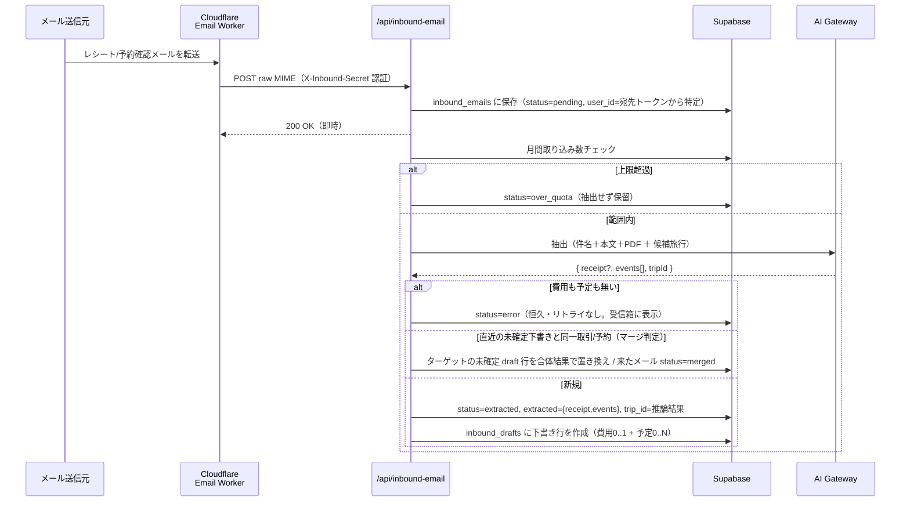
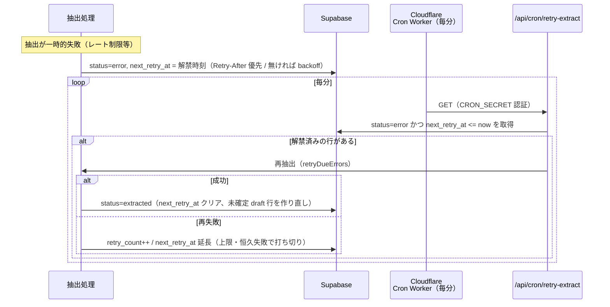
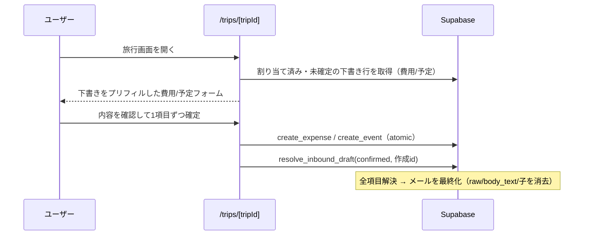
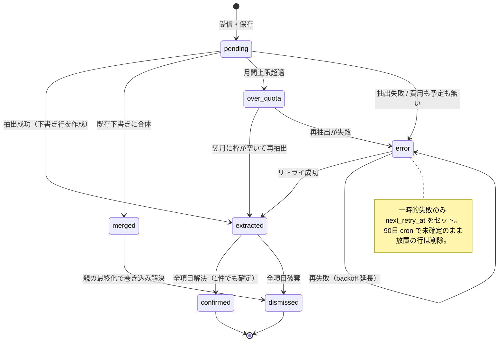

# メール取り込み（費用・予定）設計

ユーザが per-user の取り込み用アドレス（`receipts+<token>@triplot.app`）にレシートや
予約確認メールを転送すると、LLM で**費用と予定**を抽出して下書きを作り、旅行に割り当て、
最終的に費用・予定として確定する。サービス俯瞰は [`architecture.md`](../architecture.md) を参照。

## 全体像

- **1メール = `inbound_emails` の1行**。複数メールが同一取引・同一予約なら id リンク
  （`merged_into`）でグループ化する。
- **1メールから費用 0..1 件 + 予定 0..N 件**が取れる（例: 往復航空券メール = 費用1 +
  フライト2）。**下書きの1項目 = `inbound_drafts` の1行**（`kind` で費用/予定を区別）で、
  項目ごとに個別に確定/破棄する。
- **抽出と「どの旅行か」の割り当ては LLM の1回の呼び出しで同時に**行う。
- **確定（費用化・予定化）の最終判断は人**。下書き＋レビュー方式。
- **保持最小化**: 抽出後は丸ごと MIME（`raw`）を捨てて痩せ版（`body_text`）だけ残す。
  全項目の解決（メールの最終化）でさらに消し、90日で cron が削除。

## 1. 受信 → 抽出（push ＋ `after()`）

メール到着の push で即トライ。ポーリングはしない。`after()` は「**HTTP 応答を返した“後”に
同じ実行内で裏で走らせる**」Next.js の仕組みで、遅い LLM 抽出を待たせず Worker に即 200 を返すため。

### 何を予定として抽出するか

- 購入済み航空券などタイムゾーンを跨ぐ移動 = **transit**（往復は往路・復路で別の予定。
  出発/到着の現地壁時計 + IANA タイムゾーン。TZ は空港・都市名から LLM が推論し、
  実在検証（`Intl` の canonical 化）を通す。幻覚は null に落としフォームで人が選ぶ）
- 宿泊予約 = **終日**（チェックイン日〜チェックアウト日）
- レストラン・アクティビティ等の時刻のある予約 = **timed**
- **済んだ消費（店頭レシート・利用明細）は予定にしない**。逆に金額の無いメール
  （旅程のみ・リマインダー）は費用を作らない（`receipt = null`）
- 時刻はすべて現地の壁時計のまま（events の floating time モデルと一致）。timed/終日の
  TZ は保存せず旅程から導出する（[`timezone.md`](./timezone.md) の参照化モデル）

### transit の場所解決（出発地＋ターミナル）

transit（フライト等）は出発地・到着地でタイムゾーンだけでなく場所も異なるため、抽出は
`departLocation`/`arriveLocation`（空港・駅の正式名称。到着地ではなく必ず出発地を場所欄に使う）
と `departTerminal`/`arriveTerminal`（ターミナル表記）を別フィールドで持つ。ターミナルは
メールに明記が無くても、**航空会社と空港の一般的な組み合わせから LLM の一般知識で推定してよい**
（追加の LLM 呼び出しは発生せず、既存の抽出プロンプトに一文足すだけなのでトークンコストは
無視できる量）。航空会社×空港のターミナル対応表は持たない — 組み合わせ数が膨大な上にターミナル
移転で腐るため、LLM の知識をそのまま使う方が安く正確に保守できる。

場所欄（`PlacePicker` の自動解決）は**2段階**で Google の実在の場所に丸め込む:

1. ターミナルが分かっていれば「空港名＋ターミナル」で検索し、その文字列を基準にスコアリングして
   高確信なら**ターミナル単位**の場所に丸める。
2. 閾値未満（ターミナル単位の候補が見つからない/確信が持てない）なら、素の空港名で検索し直して
   **空港単位**で丸める。

同一の Autocomplete セッショントークンで両方の試行を行うため、課金は1セッション分のまま
（Place Details 取得は成功した段だけ）。この2段階により「ターミナルにこだわって空港にすら
丸まらない」ことは起きず、常に「ターミナル ≻ 空港 ≻ テキストのまま」の順で最良の結果に落ちる。

### LLM による旅行割り当て

メールには複数の日付（受信日・決済/確定日・実際の利用日）が混在しうる。日付レンジの機械照合
だと「どの日付か」を取り違えて黙って別の旅行に誤割り当てしうるため、**抽出と同時に候補旅行
（旅行名＋日程）を渡して LLM に `tripId` を推論させる**。例: 旅行中に予約した将来の航空券は、
購入時期の旅行ではなく**搭乗日（利用日）の旅行**に属する、と意味で判断できる。確信が無ければ
`tripId = null`（受信箱で人が選ぶ）。

### 明細リンクの enrichment（2パス）と学習

本文がスカスカで、品目・合計などの明細が「View your receipt」リンク先（Square/Clover 等の
レシート基盤）にしか無いメールがある。リンク先の取得（enrichment）は2パス:

1. **第1パス（許可ホスト）**: 抽出前に、**許可ホスト**（`RECEIPT_LINK_HOSTS`）に一致するリンクを
   サーバ側で fetch（SSRF ガード込み・[`fetchLink.ts`]）して本文に付加してから LLM を呼ぶ。
2. **第2パス（未許可ホスト）**: 抽出スキーマの `detailUrl` で LLM に「明細がリンク先にしか
   無いならその URL」を報告させる（本文に実在する URL のみ採用＝幻覚除去）。そのホストが
   未許可なら、**その URL 1本だけ**を SSRF ガード付きで fetch して本文に足し、**もう1回だけ**
   抽出し直す（第2パスの `detailUrl` はさらに fetch しない＝ループ禁止）。取得失敗・再抽出の
   失敗はどちらも第1パス結果で続行（enrichment は best-effort）。

第2パスは許可リストの代わりに fetch 側のガードで守る: https のみ・解決 IP の
プライベート/メタデータ拒否・リダイレクト毎ホップ再検証・タイムアウト・1MB 上限・
テキスト系 content-type 以外は破棄。「LLM が明細と特定した本文実在の URL 1本」しか
踏まないので、配信解除・追跡リンクの誤クリックは起きない。

**学習と昇格**。メールは処理後に消すので「保存メールを後で解析」はできない。代わりに
抽出の瞬間に学習信号だけ抜く。ただし記録するのは**第2パスが実際に下書きの内容を
補えた時だけ**（`extractionGainedDetail`。receipt が新規に見つかった／merchant・total・
location 等が空→埋まった／予定が増えた、のいずれか）。fetch はできたが収穫が無かった
候補（LLM の `detailUrl` 誤報告・配信解除リンク等のノイズ）は記録しない — こうすることで
admin 管理ページに出るホストは「既に実績のあるホスト」だけになり、人はドメイン名を
確認するだけで昇格判断できる（中身を見て「本当にレシートか」を確かめる必要がない）。

記録内容は `receipt_link_candidates` に **host＋出現回数＋サンプル path**（メール本体や
トークン付き URL は残さない）を upsert。人が admin 管理ページ（`/admin`。出現回数順の
一覧）を見て、本物のレシート基盤を `RECEIPT_LINK_HOSTS`（コード定数）に**昇格**＝PR
レビューでゲート。昇格したホストは第1パスで取得されるようになり、そのメールの
第2パス（追加の LLM 呼び出しとレイテンシ）が不要になる。

## 2. 自動リトライ（リコンサイル型）

抽出が**一時的に失敗**（AI Gateway 無料枠のレート制限など）したら、その場では再試行せず
`next_retry_at`（解禁時刻）を立てて記録するだけ。真実は DB（`status=error` の行）にあり、
**Cloudflare の毎分 cron が解禁済みの行を拾って再抽出する**＝状態を見て埋めるリコンサイル型。
失敗・cron・行は互いに直接話さず DB 越しに協調するので、cron は「叩くだけの独立した心拍」。

- **解禁時刻は Retry-After 優先**。429 が返す `Retry-After` をそのまま `next_retry_at` にする
  （こちらが制限値を知らなくてもサーバが解禁時刻を教えてくれる）。ヘッダが無ければ exp backoff
  （1分から倍々、6時間上限）。`MAX_RETRIES` 回で打ち切り。
- **リトライ対象は一時的失敗のみ**。レート制限/タイムアウト等は `next_retry_at` をセット、パース不能
  や「費用も予定も見つからない」などの恒久失敗は `next_retry_at = null` で対象外（受信箱に表示）。
- **トリガは Cloudflare の毎分 cron だけ**（受信箱を開いた時に動かす案は廃止：`after()` は応答後に
  走るので、確認しに来たユーザに失敗状態をそのまま見せてしまうため筋が悪い）。
- **手動リトライボタンは置かない**: 失敗直後に押すと同じレート制限に当たるため。
- **なぜ Cloudflare か**: Vercel Hobby の cron は日次。分単位の自走タイマーが要るのでメール受信と
  同じく Cloudflare に逃がす（毎分・無料）。状態は DB が持つので、心拍 Worker はメール Worker と
  別の独立ユニット（[`architecture.md`](../architecture.md) の定期実行を参照）。

## 3. 確定（下書き → 費用・予定）

旅行に割り当てられた下書きは、旅行画面の「未確定の取り込み」に**費用は費用セクション、
予定は予定セクション**に分かれて並ぶ。ここで人が内容を確認して1項目ずつ確定する
（費用は支払者・割り勘・為替レートを確認して `create_expense`、予定は日時・場所・TZ を
確認して `create_event`）。確定/破棄は `resolve_inbound_draft` が draft 行に記録し
（作成した費用/予定の id も紐づく）、**メールの全項目が解決された時点でメールを自動で
最終化**（1件でも確定があれば `confirmed`、全部破棄なら `dismissed`）して `raw`・
`body_text`・合体された子メールの痩せ版を消す。

- 受信箱の「破棄」（`dismiss_inbound_email`）は残っている未確定の下書きをまとめて破棄する
  （確定済みはそのまま）。旅行画面の各下書き行の × は1項目だけ破棄する。

## 状態遷移

メール（`inbound_emails.status`）:

下書き（`inbound_drafts.status`）: `pending` →（旅行画面で確定）→ `confirmed`、または
（× / 受信箱の破棄）→ `dismissed`。マージ・再抽出は **pending の行だけ**を置き換える
（confirmed/dismissed は不変）。

> `over_quota` は月間上限超過で保留された行。毎分の reconcile（retry-extract）が、ユーザの
> 枠（`CAP − 当月抽出数`）が空いた分だけ少量ずつ再抽出する。月替わりでカウントが 0 に戻ると
> 自動で drain される（ユーザの再転送は不要）。

## マージ（同一取引・同一予約の複数メール）

pending→確定・差額調整の決済メールや、**スケジュール変更・リマインダー**の予約メールは、
既存の未確定下書きに合体させる。判定は LLM（referenceId 一致・店名/金額/日付の近さ・
変更通知の関係）で、候補の事前絞り込み（referenceId 一致 or 日付が近い）だけ決定的に行う。

- 合体結果は**ターゲットの未確定 draft 行を直接置き換える**（費用は差額調整を加算した最終
  総額に、予定はスケジュール変更後の最新の旅程に。確定済みの行は触らない）。
- 来たメールは `status=merged` + `merged_into` で畳む（draft 行は作らない）。
- 各メールの `extracted` は「自分の」抽出結果のまま不変に保つ＝誤マージの取り消し（split）は
  子を独立下書きに戻し、親子とも自分の `extracted` から未確定 draft 行を再生成する。
  多重マージの合体が split で失われるのは許容（稀）。

## データモデルの要点

`inbound_emails`（1メール = 1行。パイプライン状態と原本を持つ）:

| 列 | 意味 |
|---|---|
| `status` | ライフサイクル（上の状態遷移図） |
| `user_id` | 宛先トークン（`receipts+<token>@`）から特定。From には依存しない |
| `raw` | 丸ごと MIME。抽出後 null（痩せ版に置換） |
| `body_text` | 痩せ版本文（マージ判定の文脈に使う）。最終化で null |
| `extracted` | そのメール「自分の」抽出結果 `{ receipt, events }`（不変。split の復元元） |
| `merged_into` | 合体先（ターゲット）の id。グループはこれで辿る |
| `trip_id` | LLM が割り当てた旅行（確信が無ければ null＝受信箱で人が選ぶ） |
| `retry_count` / `next_retry_at` | 自動リトライの回数と次回期限 |

`inbound_drafts`（下書きの1項目 = 1行。作業状態を持つ）:

| 列 | 意味 |
|---|---|
| `email_id` | 親メール（on delete cascade） |
| `kind` | `expense` / `event` |
| `payload` | Receipt / EventDraft（`apps/web/lib/import/schema.ts` が契約） |
| `status` | `pending` / `confirmed` / `dismissed` |
| `expense_id` / `event_id` | 確定時に作成した費用/予定へのリンク（kind と整合を CHECK） |

## 設計判断メモ

- **BYOK（ユーザ課金）が長期の既定**。早期は運用者課金の AI Gateway を意図的に loss-leader として使う
  （月間取り込み上限でコスト保護）。
- **`expenses` / `events` テーブルは綺麗に保つ**。取り込みの不完全さ・provenance は
  `inbound_emails` / `inbound_drafts` 側に閉じ込める。
- **全角→半角の正規化**を抽出結果の店名・場所・タイトル・referenceId に適用（日本語・カタカナは保持）。
- **予定の検証は取り込み側で吸収**: LLM 出力の日付/時刻形式・TZ 実在・種別の整合は
  `sanitizeEventDraft`（純関数）で補正し、使えない下書きは捨てる。確定フォームは通常の
  予定フォームと同一（人の最終確認がゲート）。
