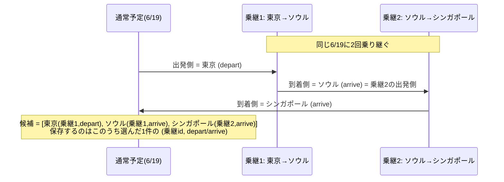

# タイムゾーン設計

「壁時計（floating time）＋ IANA TZ」モデルの全体像。誰が実際のTZ文字列を持ち、誰が
「参照だけ」持つか、TZが決まらない時どうなるか、を図でまとめる。サービス俯瞰は
[`architecture.md`](../architecture.md) を参照。

## 1. 誰が実TZを持ち、誰が参照だけ持つか

**実IANA文字列（`"Asia/Tokyo"` 等）を持つのは限られた場所だけ**。それ以外は「日付」＋
「乗継への参照」から毎回計算する。

```mermaid
flowchart TB
    subgraph 実TZを持つ（唯一の真実源）
        T["events (kind='transit')<br/>start_tz / end_tz<br/>常に非null"]
        NT["events (kind='normal') /<br/>expenses<br/>旅程に transit が<br/>1つも無い旅行だけ<br/>start_tz / tz に literal 保存"]
    end

    subgraph 参照だけ持つ（毎回自動計算）
        N["events (kind='normal') /<br/>expenses<br/>旅程に transit がある旅行<br/>start_tz / tz = NULL"]
        REF["tz_disambig_transit_id（乗継のid）<br/>tz_disambig_side（depart / arrive）<br/>※ 乗継日だけ非null。それ以外は両方null"]
    end

    N -.参照.-> REF
    REF -."どの乗継の<br/>出発側/到着側か".-> T

    style T fill:#1f6f3f,color:#fff
    style NT fill:#1f6f3f,color:#fff
    style N fill:#444,color:#fff
    style REF fill:#444,color:#fff
```

**判定基準は「その旅行に乗継が1つでもあるか」の1点だけ**。RPC内のヘルパー
`resolve_normal_event_tz()`（SQL）が保存の都度この判定をやり直す。

| 旅行の状態 | 通常予定・費用の保存 |
|---|---|
| 乗継が1つ以上ある | `start_tz`/`tz` は保存しない（NULL）。乗継"当日"だけ `tz_disambig_*` で選択を保存 |
| 乗継が1つも無い | 導出元が無いので `start_tz`/`tz` に実TZ文字列をそのまま保存（従来通り） |

## 2. 実際にTZが決まる流れ

表示・エクスポートのたびに `resolveEventTz(date, tzDisambigTransitId, tzDisambigSide, 旅程)`
（`packages/shared/src/schedule.ts`）を呼んで、その場で計算する。**保存された値をそのまま
信じるのではなく、常にこの関数を通す**——これが「乗継を編集すると紐づく予定が自動追従する」
仕組みの正体。

```mermaid
flowchart TD
    A[日付 + 保存済みの選択] --> B{その日に候補は<br/>いくつある?}
    B -->|旅程からズバリ1つに決まる<br/>大多数の日はここ| C[そのTZを返す<br/>選択は無視してよい]
    B -->|乗継"当日"で<br/>複数候補ある| D{保存済みの<br/>tz_disambig_*<br/>と一致する候補は?}
    D -->|ある| E[その候補のTZを返す]
    D -->|無い<br/>（未選択 or 参照先が消えた）| F[候補の先頭<br/>＝出発側にフォールバック]
    B -->|旅程に乗継が<br/>1つも無い| G[保存されている<br/>literal な値をそのまま使う]
```

## 3. 乗継当日の「候補」はどう作られるか

同じ暦日に2回以上乗り継ぐ日も正しく扱えるよう、候補は「時系列に触れた全TZ」を集めたリスト。
各候補は「どの乗継の出発側/到着側から来たか」という出自を持つ（`tz_disambig_*` に保存するのはこれ）。



## 4. ブラウザ/OSのTZはどこで使われるか

**共有ライブラリ（`schedule.ts`）は一切使わない。** サーバーで実行されると「サーバーのTZ」に
なってしまい、ユーザーの実際の場所と無関係な値になるため。ブラウザTZが顔を出すのは
**新規作成フォームの初期値サジェストだけ**、しかも「他に手がかりが無い時の最終手段」。

```mermaid
flowchart LR
    subgraph クライアントのみ["クライアントのみ（\"use client\"）"]
        SS["schedule-section.tsx<br/>defaultTz"]
        BR["Intl.DateTimeFormat()<br/>= ブラウザのTZ"]
    end
    subgraph 共有ライブラリ["共有ライブラリ（サーバーでも動く）"]
        RE["resolveEventTz()<br/>ブラウザTZの概念を持たない"]
    end

    SS -->|"1. この旅行で前回<br/>入力した値があれば優先"| SS
    SS -->|"2. 無ければ"| BR
    RE -.->|新規作成フォームの<br/>初期表示だけに使う<br/>保存・エクスポートには不使用| SS
```

## 5. 既知の穴: 乗継を消すと手がかりが無くなる日がある

**「乗継がある旅行として作られた」通常予定・費用は、その時点で `start_tz`/`tz` を保存していない
（上の①）。** あとで**その旅行の乗継を全部消す**と、この予定たちは「旅程からの自動導出」も
「保存済みliteral値」も両方使えない状態になり、最終フォールバックの `"UTC"` に落ちる。

```mermaid
sequenceDiagram
    actor U as ユーザー
    participant Ev as 通常予定「ビーチ」
    participant Tr as 旅程(乗継あり)

    U->>Tr: 乗継(東京→ホノルル)を作成
    U->>Ev: 「ビーチ」を作成(6/25, ホノルル滞在中)
    Note over Ev: start_tz=NULL<br/>(旅程から自動導出できるので保存しない)
    Ev-->>U: 表示: Pacific/Honolulu ✅

    U->>Tr: 乗継を削除
    Note over Tr: 旅程が空に
    Ev-->>U: 表示: UTC ⚠️<br/>(導出元も保存値も無い)

    rect rgb(80,30,30)
    Note over U,Ev: ここで「ビーチ」を編集して保存すると<br/>UTCが literal として永続化される<br/>(TZ欄自体が画面に出ないので気づけない)
    end

    U->>Tr: 同じ乗継を作り直す
    Note over Ev: 保存操作を挟んでいなければ<br/>再び自動導出 → Pacific/Honolulu ✅ に自己修復<br/>(挟んでいたらUTCのまま=未修正)
```



**エクスポート（Googleカレンダー）も同じ `resolveEventTz` を使うため、同じ穴の影響を受ける。**

### 未実装の対策案

情報が消える瞬間（乗継の削除／`transit`→`normal`への種別変更）に、影響を受ける予定・費用の
「その時点で正しく解決できているTZ」を消える前に literal として凍結保存する。乗継が復活しても
実害なし（旅程がある限り literal は無視される）。実装には `deleteEvent`（今は `events` への直接
DELETE）を、この凍結処理を挟める SECURITY DEFINER RPC に変える必要がある。
