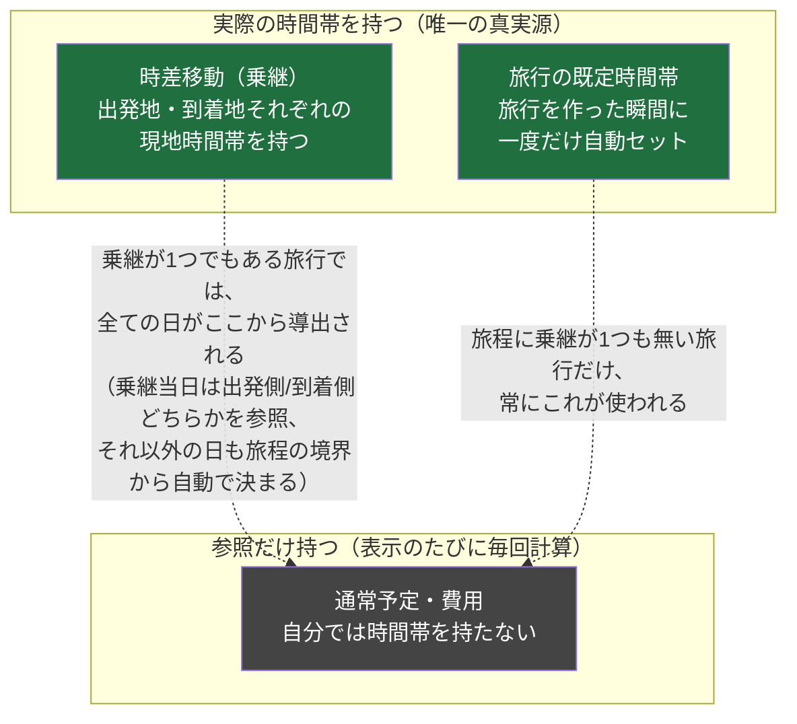
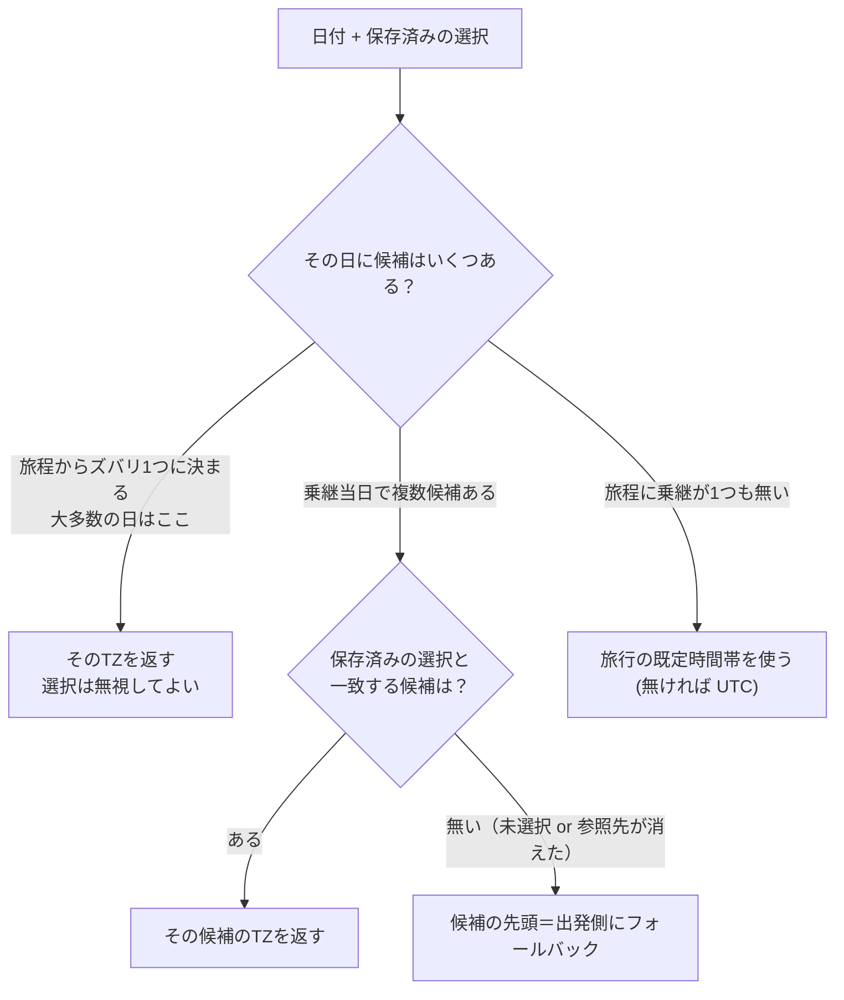
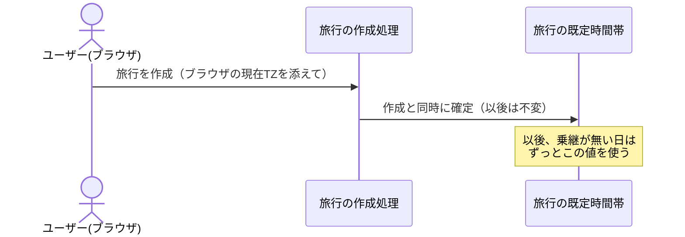
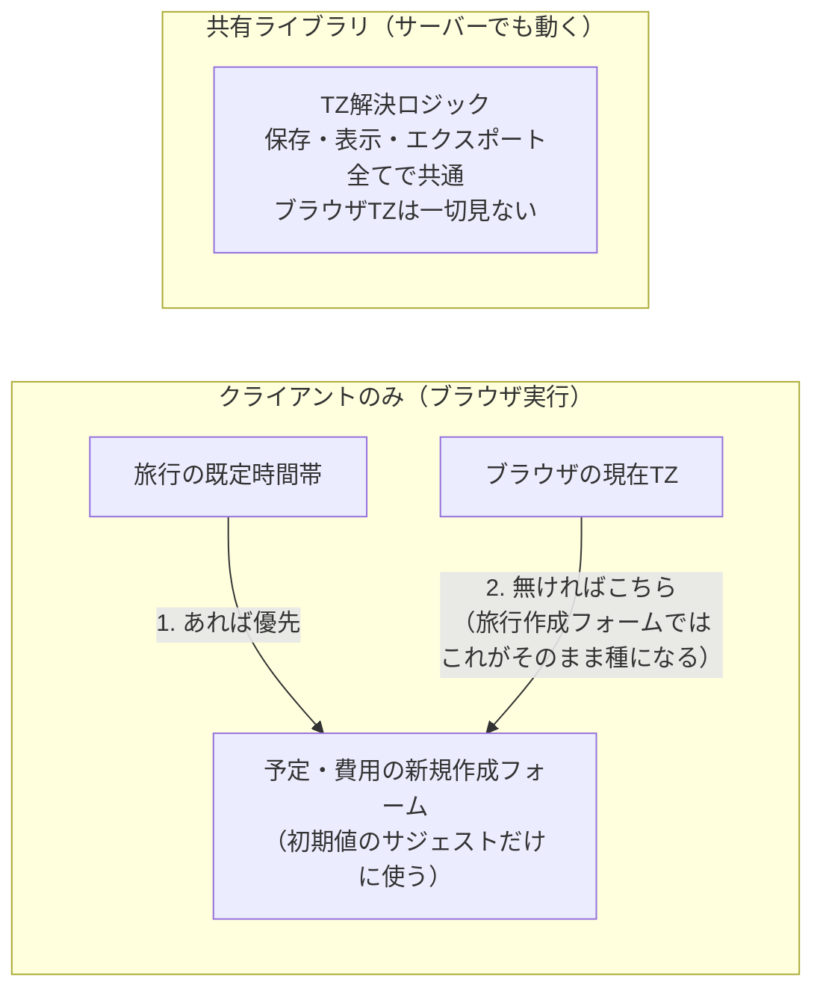

# タイムゾーン設計

「壁時計（floating time）＋ IANA TZ」モデルの全体像。誰が実際のTZ文字列を持ち、誰が
「参照だけ」持つか、TZが決まらない時どうなるか、を図でまとめる。サービス俯瞰は
[`architecture.md`](../architecture.md) を参照。

## 1. 誰が実TZを持ち、誰が参照だけ持つか

**実IANA文字列（`"Asia/Tokyo"` 等）を持つのは時差移動（乗継）だけ**。通常予定・費用は
**常に**「参照（乗継当日だけ）」または「何も持たない（それ以外の日は自動導出）」のどちらかで、
自分で実TZ文字列を持つことは無い。

通常予定・費用のテーブルには `tz_disambig_transit_id`（乗継のid）と `tz_disambig_side`
（`depart`/`arrive`）の列があるが、**乗継当日以外は両方 NULL のまま**。実TZ文字列を持つ列
自体が通常予定・費用には無い（events テーブルの `start_tz`/`end_tz` は transit 行だけが使う。
非 transit 行では DB の CHECK 制約で常に NULL を強制）。

## 2. 実際にTZが決まる流れ

表示・エクスポートのたびに `resolveEventTz(date, tzDisambigTransitId, tzDisambigSide, 旅程)`
（`packages/shared/src/schedule.ts`）を呼んで、その場で計算する。**保存された値をそのまま
信じるのではなく、常にこの関数を通す**——これが「乗継を編集すると紐づく予定が自動追従する」
仕組みの正体。

## 3. 乗継当日の「候補」はどう作られるか

同じ暦日に2回以上乗り継ぐ日も正しく扱えるよう、候補は「時系列に触れた全TZ」を集めたリスト。
各候補は「どの乗継の出発側/到着側から来たか」という出自を持つ（`tz_disambig_*` に保存するのはこれ）。

## 4. 旅行の既定時間帯（trips.default_timezone）とブラウザ/OSのTZ

旅行そのものには本来「場所」も「TZ」も無い概念（多都市を跨ぐ旅程では単一のTZが意味を成さない
ため）。ただし**乗継が1つも無い旅行**では自動導出の元になる旅程が無いので、唯一の拠り所として
`trips.default_timezone` を持つ。

- **ユーザーには見えない・変更するUIも無い。** **旅行を作成する瞬間**に、作成者のブラウザの
  現在TZで**一度だけ**自動セットされ、以後は据え置き。
- 「旅行の公式なTZ設定」ではなく、あくまで「他に手がかりが無い時の最後の拠り所」という
  狭い役割に限定される。
- シードする場所を「最初の予定/費用を作った瞬間」ではなく「旅行を作った瞬間」にしているのは、
  旅行作成が**必ず単独の作成者による、1回きりの操作**だから。予定/費用の作成時にシードする
  設計だと、共有旅行で複数メンバーが触れうる分「誰の・いつのブラウザTZで決まるか」が
  曖昧になる（後から参加した別メンバーが最初に予定を作ると、その人のTZが既定になってしまう）。

**共有ライブラリ（`schedule.ts`）はブラウザTZを一切知らない。** サーバーで実行されると
「サーバーのTZ」になってしまい、ユーザーの実際の場所と無関係な値になるため。ブラウザTZが
顔を出すのは「新規作成フォームの初期値サジェスト」と「旅行作成時の種まき」の2箇所だけ。

## 5. なぜこの形に落ち着いたか（旧設計からの変更点）

当初は「乗継が1つも無い旅行だけ、通常予定・費用が実TZ文字列を literal 保存する」という
例外を残していた。これは以下の問題を生んでいた:

- 通常予定・費用の「TZの持ち方」が旅行の状態（乗継の有無）で変わってしまい、一貫しない設計だった。
- **旅程にある乗継を全部消すと、既存の（乗継がある間に作られた）通常予定・費用が
  「自動導出の元」も「保存済みliteral値」も両方失い、`UTC` にフォールバックしてしまう穴があった。**
  乗継を作り直せば大抵は自己修復するが、その間に該当の予定/費用を編集して保存すると
  `UTC` が literal として永続化されてしまう（TZ欄自体が画面に出ないため気づけない）。

`trips.default_timezone` を導入したことで、通常予定・費用は**常に「参照 or 自動導出」のみ**
になり、上記の穴も副産物的に解消した（フォールバック先が旅行に紐づく安定した値になったため、
旅程の乗継を何回消しても壊れない）。
