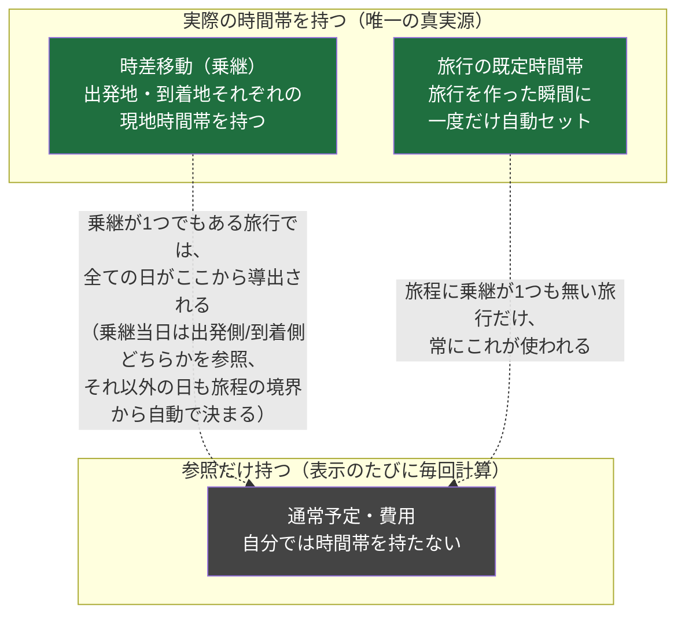
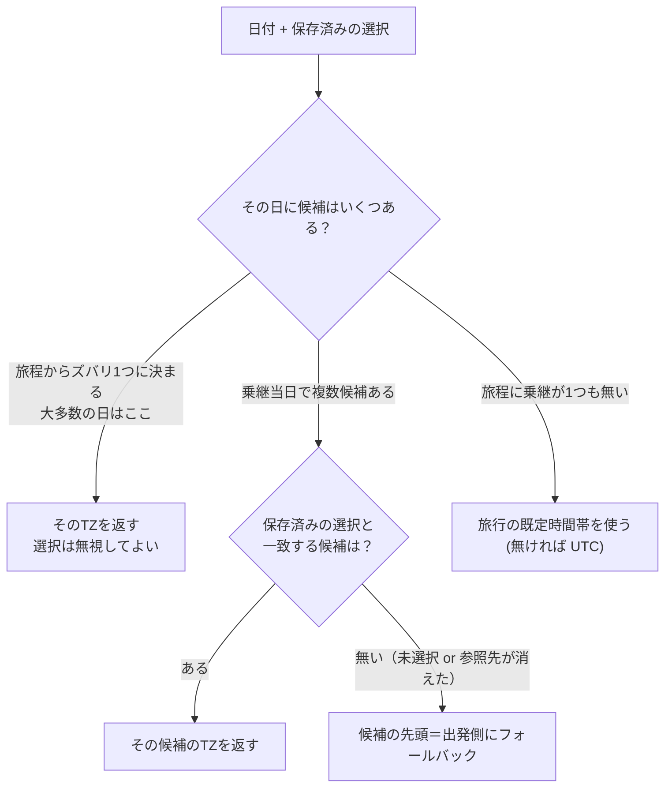
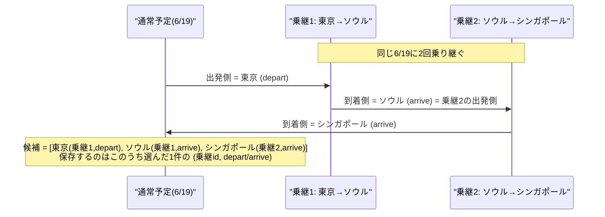
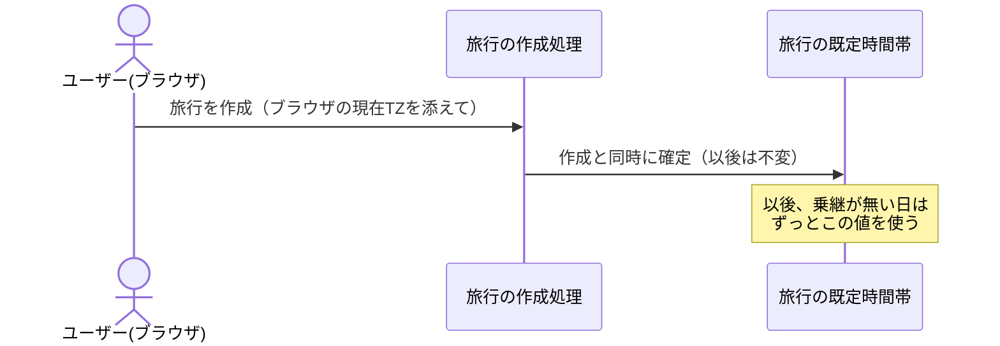
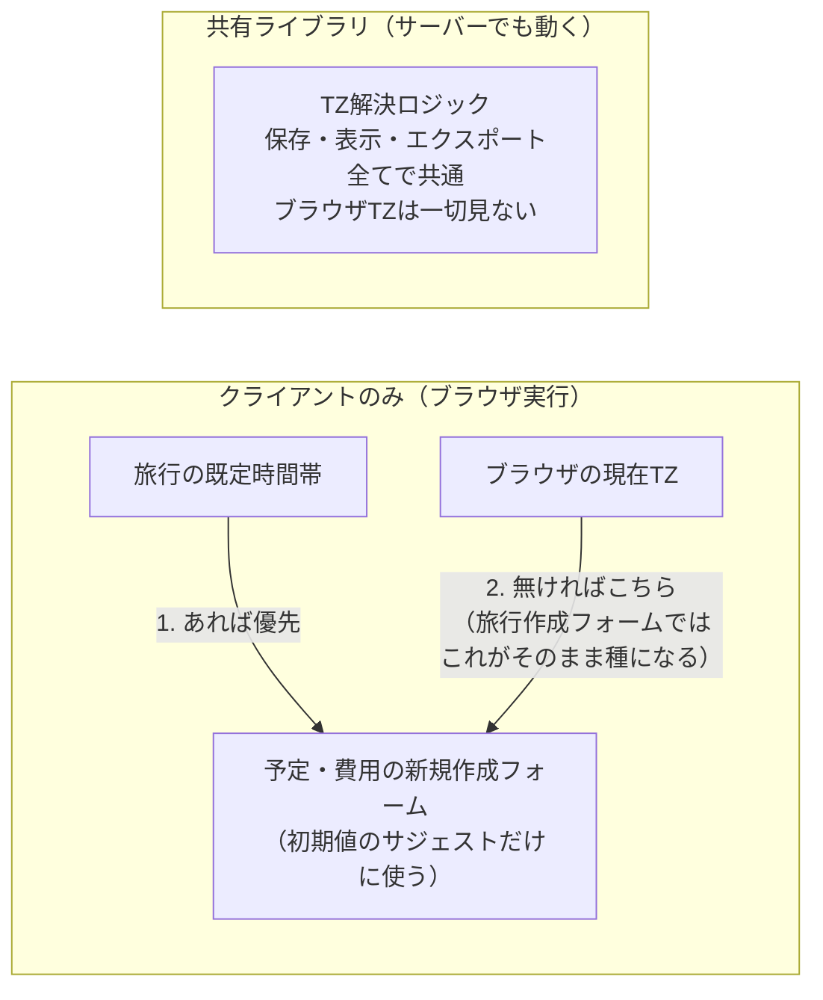

# タイムゾーン設計

「壁時計（floating time）＋ IANA TZ」モデルの全体像。誰が実際のTZ文字列を持ち、誰が
「参照だけ」持つか、TZが決まらない時どうなるか、を図でまとめる。サービス俯瞰は
[`architecture.md`](../architecture.md) を参照。

## 0. なぜ「持たせず毎回導出」なのか

先に結論: **全予定に実TZを埋める方式を採らない理由は、入力順序の非対称性にある。**

旅行の計画は「中日の予定を先に立てて、フライトは後から確定する」順序になることが多い。

- **導出方式（現行）**: 後からフライトを入れた瞬間、既存の予定の実効TZが自動で正しくなる。
  既存行は1つも書き換えない。
- **埋める方式**: フライトが決まった時点で、**既存の全予定のTZを導出して書き戻す**処理が
  要る。旅程が動くたびに再計算とカスケード更新が走り、「どの順序で入力したか」で結果が
  変わりうる。入力順序に依存する不具合は再現条件が掴みにくく、直しにくい。

埋める方式でも「ユーザーにTZを聞かずに自動で埋める」なら、結局この文書の導出ロジックが
そのまま要る。違いは **導出結果を凍結するか、毎回やり直すか** だけで、凍結する側だけが
余分に「陳腐化した値を直す責任」を負う。

**代償は乗継当日の曖昧性**（下の 3 節）。成田を 4/28 に発ってホノルルに 4/28 に着く日、
「4/28 15:00 の予定」が出発側か到着側かは日付だけでは決まらない。`tz_disambig_transit_id` /
`tz_disambig_side` の2列とそれを選ばせるUIは、この代償を払うための仕組み。
**複雑に見えても消さないこと** — 消して埋める方式に戻すと、上の書き戻し問題と交換になるだけ。

## 1. 誰が実TZを持ち、誰が参照だけ持つか

**実IANA文字列（`"Asia/Tokyo"` 等）を持つのは時差移動（乗継）だけ**。通常予定・費用は
**常に**「参照（乗継当日だけ）」または「何も持たない（それ以外の日は自動導出）」のどちらかで、
自分で実TZ文字列を持つことは無い。

```mermaid
flowchart TB
    subgraph G1["実際の時間帯を持つ（唯一の真実源）"]
        T["時差移動（乗継）<br/>出発地・到着地それぞれの<br/>現地時間帯を持つ"]
        D["旅行の既定時間帯<br/>旅行を作った瞬間に<br/>一度だけ自動セット"]
    end

    subgraph G2["参照だけ持つ（表示のたびに毎回計算）"]
        N["通常予定・費用<br/>自分では時間帯を持たない"]
    end

    T -.->|"乗継が1つでもある旅行では、<br/>全ての日がここから導出される<br/>（乗継当日は出発側/到着側どちらかを参照、<br/>それ以外の日も旅程の境界から自動で決まる）"| N
    D -.->|"旅程に乗継が1つも無い旅行だけ、<br/>常にこれが使われる"| N

    style T fill:#1f6f3f,color:#fff
    style D fill:#1f6f3f,color:#fff
    style N fill:#444,color:#fff
```

通常予定・費用のテーブルには `tz_disambig_transit_id`（乗継のid）と `tz_disambig_side`
（`depart`/`arrive`）の列があるが、**乗継当日以外は両方 NULL のまま**。実TZ文字列を持つ列
自体が通常予定・費用には無い（events テーブルの `start_tz`/`end_tz` は transit 行だけが使う。
非 transit 行では DB の CHECK 制約で常に NULL を強制）。

## 2. 実際にTZが決まる流れ

表示・エクスポートのたびに `resolveEventTz(date, tzDisambigTransitId, tzDisambigSide, 旅程)`
（`packages/shared/src/schedule.ts`）を呼んで、その場で計算する。**保存された値をそのまま
信じるのではなく、常にこの関数を通す**——これが「乗継を編集すると紐づく予定が自動追従する」
仕組みの正体。費用の発生順ソートも専用のキャッシュ列は持たず、表示のたびにここで解決したTZ
＋壁時計の発生時刻から都度算出する（保存はしない）。

```mermaid
flowchart TD
    A["日付 + 保存済みの選択"] --> B{"その日に候補はいくつある？"}
    B -->|"旅程からズバリ1つに決まる<br/>大多数の日はここ"| C["そのTZを返す<br/>選択は無視してよい"]
    B -->|"乗継当日で複数候補ある"| D{"保存済みの選択と<br/>一致する候補は？"}
    D -->|"ある"| E["その候補のTZを返す"]
    D -->|"無い（未選択 or 参照先が消えた）"| F["候補の先頭＝出発側にフォールバック"]
    B -->|"旅程に乗継が1つも無い"| G["旅行の既定時間帯を使う<br/>(無ければ UTC)"]
```

## 3. 乗継当日の「候補」はどう作られるか

同じ暦日に2回以上乗り継ぐ日も正しく扱えるよう、候補は「時系列に触れた全TZ」を集めたリスト。
各候補は「どの乗継の出発側/到着側から来たか」という出自を持つ（`tz_disambig_*` に保存するのはこれ）。

```mermaid
sequenceDiagram
    participant 予定 as "通常予定(6/19)"
    participant 乗継1 as "乗継1: 東京→ソウル"
    participant 乗継2 as "乗継2: ソウル→シンガポール"

    Note over 乗継1,乗継2: 同じ6/19に2回乗り継ぐ

    予定->>乗継1: 出発側 = 東京 (depart)
    乗継1->>乗継2: 到着側 = ソウル (arrive) = 乗継2の出発側
    乗継2->>予定: 到着側 = シンガポール (arrive)

    Note over 予定: 候補 = [東京(乗継1,depart), ソウル(乗継1,arrive), シンガポール(乗継2,arrive)]<br/>保存するのはこのうち選んだ1件の (乗継id, depart/arrive)
```

## 3.5 未確定の移動も年表に入れる

TZ の年表（`TripTzTimeline`）は移動から組む。**未確定の移動（取り込みの仮予定）も同じ資格で
入れる。** 取り込んだフライトを確定する前でも、その日以降の予定は到着地の TZ で並ぶべきだから。

**年表を2つ作らないこと。** 確定した予定だけで年表を組んで下書きを導出すると、カレンダーの列
（`buildSchedule` が確定＋仮の一覧から組み直す）と食い違う。下書きが持つ移動日の選択
（`tzDisambigTransitId`）は列側の年表に存在しない移動を指すことになり、一致しないので先頭候補
＝出発側に落ちる。実機では、TZ の境界がまだ仮予定のフライトだった時に**ハワイの仮予定が東京の
列に並んだ**（下書き自身の TZ はハワイなのに、置かれる列だけ東京）。

導出は `deriveEventDraftItemsWithTimeline` に集約する。

**種別を変えるのは保存時ではなく、旅程を組む時。** ユーザーが「移動」と言ったものは移動のまま
保存する（以前は iOS のフォームだけが「時差が無ければ通常の予定に降格」していて、確定した
途端に移動が外れるように見えた）。境界として扱うかどうかの判断は `buildSchedule` が持ち、
時差の無い移動をそこで通常の予定に均す。列も年表もリボンもまとめて正しくなる。

**年表に入れてよいのは、実際に TZ が変わる移動だけ。** 年表の各要素は現在の TZ を書き換える
ので、境界を作らない移動を入れると、その推測値で現在の TZ を上書きしてしまう。保存時の規約
（`crossesTimezone`）と同じで、仮予定の疑似イベントもそれに揃える。実データで踏んだ形:

| 起きたこと | 原因 |
|---|---|
| ホノルル滞在中の日が全部東京に戻った | TZ 不明の Uber が旅行の既定 TZ（東京）として年表に入り、フライトが示した境界を打ち消していた |
| 成田 → ホノルルの境界が消えた | 仮予定の `departTz`/`arriveTz` を実効値として読んでいた。これは**上書き**で、座標が分かる端点では置かない規約（`event-form` の `applyFlight`）なので、フライトでは両方 null になる |
| 「ホノルル → 東京」の幽霊の境界ができた | 乗車地だけ座標が取れた Uber で、決められない側が既定 TZ に落ちていた |

順に、①TZ が変わらない移動は境界にしない ②上書きが無ければ座標から導出する（保存時と同じ）
③片方しか決められないときはもう片方に合わせる、で解いている。

## 4. 旅行の既定時間帯（trips.default_timezone）とブラウザ/OSのTZ

旅行そのものには本来「場所」も「TZ」も無い概念（多都市を跨ぐ旅程では単一のTZが意味を成さない
ため）。ただし**乗継が1つも無い旅行**では自動導出の元になる旅程が無いので、唯一の拠り所として
`trips.default_timezone` を持つ。

- **ユーザーには見えない・変更するUIも無い。** **旅行を作成する瞬間**に、作成者のブラウザの
  現在TZで**一度だけ**自動セットされ、以後は据え置き。
- 「旅行の公式なTZ設定」ではなく、あくまで「他に手がかりが無い時の最後の拠り所」という
  狭い役割に限定される。
- シードする場所を「最初の予定/費用を作った瞬間」ではなく「旅行を作った瞬間」にしているのは、
  旅行作成が**必ず単独の作成者による、1回きりの操作**だから。予定/費用の作成時にシードする
  設計だと、共有旅行で複数メンバーが触れうる分「誰の・いつのブラウザTZで決まるか」が
  曖昧になる（後から参加した別メンバーが最初に予定を作ると、その人のTZが既定になってしまう）。

```mermaid
sequenceDiagram
    actor U as ユーザー(ブラウザ)
    participant C as 旅行の作成処理
    participant D as 旅行の既定時間帯

    U->>C: 旅行を作成（ブラウザの現在TZを添えて）
    C->>D: 作成と同時に確定（以後は不変）
    Note over D: 以後、乗継が無い日は<br/>ずっとこの値を使う
```

**共有ライブラリ（`schedule.ts`）はブラウザTZを一切知らない。** サーバーで実行されると
「サーバーのTZ」になってしまい、ユーザーの実際の場所と無関係な値になるため。ブラウザTZが
顔を出すのは「新規作成フォームの初期値サジェスト」と「旅行作成時の種まき」の2箇所だけ。

```mermaid
flowchart LR
    subgraph G3["クライアントのみ（ブラウザ実行）"]
        DTZ["旅行の既定時間帯"]
        BR["ブラウザの現在TZ"]
        SS["予定・費用の新規作成フォーム<br/>（初期値のサジェストだけに使う）"]
    end
    subgraph G4["共有ライブラリ（サーバーでも動く）"]
        RE["TZ解決ロジック<br/>保存・表示・エクスポート全てで共通<br/>ブラウザTZは一切見ない"]
    end

    DTZ -->|"1. あれば優先"| SS
    BR -->|"2. 無ければこちら<br/>（旅行作成フォームでは<br/>これがそのまま種になる）"| SS
```
