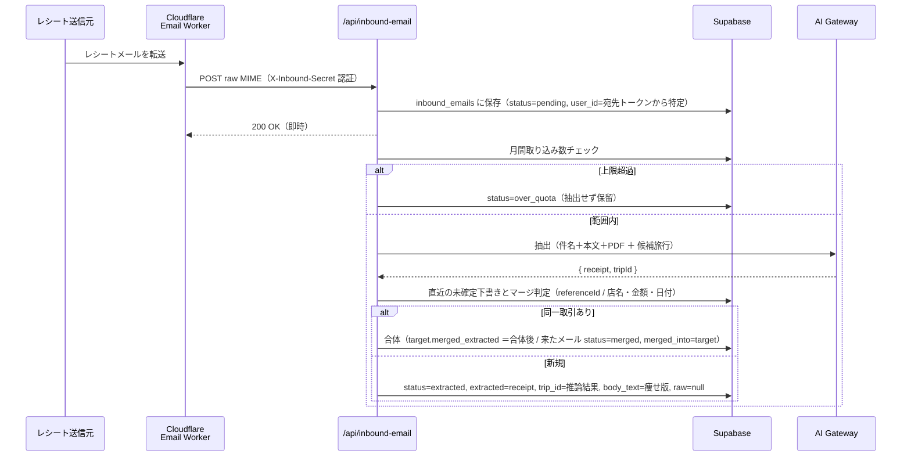
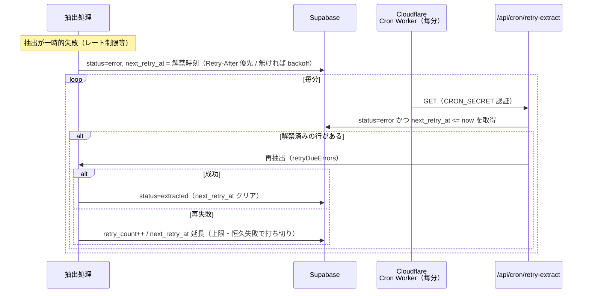
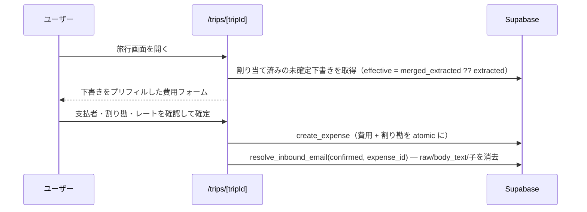
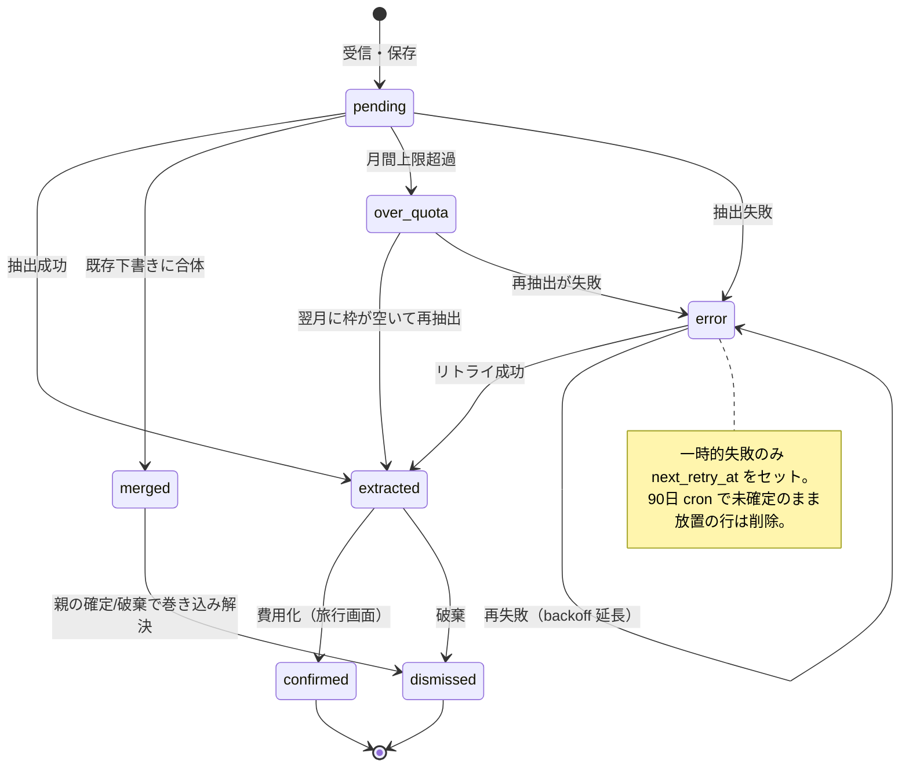

# 費用インポート（メール転送）設計

ユーザが per-user の取り込み用アドレス（`receipts+<token>@triplot.app`）にレシート
メールを転送すると、LLM で費用情報を抽出して下書きを作り、旅行に割り当て、最終的に
費用として確定する。サービス俯瞰は [`architecture.md`](./architecture.md) を参照。

## 全体像

- **1メール = `inbound_emails` の1行**。複数メールが同一取引なら id リンク（`merged_into`）で
  グループ化する。
- **抽出と「どの旅行か」の割り当ては LLM の1回の呼び出しで同時に**行う。
- **確定（費用化）の最終判断は人**。下書き＋レビュー方式。
- **保持最小化**: 抽出後は丸ごと MIME（`raw`）を捨てて痩せ版（`body_text`）だけ残す。確定/破棄で
  さらに消し、90日で cron が削除。

## 1. 受信 → 抽出（push ＋ `after()`）

メール到着の push で即トライ。ポーリングはしない。`after()` は「**HTTP 応答を返した“後”に
同じ実行内で裏で走らせる**」Next.js の仕組みで、遅い LLM 抽出を待たせず Worker に即 200 を返すため。

### LLM による旅行割り当て

メールには複数の日付（受信日・決済/確定日・実際の利用日）が混在しうる。日付レンジの機械照合
だと「どの日付か」を取り違えて黙って別の旅行に誤割り当てしうるため、**抽出と同時に候補旅行
（旅行名＋日程）を渡して LLM に `tripId` を推論させる**。例: 旅行中に予約した将来の航空券は、
購入時期の旅行ではなく**搭乗日（利用日）の旅行**に属する、と意味で判断できる。確信が無ければ
`tripId = null`（受信箱で人が選ぶ）。

## 2. 自動リトライ（リコンサイル型）

抽出が**一時的に失敗**（AI Gateway 無料枠のレート制限など）したら、その場では再試行せず
`next_retry_at`（解禁時刻）を立てて記録するだけ。真実は DB（`status=error` の行）にあり、
**Cloudflare の毎分 cron が解禁済みの行を拾って再抽出する**＝状態を見て埋めるリコンサイル型。
失敗・cron・行は互いに直接話さず DB 越しに協調するので、cron は「叩くだけの独立した心拍」。

- **解禁時刻は Retry-After 優先**。429 が返す `Retry-After` をそのまま `next_retry_at` にする
  （こちらが制限値を知らなくてもサーバが解禁時刻を教えてくれる）。ヘッダが無ければ exp backoff
  （1分から倍々、6時間上限）。`MAX_RETRIES` 回で打ち切り。
- **リトライ対象は一時的失敗のみ**。レート制限/タイムアウト等は `next_retry_at` をセット、パース不能
  などの恒久失敗は `next_retry_at = null` で対象外（受信箱に「再試行できませんでした」と表示）。
- **トリガは Cloudflare の毎分 cron だけ**（受信箱を開いた時に動かす案は廃止：`after()` は応答後に
  走るので、確認しに来たユーザに失敗状態をそのまま見せてしまうため筋が悪い）。
- **手動リトライボタンは置かない**: 失敗直後に押すと同じレート制限に当たるため。
- **なぜ Cloudflare か**: Vercel Hobby の cron は日次。分単位の自走タイマーが要るのでメール受信と
  同じく Cloudflare に逃がす（毎分・無料）。状態は DB が持つので、心拍 Worker はメール Worker と
  別の独立ユニット（[`architecture.md`](./architecture.md) の定期実行を参照）。

## 3. 確定（下書き → 費用）

旅行に割り当てられた下書きは、旅行画面の「未確定の取り込み」に並ぶ。ここで人が支払者・割り勘・
為替レートを確認して費用化する（`create_expense` RPC）。確定すると `resolve_inbound_email` が
`status=confirmed` にし、`raw`・`body_text` と合体された子メールの痩せ版も消す。

## 状態遷移（`inbound_emails.status`）

> `over_quota` は月間上限超過で保留された行。毎分の reconcile（retry-extract）が、ユーザの
> 枠（`CAP − 当月抽出数`）が空いた分だけ少量ずつ再抽出する。月替わりでカウントが 0 に戻ると
> 自動で drain される（ユーザの再転送は不要）。

## データモデルの要点

| 列 | 意味 |
|---|---|
| `status` | ライフサイクル（上の状態遷移図） |
| `user_id` | 宛先トークン（`receipts+<token>@`）から特定。From には依存しない |
| `raw` | 丸ごと MIME。抽出後 null（痩せ版に置換） |
| `body_text` | 痩せ版本文（マージ判定の文脈に使う）。確定/破棄で null |
| `extracted` | そのメール「自分の」抽出結果（Receipt） |
| `merged_extracted` | 合体後の実効値（ターゲット行のみ）。表示・確定は `merged_extracted ?? extracted` |
| `merged_into` | 合体先（ターゲット）の id。グループはこれで辿る |
| `trip_id` | LLM が割り当てた旅行（確信が無ければ null＝受信箱で人が選ぶ） |
| `retry_count` / `next_retry_at` | 自動リトライの回数と次回期限 |

## 設計判断メモ

- **BYOK（ユーザ課金）が長期の既定**。早期は運用者課金の AI Gateway を意図的に loss-leader として使う
  （月間取り込み上限でコスト保護）。
- **`expenses` テーブルは綺麗に保つ**。取り込みの不完全さ・provenance は `inbound_emails` 側に閉じ込める。
- **全角→半角の正規化**を抽出結果の店名・場所・referenceId に適用（日本語・カタカナは保持）。
