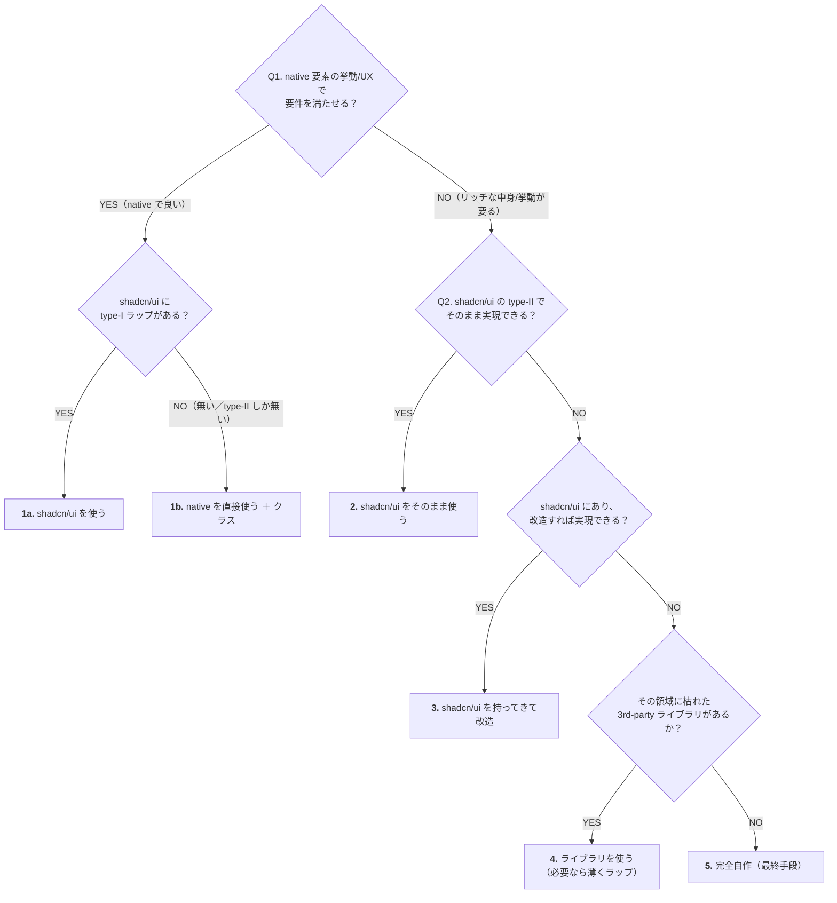
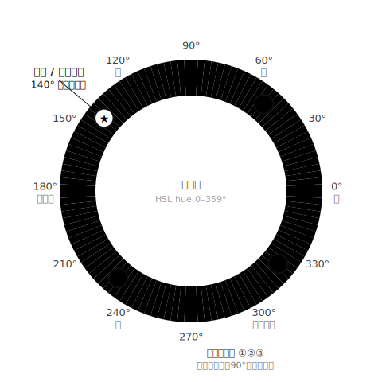

# UI ガイドライン

triplot の UI 規約（テーマ・アイコン・ボタン配色・コピー・インタラクション）。新しい UI を足すときはこれに従う。
（"design" は設計の意味と紛れるので、見た目＋インタラクションの規約はこの名前。システム設計は
[`architecture.md`](./architecture.md)。）
このファイルは `CLAUDE.md` から `@` で読み込まれる（AI エージェントも人も同じ単一の真実を見る）。

スタイリングは **Tailwind CSS v4（utility-first）**。見た目は基本 utility クラス（`className`）で書き、
値は下記の token（余白・サイズ・色）に従う。スタックとしての記載は `CLAUDE.md` の技術スタックにもある。

## テーマ・コピー

- **ダークモードは未実装**（`app/globals.css` の `color-scheme: light`）。ライトに固定する方針ではなく単に未対応 — 実装するまで `dark:` variant を個別に足さない（BACKLOG #13 で一括対応する）。色はテーマトークンで書いておけば後でそのまま追従する。
- アプリ内コピーは日本語、コメントは日英混在 — 周囲のファイルに合わせる。
- **画面に応じて見た目を変えるときは「何を本質的に切り替えたいか」を見極め、それを決める軸で判定する**。
  脊髄反射で幅やタッチを使い分けず、その表示を本質的に左右している軸を選ぶ:
  - **使える幅で決まること**（要素が画面に対して大きすぎる等）→ **ビューポート幅**で判定。
    **ルール: 一定幅以上の入力フォームは、狭い画面ではボトムシート（`vaul`）、広い画面ではタップ位置のポップアップ**
    （`FormPopover` の `fullScreenOnNarrow`）。**全画面表示は使わない**＝文脈（元画面＝どこから開いたか）が消えるため。
    ボトムシートは下からせり上がり・ドラッグで閉じ・上に元画面が薄暗く残る（Google マップ等と同じ世の中標準）。
    Base UI にシート部品が無いので vaul を使う（shadcn の Drawer も中身は vaul。直に使う理由は下の「ライブラリを使う」段）。
    要素が自分の入れ物の幅で決まるならコンテナクエリの方が正確。
    - **閾値はマジックナンバーにせず、対象の幅から導く**。例: ポップアップ時のフォームは 352px(`w-[22rem]`)で、
      余白付きで“浮いてるカード”に見える下限が ~640px → それ未満でボトムシート。**フォーム幅を変えたら閾値も見直す**。
    - **同じ大きさの部品は同じ閾値**でよい（現状の入力フォームは全部 352px なので 640px 共通）。幅が違う部品が出たらその幅で導く。
  - **入力モダリティで決まること**（タッチかマウスか）→ **`pointer` クエリ**。
    例: iOS のフォーカス時ズーム防止（16px 強制）は touch ブラウザ固有の挙動なので `any-pointer: coarse` で判定する（幅は無関係）。
  - 段組み程度の幅変化は `flex-wrap` で吸収できることも多い（その場合はメディアクエリ自体が要らない）。

## Placeholder の規約

- **具体例のみ**。「〇〇を入力」「例:」などのプレフィックスは書かない。
- **ハワイ旅行テーマで統一**（アプリ全体で例が世界観として一貫するよう）。

| フィールド | placeholder |
|---|---|
| 旅行タイトル | `ハワイ旅行` |
| 場所検索（`place-search`） | `パンケーキ` |
| 費用のメモ | `ランチ` |
| 費用・予定の場所（`place-picker`） | `Eggs 'n Things`（デフォルト）/ 呼び出し元で上書き可 |
| 予定タイトル（通常・終日） | `ハイキング` |
| 予定の場所（通常） | `ダイヤモンドヘッド` |
| 予定のメモ（通常） | `日焼け止め持参` |
| 移動タイトル（transit） | `NRT-HNL` |
| 移動の場所（transit） | `成田国際空港` |
| 移動のメモ（transit） | `ターミナル1` |
| 場所のメモ（`place-popups`） | `22時まで` |
| ピンの場所名 | `集合場所` |
| TODO 準備 | `航空券の予約` |
| TODO 現地 | `両親にお土産買う` |
| 日程（`DateRangePopover`） | 空文字 — 具体的な日付例は入力済みデータに見えるため例外的に空にする |

- 入力形式が自明でない数値・コード（為替レート等）にだけ例外として `例: 150` 形式を許容する。

## アイコンの 2 ファミリー

役割で使い分け。混ぜない:

| 用途 | ファミリー | ファイル | 形 |
|---|---|---|---|
| **操作系**（保存・追加・削除・編集・閉じる…） | Lucide line（ISC） | `components/icons.tsx` | viewBox `0 0 24 24` / 線画 stroke |
| **場所カテゴリ**（ピンの形） | Material Symbols Rounded FILL | `lib/placeIcons.ts` → `components/place-list.tsx` の `PlaceIcon` | viewBox `0 -960 960 960` / 塗り |
| **費用カテゴリ** | Material Symbols Rounded FILL | `components/expense-category-icon.tsx` | 同上 |

理由: 操作系は中立な線画で「動作を表す」、カテゴリ系は Google Maps の POI と概念を揃えるため Material Symbols（塗り）。新規アイコンを足すときも上の表に従う。SVG は web フォントを使わずパスを inline 埋め込み（依存ゼロ・FOUT 無し）。MS パスの取得は `https://fonts.gstatic.com/s/i/short-term/release/materialsymbolsrounded/{name}/fill1/24px.svg`、Lucide は `https://unpkg.com/lucide-static/icons/{name}.svg` から拾える。

**操作系アイコンは必ず `components/icons.tsx` に置く**（コンポーネント内でインライン SVG を手書きしない）。例: ⋯ メニューは `EllipsisIcon`（Lucide more-horizontal）。

### 地図・Google 連携まわりのビジュアルは Google に合わせる

地図上のマーカーや Google 由来のデータ表示は、Google マップの見た目に寄せる（**Material Symbols 塗り＋必要なら Google ブランド色**）。Lucide 操作アイコンとは別系統で、ここを Lucide の線画に置き換えると Google の塗り表現から浮くので**しない**:

- **評価★**（`place-popups` の Google 評価表示）= Material Symbols `star`（塗り、amber）。Google の星表示と揃える。
- **地図ピン**（`place-map` の `RedPin`＝ドラッグ仮ピン／検索候補ピン）= Material Symbols `location_on` 形を Google 純正マーカー色（赤 `#EA4335`・白縁・影）で描き、ベースマップに溶け込ませる。

これらは「例外」ではなく**この原則に従った正規の実装**。新しく地図/Google 連携のビジュアルを足す時もこの方針に従う。

### アイコンのサイズ — 置かれる文脈で決まる

サイズは「離散的な数段」に絞り、半端値を散らさない。決め方は**何の隣に置くか**で3系統:

| 文脈 | サイズの決め方 | 例 |
|---|---|---|
| **行内**（文字の隣） | 離散スケール **{12, 16, 18, 20, 24}** の中で、**隣接テキスト以上で最小の段**を選ぶ（＝アイコンはテキストと同等〜やや大きい。比例ではなく段階的）。`text-sm`(14)→16 / `text-xs`(12)・`text-[11px]` 等の小さい行→12 / 見出しの隣（現状そういう箇所は無い）→上の段(text-lg→20 目安) | text-sm の行・戻りリンク → 16 / 場所名や凡例の text-xs〜`text-[11px]` → 12 |
| **ボタン内** | ボタンの大きさに合わせる | 密なボタン（×閉じる `h-6`・リスト内）→ 16 / 標準 `h-9` → 18 / 主送信（Primary）→ 20 |
| **徽章**（アバター等に重なる丸の中身） | 丸に対しバランスの良い**偶数**（丸の 55〜65%） | 14px 丸の管理者王冠 → 10 / 20px 丸の編集鉛筆 → 12 |

- ヘッダーナビのアイコンだけ 24（例外）。
- `13` `15` `22` のような半端値は作らない。行内なら隣接文字へ、ボタンなら 16/18/20 へ寄せる。
- **ドロップダウンの選択チェック（末尾）は 16**（shadcn/ui の `h-4 w-4` と同じ。本文 14 でもチェックは 16）。
  同じ行の先頭グリフ（優先度・カテゴリ等）も 16 で揃え、行内の2アイコンを同寸にする。
- **status グリフ（優先度アイコン等、それ自体が状態を表す固定アイコン）はトリガ／ドロップダウンで
  サイズを変えない**（開いた瞬間に縮まない）。PriorityIcon は両所で 16。

## 文言は極力アイコンに寄せる（ローカライズ準備）

説明や操作の文言は、この優先順位で上から検討する:

1. **書かない**（無くても伝わるなら書かない）
2. **アイコンのみ**（動作を表すボタンはアイコン＋`aria-label`/`title`）
3. **短くシンプルに**
4. **長くなるなら `?` ツールチップ**を使えないか考える（[[help-tip]]）

将来の i18n コストを下げるためでもある。テキストラベルは「アイコンだけで意味が確実に伝わらない」場合だけ。例:

- 保存／追加／作成／編集／削除／閉じる／検索 → アイコン
- 「キャンセル」など他に表しようの無いものは現状テキスト可（必要なら後で見直し）
- アクセシビリティ用に `aria-label` + ホバー用に `title` は必ず付ける（読み上げ・hover ツールチップが文言の代わり）

## 部品の作り方：何を使うか（5択を上から）

このプロジェクトは **shadcn/ui プロジェクト**（`components.json` あり・style `base-nova`＝Base UI 製）。
UI 部品が要るときは下のフローで**上から**選ぶ。**「shadcn/ui の見た目を手書きで真似る」はこのフローに無い＝アンチパターン**
（shadcn/ui にあるなら shadcn/ui を使う。手書き再現は a11y を落とすだけ）。

**前提 — shadcn/ui の部品は2タイプ:**

- **type-I＝native 要素にクラスを着せただけ**（Button=`<button>`・Input=`<input>`・Textarea・Label・Badge…）。中身は native そのもの。
- **type-II＝native を捨てて Base UI で作り直したもの**（Select・DropdownMenu・Dialog・Popover・Combobox・Tabs・**Checkbox**・Switch…）。
  見た目の自由と引き換えに、a11y・キーボード操作・フォーカス管理・はみ出し位置決めを**自前で持つ**（native のモバイル UI〔OS ピッカー等〕は失う）。
- **見分け方**: `components/ui/*` の実装が `<button>`/`<input>` を直接返す＝type-I、`@base-ui/react/...` を import＝type-II。

**フロー（上から順に検討。上で済むなら上を採る）:**



各ステップの勘所（チャートに載せきれない注記）:

- **1a**: 中身は native なので何も失わない。
- **1b**: type-II を取ると native のモバイル UI を無駄に失うので取らない。
- **2**: a11y もタダで付く。
- **3**: source は自分の物なので改変可。
- **4**: ゼロから作らない（カレンダー・地図・チャート・リッチエディタ等）。
- **5**: native も shadcn/ui もライブラリも無い、このアプリ固有のもの。

**順序の理由:** 下へ行くほど「自分で書く量」と「**a11y を落とすリスク**」が増える。だから native → shadcn/ui → shadcn/ui 改造 → ライブラリ → 自作 の順。

**一意に落とす2つのゲート:** ① native の挙動で足りるか（Q1） ② shadcn/ui そのままで欲しい中身を出せるか（Q2）。この2問で枝が決まる。

**このアプリでの当てはめ:**

- type-I → 必ず使う: ボタン `<Button>`、テキスト入力 `<Input>`（`components/ui/input.tsx`＝native `<input>`＋`inputClass`）。
- 1b: プレーンな選択は native `<select>`（通貨・支払者・旅行・ステータス）、checkbox/radio も native、開閉（折りたたみ＝TODO セクション・割り勘対象 全員/custom・参加者 custom）は native `<button aria-expanded>` ＋ 条件レンダー。
  ※ Base UI Collapsible/Accordion は **type-II**（`<button>`＋`<div>` で再構築＝native `<details>` のラッパーではない）。native で足りるので 1a ではなく 1b＝native を直接使う。
- 2（shadcn/ui/Base UI）: メニュー＝Base UI Menu（⋯/アカウント）、ダイアログ＝Base UI Dialog（確認・場所アイコン）、
  リッチな選択＝Base UI Select（費用カテゴリ・TODO 優先度）、フォーム popover＝Base UI Popover、
  オートコンプリート＝Base UI Combobox（`place-picker`/`place-search`）、`?` ヒント＝Base UI Popover の
  `openOnHover`（`HelpTip`）＝ホバー（PC）でもタップ（モバイル）でも開く。Tooltip はタップで開かないので使わない。
- 4（ライブラリ）: 日付＝`react-day-picker`（Base UI Popover 内）、地図＝Google Maps、
  **狭い画面のフォームのボトムシート＝`vaul` を直接使う**。Base UI にシート部品が無いため。
  なお **shadcn の Drawer も中身はこの vaul** だが、そのラッパーは modal＋専用 Overlay 前提で、
  我々の要件＝`modal=false`（フォーム内のポータル popover を生かす）・自前 dim（閉じアニメを切らさない）・
  PC ポップオーバー/モバイルシートの 1 コンポーネント切替 と衝突する。なのでラッパーは噛まさず vaul を
  直に使う（部品フローの step3/4＝ラッパーが合わないのでライブラリ直）。`form-popover.tsx` の
  `NarrowSheet` 1 か所に隔離されている。
- 5（完全自作）: 週カレンダー・地図上の独自描画・色相ホイール。
- **逸脱なし（過去の逸脱は解消済み）:** 場所入力のオートコンプリート（`place-picker`/`place-search`）は
  **Base UI Combobox**（step2）に移行済み。殻（候補リスト・開閉・キーボード・はみ出し位置決め・a11y）は
  Combobox に委ね、「保存済み/Google/自由入力」の解決や Google 非同期取得・hidden input 導出だけ自前で持つ。
  ⋯/アカウントメニュー・確認ダイアログ・`CategorySelect`・種別セレクタも Base UI 化・native radio 化で解消済み。

## ボタンの配色

**ボタンは共通の `<Button>` コンポーネント**（`components/ui/button.tsx`）を使う。手書きの `<button className="...">` で
ボタン1個ずつスタイルしない。`variant` で役割を、`size` で大きさを選ぶ:

- `variant`: **`primary`**（黒塗り・送信/追加/保存）／**`destructive`**（赤枠・削除）／**`outline`**（白枠・キャンセル/コピー）／**`ghost`**（枠なし・ツールバー/トグルのアイコン）
- `size`: `default`(h-9 テキスト) / `sm`(h-8) / `icon`(h-9 w-9) / `iconSm`(h-8 w-8) / `iconDense`(h-7 w-7)
- 幅・位置（`w-full`/`flex-1`/`shrink-0`/`rounded-full` 等）は `className` で渡す。角丸は rounded-md（入力欄と揃う）、**フォーカスは `focus-visible:ring`**（キーボード操作時のリング＝a11y）を Button が担保する。
- **× 閉じるボタンは `<CloseButton>`**（`components/close-button.tsx`、subtle 色・rounded-full の独自レシピ。`label`/`iconSize`/`className`/`type` を渡せる）。

**`<Button>` を使う／使わないの境界**（混在は分断ではなく、UIパターンの違い）:

| これは `<Button>` | これは `<Button>` ではない（別パターン） |
|---|---|
| 押すと動作する「ボタンの見た目」の操作子（送信・削除・キャンセル・コピー・追加起動・ツールバー/トグルのアイコン） | メニュー/ドロップダウンの行 → `menuItemClass` |
| × 閉じる/破棄 → `<CloseButton>` | セグメント選択 → セグメントトラック ／ 入力風トリガ → `inputClass` |
| | **クリックできる「領域・タイル・行」**（カレンダーの予定タイル・リスト行・地図マーカー・「全員▼」等の開閉トグル）。これらは `<button>` 要素でも「ボタンの見た目」を持たないので Button にしない |

判断: 「**枠/塗りのある“ボタン”として見せたい**」なら `<Button>`。「クリックできる中身（行・タイル・トグル）」なら各パターンのまま。

下表は variant の意味（役割）の定義。色は Button が実装する:

| 役割 | 色 | 例 |
|---|---|---|
| **Primary**（その UI の主目的を**完了/送信**する1動作） | **`bg-primary text-primary-foreground`**（hover `bg-primary/90`） | 保存 / 追加 / 作成 / 確定 / 検索（送信） |
| **選択・アクティブ**（選択中のタブ/チップ/チェック等） | Primary と同じ `bg-primary text-primary-foreground`（枠は `border-primary`）。柔らかくしたい時は `bg-secondary`/`bg-muted` | 選択中セグメント / オンのトグル / 完了チェック |
| **Destructive**（破壊的・取り消せない） | 赤枠 (`border-red-600/20 text-red-600`)、サイズは小さめキープ | 削除 |
| **Neutral / Navigate**（補助・移動・取得） | 白枠 or 透明 | **コピー / エクスポート** / × 閉じる / キャンセル / 鉛筆だけの "編集を始める" 系（タブ的） |

- **Primary は「そのUIを開いた主目的を完了/送信する1動作」だけ**。状態を変えない補助操作（**クリップボードへのコピー・エクスポート**）は、たとえそのUIで一番目立っても **Neutral**。
  - 例：**共有リンクのコピーも取り込みアドレスのコピーも Neutral（白）で揃える**（同じ「コピー」を文脈で黒/白と変えない）。Primary は保存・追加・確定など“進める”動作に限る。
- **色はベタ値でなくテーマトークンで書く**：`bg-primary` / `text-primary-foreground` 等（`globals.css` の `--primary` ＋ `.dark`）。これらは**ライトで黒・ダークで自動反転**するので、近く対応するダークモードがそのまま効く。**新規に `bg-black` / `text-white` をベタ書きしない**（選択/アクティブも、暗い浮遊チップ＝トースト・ツールチップ〔HelpTip〕も同じく primary トークン＝`bg-primary text-primary-foreground`）。例外で `text-white` が要るのは、動的な彩度の高い地色（メンバー hue・地図マーカー・カテゴリ色）の上に乗せる文字だけ。

## 余白・サイズ（spacing & sizing）

基準は **4px グリッド**（Tailwind の数値がそのまま 4px 刻み: `1`=4px・`2`=8px・`3`=12px・`4`=16px…）。
値は de facto（4pxグリッド＋shadcn/ui 相当のコントロール寸法）に沿い、種類を絞る。**「迷ったらこの値」**。

| 区分 | 既定 | 補足 |
|---|---|---|
| **コントロール高さ** | `h-9`（36px） | ボタン・入力・セレクト。小さめは `h-8`（32px） |
| **テキストボタン** | `h-9 px-4 text-sm rounded-md` | 小: `h-8 px-3 text-xs`。配色は「ボタンの配色」節 |
| **アイコンボタン** | `h-9 w-9`、アイコンは 18–20px、密なリスト内のみ `h-7 w-7` 可 | 形は用途で決める → **`rounded-full`**＝単独アイコンの操作子（×閉じる・ナビ/ツールバー〔受信箱〕・トグル〔優先度・いいね〕・アバター。枠なし＋円形ホバー）／**`rounded-md`**＝フォーム/リストのアクション（送信・追加・削除・編集・検索。テキストコントロールと角丸を揃える） |
| **入力・セレクト** | 共通定数 **`inputClass`**（中身は `components/input-class.ts`。枠・bg・**固定高 `h-9`**・padding・text・focus を1ソース化） | レイアウト（`mt-1 block w-full`・`min-w-0`・`flex-1`・`pr-9` 等）は呼び出し側が足す。入力風トリガ（カスタムセレクト）も同じ（`flex items-center ${inputClass}`）。**手書きで枠・bg・focus を並べず必ず `inputClass` を使う**。iOS のフォーカス時ズーム防止は **globals.css がタッチ端末（`any-pointer: coarse`）で 16px を強制**するので入力は `text-sm` のままで可 |
| **入力の高さ** | `inputClass` が**固定 `h-9`（36px）を内包**＝全コントロール一律 36px | 以前は `py-2`（可変高）だったが、native `<input>` と `<select>` で実高さがズレる（select が低い）うえ iOS の 16px 強制フォントで膨らんで 36px から外れたため、**固定高に統一**。ボタンと横並びでも縦積みでも `inputClass` だけで高さが揃う（個別 `h-9` の付与は不要）。隣に置くボタンも `h-9`、コンパクト行のみ `h-8` で両者を合わせる |
| **角丸** | 小インライン `rounded`(4px) / コントロール・ドロップダウン `rounded-md`(6px) / カード・枠・ダイアログ・モーダル `rounded-lg`(8px) / 円形 `rounded-full` | `rounded`(4px) はバッジ・カレンダーブロック・小さいメッセージ箱。`rounded-2xl` 等は使わない |
| **gap（要素間）** | 既定 `gap-2`(8px) / ゆとり `gap-3`(12px) | `?` や補助要素があるとき `gap-3` |
| **ページコンテナ** | `mx-auto w-full max-w-2xl px-6 py-10` | AppHeader 配下の全ページ共通。情報量の多い旅行詳細のみ `max-w-3xl`、モーダルは `max-w-md` |
| **セクション縦積み** | `space-y-6` | ページ本文の上は `mt-10` 目安 |
| **文字** | コントロール・本文 `text-sm`(14px) / 補助・注記 `text-xs`(12px) | 下の「テキストサイズの階層」参照 |
| **フォームラベル** | `text-sm`（入力とペアの一級要素なので本文側） | shadcn/ui Label / Primer / Polaris と同じ 14px。`text-xs` は補助・注記専用 |
| **見出しの太さ** | `font-semibold` | 日本語システムフォント（游ゴシック等）はウェイト段階が粗く、500(medium) が 400 と同じ見えになる環境がある。600 は bold にマップされ確実に差が付く。`font-medium` は行内の強調（選択中・項目名）用 |
| **hover 背景** | `hover:bg-foreground/10` | **「その要素の前景色を 10% 重ねる」の1式のみ**（Material の state layer 方式）。半透明オーバーレイなので入れ子でも同じクラスで自動的に一段濃くなり（1段=10%・2段=約19%…）、ダークモードも foreground 反転で自動。色付きコントロール（いいね済み♥= `text-rose-500` 等）は自分の前景色で `hover:bg-rose-500/10`。`hover:bg-zinc-*` のベタ書きはしない |
| **選択中の行の背景** | `bg-accent` | hover（一時的なオーバーレイ）とは別の「状態」なのでベタ塗りトークン。shadcn/ui の accent と同じ |

**ボタンの幅**：

- **全幅 `w-full`** … 狭いコンテナ（ポップアップ／フォーム下部／モバイルのシート）の主動作。タップしやすく主役が明確。
- **内容幅（auto）** … ページ内の補助・インライン・横並びのボタン。
- **避ける**：内容幅のボタンを幅広の枠（カード）に1つだけ入れて右側が余る“中途半端”な形。全幅にするか枠を外す。

逸脱が要るときは個別に上書き可（なぜ外したかをコメントで一言）。将来、共有の `Button`/`Input`
コンポーネントに寄せて強制してもよい（今は utility クラスで上記値を使う運用）。

## テキストサイズの階層

Tailwind の標準スケールに乗る。**`text-[Npx]` の任意指定は、容器に物理的に収める時か高密度グリッドだけ**
（一般の「少し小さい注記」に使わない＝12/11/10 と1px刻みの段を増やさない）。

| 用途 | サイズ |
|---|---|
| LP ヒーロー | `text-4xl`(36) |
| ページ見出し h1（取り込み・設定・メンバー・旅行名…） | `text-2xl`(24) |
| セクション見出し h2・合計の強調・ワードマーク | `text-lg`(18) |
| 本文・コントロール・フォームラベル | `text-sm`(14) |
| 補助・注記・副情報 | `text-xs`(12) |

- 見出しの太さは `font-semibold`（「余白・サイズ」節）。`text-xl`(20) は見出し段としては使わない。
- **`text-xs`(12) より小さくしてよいのは2ケースだけ**:
  1. **容器に収める**: アバター頭文字(18px丸→10px)、HelpTip の `?`(16px丸→10px)、バッジ件数(15px丸→9px)
  2. **高密度グリッド**: 週カレンダー。予定タイトルは標準の `text-xs`(12)、時刻・軸ラベル等の副情報のみ
     `text-[10px]`（Tripit 風の密な時間表での「タイトル/時刻」2段。副情報は色・濃さ・等幅でも区別）
- 開閉インジケータ等は文字記号（`▼▲`）でなく ChevronIcon を使う（「アイコンの2ファミリー」節）。

## テキスト色の階層

3段階。Material Design の濃度基準に合わせ、shadcn/ui のセマンティックトークンで実装する。
**`text-zinc-*` の直書きは禁止**。必ず以下のトークンを使う。

| トークン | 濃さ | 用途 |
|---|---|---|
| `text-foreground` | 87% | 主要テキスト（本文・見出し・入力済み値・**フォームのフィールドラベル**） |
| `text-muted-foreground` | 60% | 補助テキスト（ノート・副情報・メタのラベル〔「メールの転送先」等〕） |
| `text-subtle-foreground` | 38% | プレースホルダ・非活性アイコン |

- **「ラベル」の取り違えに注意**: フォームのフィールドラベル（入力の上の太字ラベル＝タイトル・価格・公開範囲…）は
  **87%（`font-medium`、色指定なし）**。shadcn/ui の `Label` と同じで、入力値と同格の主要素。
  60%(muted) にするのは「メールの転送先」「今月の取り込み」のような**注記・メタのラベル**だけ。

`globals.css` の CSS 変数で一元管理しているので、値を変えれば全箇所に即反映する。
ダークモード対応も `.dark {}` を1箇所書き換えるだけ。

**命名について:** `muted-foreground` は shadcn/ui の命名規則で「補助テキスト兼プレースホルダ」の意。
語源（muted = 抑えた）よりも shadcn/ui の実際の用法に従い、補助テキストに使う。
`subtle-foreground` はプレースホルダ・非活性アイコン専用の 38%（Material Design disabled/hint）。
補助テキスト（60%）とセマンティックを分けることで独立して変更できる。

## ボーダー色（前景色の α 階段）

hover と同じ「**自分の前景色の α 重ね**」で表す。`border-zinc-*` のベタ書きはしない:

| α | 用途 |
|---|---|
| `border-foreground/5` | 最弱の補助線（カレンダーの時間グリッド線・メニュー内の区切り） |
| `border-foreground/10` | 区切り線・カード枠・リストの仕切り。チップの輪郭 `ring-foreground/10`、リスト行の仕切り `divide-y divide-foreground/10` も同段（`divide-zinc-*` は使わない） |
| `border-foreground/20` | コントロール枠（input・select・ボタン枠） |
| `hover:border-foreground/40` | 枠の hover 強調（カード・破線ボタン） |
| `focus:border-primary` | focus は「意味色」なので α 階段の外（全コントロール共通） |

- 半透明なので色付きの面の上でも区切りが見え、ダークモードは foreground 反転で自動（shadcn/ui の
  ダークボーダー `oklch(1 0 0 / 10%)` と同じ手法）。
- **色付きコントロールの枠も同じ式**: 前景色から `枠 = /20`・`hover 背景 = /10` を導出する。
  例: 削除ボタン = `text-red-600 border-red-600/20 hover:bg-red-600/10`（red-600 ひとつから全部決まる）。

## セマンティック色（意味 → 色の対応）

世の中の semantic color 慣例（error=red / warning=amber / info=blue / success=green）に沿って、
**「この意味はこの色」** で決める（「この色はここで使ってよい」という色側のリストにはしない）:

| 意味 | 色・形 | 例 |
|---|---|---|
| **エラー**（操作が失敗した・進めない） | メッセージ面は共通部品 **`<MessageBox kind="error">`**（密な場所＝吹き出し内は `dense` で小さく。中身は `components/message-box.tsx`） | フォーム送信失敗 |
| **警告・注意・要対応**（進めるが知っておくべき／放置すると完了しない保留状態） | amber。メッセージ面は **`<MessageBox kind="warning">`**。シェードは面=50/100・枠=200/400・文字=700〜900（薄い面は黄色く、濃い文字はオレンジっぽく見えるが同じ色相）＝バッジ/行ハイライト/カラウト等の非メッセージ面は個別に書く | 上限到達の知らせ / 取り込みの「要割当」「未確定の取り込み」/「地図未登録」バッジ / ピン設置中の行 |
| **情報**（進行に影響しない・知らせるだけ） | blue（面は `bg-blue-50`、テキスト・アイコンは `text-blue-500`〜`600`） | カレンダーの旅行期間の帯 / TODO 優先度「低」アイコン（高=赤・中=黄・低=青の Jira 慣例。色＋形状で色覚配慮） |
| **リンク・インラインのアクションテキスト** | `text-blue-600 hover:underline`（web 慣例） | 「Googleマップで開く」「ピンを設定」 |
| **追加候補 / 削除候補のプレビューペア** | blue / red | `place-icon-picker`。世の中の慣例は追加=green だが、triplot は green(140°) を「確定/全員」に予約済みのため blue |

- success(green) のステータス枠は作らない: green(140°) は「確定/全員」（「色（メンバー・予定）」節）に予約済み。
- エラー・警告はトースト（[[フィードバック]]）ではなくフォーム内・該当箇所の近くにインラインで出す（どの入力が問題かが分かるように）。
- destructive なボタンの赤（`border-red-600/20 text-red-600`）は「ボタンの配色」節。同じ red 系でも役割が違う。
- **red は1色。濃さは「役割」でなく「背景」で決まる**（背景が濃いほど文字を濃く＝コントラスト確保。
  Material の `error` / `onError` と同じ考え。shadcn/ui は `--destructive` 1色）。役割ごとに赤を増やさない:

  | 背景 | 赤 | 用途 |
  |---|---|---|
  | 白地 | `text-red-600` | Destructive ボタンの文字／枠・必須 `*`・赤い前景全般 |
  | `bg-red-50`（薄面） | `text-red-700` | エラーボックス（red-600 だと薄赤面でコントラスト不足ぎみ→1段濃く） |
  | `bg-red-100`（塗り） | `text-red-900` | diff の「削除候補」塗りチップ（blue 側 `bg-blue-100 text-blue-900` の対） |

  - **例外**: 優先度アイコンの `text-red-500` は「高=red-500 / 中=amber-500 / 低=blue-500」と
    **同じ鮮やかさ(500)で揃えた三つ組**の一部。赤のコントラストランプとは別系統なので 500 のまま。
- 新しい意味に色を当てるときは、**既に色が決まっている意味と紛れない色**を選ぶ。落とし穴は「選択・アクティブ」
  （= primary、「ボタンの配色」節）を blue にしてしまうこと — メンバー色が任意 hue なので blue(≒220°) の
  メンバーと識別不能になる（過去に実バグ）。カレンダー上の予定ブロックの選択も、別色を乗せず**地色と同じ
  hue の濃い枠を太く**して示す（`eventHueSelectedBorder`、実質 2px。Google Calendar と同方式）。

## レイヤーと影

重なりの「重さ」を z-index・影・背景の3点セットで揃える:

| レイヤー | z | 影 | 角丸 | 背景の遮り |
|---|---|---|---|---|
| インラインドロップダウン／メニュー（入力直下のサジェスト・セレクト・⋯/アバターメニュー） | `z-20`〜`z-50` | `shadow-lg` | `rounded-md` | なし（クリックで閉じる） |
| ポップオーバー（`FormPopover`） | 背景 `z-40` ＋ 本体 `z-50` | `shadow-xl` | `rounded-lg` | 透明（クリックで閉じる） |
| モーダル（`place-icon-picker`・`confirmDialog` 等、選択を強制する） | `z-50` | `shadow-xl` | `rounded-lg` | `bg-black/40` |
| トースト | `z-50` | `shadow-lg` | `rounded-md` | なし |

背景の暗さはユーザを拘束する度合い: ドロップダウン＝作業の続き（遮らない）、モーダル＝決めるまで戻れない（暗くする）。中間のポップオーバーは透明オーバーレイで「外をクリックしたら閉じる」だけ提供する。

**スクロールするリストの最大高さ**: 入力直下の候補・選択肢リスト（オートコンプリート・セレクト・チェックリスト）は
`max-h-64`（256px）＋ `overflow-y-auto` で統一。モーダル/ポップオーバーの器自体は vh 基準（`max-h-[80vh]` 等）で別管理。

**閉じる経路は3つ揃える**（オーバーレイ全般）: `Esc` キー・背景クリック・キャンセル/×ボタン。WAI-ARIA の
dialog パターンに沿う。どれか1つだけにしない。

**モーダルの ARIA**: `role="dialog"` ＋ `aria-modal="true"` ＋ アクセシブル名（`aria-label` か見出しへの
`aria-labelledby`）の3点セットを必ず付ける。`FormPopover` は `label` prop を渡すと dialog として公開する
（メニュー用途〔⋯〕は dialog ではないので label を省略）。ドロップダウンは `role="listbox"`、⋯ は `role="menu"`。

## 確認ダイアログ（破壊的操作）

**取り消せない操作の前には必ず確認を挟む**。素の `window.confirm()` は使わない（スタイル不能・
同期ブロック・モバイルで URL が出る）。共通の `confirmDialog()`（`components/confirm-dialog.tsx`）を使う:

```ts
if (!(await confirmDialog({ title: "この予定を削除しますか？" }))) return;
```

- 確定ボタンは既定で **Destructive（赤枠）**。非破壊な確認だけ `destructive: false`（Primary）にする。
- 文言の型: 軽い削除は `title` だけ（「この◯◯を削除しますか？」）。影響が広い・不可逆なものは
  `body` に影響範囲を書く（「予定・場所・費用…も消え、元に戻せません。」）。`confirmLabel` は動詞
  （「削除」「外す」「退出」「再生成」）。
- `<ConfirmDialogHost />` を root layout に1つ（`<Toaster />` と同じ imperative パターン）。

## 定型部品（de facto パターン）

繰り返し使う小さい部品の標準形。新しく似たものを作るときはこれをコピーする。
**「使う部品・クラス」列のものを必ず使い、手書きの span / 独自クラスで再現しない**（単一の真実）。

| パターン | 使う部品・クラス・関数 | レシピ・ルール・注意 |
|---|---|---|
| **× 閉じるボタン**（フォーム・ポップアップ右上） | `<CloseButton>`（`components/close-button.tsx`） | subtle 色・rounded-full・h-6 ＋ `aria-label`/`title`（既定「閉じる」）を内包。**専用行を作らず form 右上角に重ねる**＝ form を `relative`、`<CloseButton className="absolute right-2 top-2 z-10" />`（`flex justify-end` の独立行は使わない＝縦を 1 行ぶん詰める）。**先頭要素が × の下に潜るとき（全幅のセグメントトラック等）だけ、その要素に右クリアランス `mr-7` を足す**。先頭が「短いラベル＋全幅入力」なら × はラベル行の空いた右側に乗るだけなのでクリアランス不要 |
| **インラインバッジ**（件数・状態の小さな添え物） | 素のクラス／private 可視性は `<PrivateBadge>`（`components/private-badge.tsx`） | バッジ地は `rounded bg-muted px-1.5 text-xs text-muted-foreground`。**private 可視性は鍵アイコン**（`LockIcon` 16・muted）＝モバイルで面積を取らず世界的に通じる（「文言は極力アイコンに寄せる」）。意味は `title`/`aria-label` で担保。場所/費用/予定/TODO 名の隣に出すのは `PrivateBadge` で1ソース化 |
| **破線ボーダー＝「ここに追加できる」** | `border border-dashed border-foreground/20` | 控えめな追加アクション（割り勘の行追加・地図への登録）。実線ボタンより一段弱い「空きスロット」の表現 |
| **横並び要素の区切り（縦棒）** | `<InlineDivider>`（`components/inline-divider.tsx`） | 横に並ぶ複数要素を区切る縦棒は **`/`・`・` のテキスト区切りでなく `<InlineDivider>`**（1px 幅・`bg-foreground/10`＝ボーダーの仕切り段。アイコンではない）。`flex items-center gap-2` の要素間に挟む。例: 旅行ヘッダの「日程 ｜ 精算通貨」、取り込み行の「金額 ｜ 日付 ｜ カテゴリ」、公開範囲 ｜ 要予約。**ただし分数（`3 / 10 件`）やパス・URL の `/` は区切りではないので変えない** |
| **トグルチップ**（参加者・割り勘対象・支払者などメンバー選択） | `<ToggleChip on=... hue?=...>`（`components/toggle-chip.tsx`） | 非選択＝muted+ring。選択は2系統: **`hue`（メンバー hue）を渡すとそのメンバー色**（`chipStyle`＝アバター/メンバーチップと同じ薄い面＝誰を選んでいるか色で分かる）／hue 無しは primary 塗り（中立トグル）。`aria-pressed` を内包。メンバーを選ぶ用途では hue を渡す |
| **フォームフッター**（ポップオーバーフォーム下部） | `flex gap-2` レイアウト | ［削除 `h-9 w-9` Destructive（編集時のみ）］＋［送信 `h-9 flex-1` Primary・アイコン］。送信が flex-1 で主役、削除は正方形で控えめ |
| **空状態** | `text-sm text-muted-foreground` のプレーン文 | 枠・イラストは作らない。「まだ〜ありません。」＋可能なら次のアクションへの誘導を一文（例:「上の転送先アドレスにレシートを転送してみてください」） |
| **hover を持つ要素** | 素の `transition` | `transition-colors` 等のプロパティ限定は使わない（短い汎用トランジションで統一） |
| **金額表示** | `formatAmount`（`lib/formatAmount.ts`） | `Intl.NumberFormat("ja-JP", { style: "currency" })`。JPY は小数なし・USD は2桁。`¥${n}` の手書き整形・各所での再定義はしない |
| **「誰が」**（作成者・支払者・参加者） | `MemberAvatar`（`sm`=18px / `md`=24px） | 色丸＋表示名の先頭1文字。人を示す箇所は必ずこれ（色トーンはメンバーチップと統一、[[色（メンバー・予定）]]） |
| **フォームのフィールドラベル** | `<FieldLabel>`（`components/field-label.tsx`） | `font-medium`（foreground 87%）の最小プリミティブ。必須は `<FieldLabel required>` で赤 `*`（直書きしない）。任意は何も付けない（`*` の有無で必須/任意を示す）。外側 `<label className="block text-sm">` と入力はインラインのまま |
| **切り詰め** | 1行 `truncate` ／ 複数行 `line-clamp-2` | リスト内の可変長テキスト（名前・タイトル・候補行）は必ずどちらかで止める。親に `min-w-0` が無いと truncate が効かない |
| **「1つ選ぶ」コントロールの配色レシピ**（セグメント・選択ピル・トグルボタン等） | 配色レシピ（クラス） | 選択中 = `border-primary bg-primary text-primary-foreground`／非選択 = `border-foreground/20 text-muted-foreground hover:bg-foreground/10`。「選択・アクティブ = primary」の具体形 |
| **メニュー/ドロップダウンの選択行**（アカウント/⋯メニュー・セレクト・候補・チェックリスト等の浮遊パネルの行） | `menuItemClass`（`components/menu-item.ts`） | 幅・padding・hover・focus リングを内包。各行は display（単一行 `flex items-center gap-2` / 候補2行 `block`）・文字色（補助は `text-muted-foreground`）・選択状態（`bg-accent font-medium`）だけ足す。padding は統一（独自に作らない）。器の幅だけ中身依存（`w-24`〜`w-full`）。destructive な行は hover 色が違う（`hover:bg-red-600/10`）ので定数を使わず個別に書く |
| **セグメントトラック**（横並びで1つ選ぶ標準構造） | `sr-only` の native radio group ＋装飾した `<label>` | 器 = `flex gap-1 rounded-md border border-foreground/10 p-1`、各セグメント = `flex-1 rounded px-2 py-1.5 text-xs font-medium`（セグメント自身に枠は付けない）。選択色は上の配色レシピ。独立ボタン型は使わずトラック型に寄せる。native radio を敷くと radiogroup セマンティクス・矢印キー移動・フォーカスが native のまま効く（種別 通常/終日/時差移動・新規/コピー）。素の `<button>` 並べは a11y が弱いので使わない |
| **数字の揃え** | `tabular-nums` | 桁がガタつくと困る数字（時刻・件数・金額の縦並び）に付ける |
| **セクション見出し** | `<h2 className="text-lg font-semibold">` | 右に操作（追加ボタン・HelpTip 等）を置くときは `<div className="flex items-center justify-between gap-2">` で両端に並べる。操作が無ければ素の h2 |
| **アバター画像** | 丸い容器＋`` ／ 自分は `selfAvatarClass`（`components/self-avatar.ts`） | 画像が無いときは頭文字フォールバック。自分（ログインユーザ）のアバターは中立 zinc（`selfAvatarClass`）＝メンバー色 hue とは別系統。`MemberAvatar` の hue 丸は旅行内で誰かを色で識別する用途、アカウント自身（`account-menu` / `avatar-upload`）は識別不要なので中立。自分のアバターに hue を当てない |
| **フォームのフィールド構造** | `<label className="block text-sm">…</label>` | `<FieldLabel required?>ラベル</FieldLabel>` ＋入力 `<input className="mt-1 ..." />`。入力との間隔 `mt-1`、フィールド間 `space-y-3`。ラベル色は FieldLabel が foreground(87%) を担保（muted にしない） |
| **日時の表示整形** | `lib/schedule.ts`（`formatDayLabel`・`formatMinutes` 等）／ローカル日付は `lib/ymd.ts`（`parseYmd`/`formatYmd`） | 手書きしない。日付 = `M/D`（年なし・ゼロ埋めなし）／曜日付き `M/D(曜)`／時刻 `HH:MM`（24h・時もゼロ埋め〔`9:00` でなく `09:00`〕、`00:00`＝未設定は出さない）／期間 `M/D(曜) → M/D(曜)`。0時からの通算分→時刻は `formatMinutes(min)`（`Math.floor(min/60)` を手書きしない）。例外: 高密度な週カレンダーは時の先頭ゼロを落とす `formatMinutes(min, false)`（`9:00`）。react-day-picker のローカル `Date` ↔ `"YYYY-MM-DD"` は ymd.ts（schedule.ts は UTC 専用） |

## 薄くする手段：色トークン vs opacity

「薄く見せる／de-emphasize する」手段は2つ。**2つの軸**で決める（混ぜない）:

**軸1 — 色付き/複合の要素か？** → なら **opacity 一択**（機械的必然）。
member 色の地のブロック・hue 地色・primary 塗りのボタン・画像アバター等は「単一の文字色」が無いので、要素を丸ごと薄くするしかない。色トークンは当てられない。これには **hue から作った文字色** も含む — 予定ブロック内の時刻・場所名を「タイトルより一段控えめ」に下げたいが、文字色が人ごとの hue 由来で固定の灰色トークン（muted-foreground）を当てられないので、**状態の切り替えではなくても** opacity で薄くしてよい。

**軸2 — 中立のテキスト/アイコン単体なら、その薄さは…**
| 種類 | 手段 | 例 |
|---|---|---|
| **恒常的な強調階層**（ずっと薄いインク） | **色トークン**（`text-subtle-foreground` 38% / `text-muted-foreground` 60%） | プレースホルダ・補助テキスト・控えめなアイコン |
| **状態としての ON/OFF 切り替え**（有効↔無効・確定↔未確定・追加済↔未追加で、要素を丸ごと dim/明にする） | **opacity** | disabled（中立なテキストボタンでも opacity）・地図ピンの未確定↔確定・アイコンピッカーの追加済↔未追加 |

判断基準: **「ずっと薄いインク」なら色トークン。「今この要素が dim/off の状態」or「色付きで灰色トークンを当てられない」なら opacity**。disabled が中立テキストでも opacity なのは状態切り替えだから。shadcn/ui・Material と同じ。

**opacity の値は2つに絞る**:
- **`opacity-50` = 状態 dim**（disabled・未確定・不参加・追加済）。`disabled:opacity-50` で統一、`opacity-40/60` は使わない。状態をホバーで明るく戻すときは opacity を上下させず標準の `hover:bg-foreground/10`（[[薄くする手段：色トークン vs opacity]] と「定型部品」の hover ルール）。
- **`opacity-70` = 色付きブロック内の脇役 fade**（hue 文字の時刻・場所名・チェックをタイトルより控えめに）。
- 例外: 画像アバターの `hover:opacity-90`（写真は bg 重ねが効かないので軽い減光でホバー）、ツールチップの `opacity-0↔100`（出現フェード＝薄さの話でなくアニメーション）。

## HelpTip の使いどころ

インラインに置いたら UI が長くなる・読みにくくなる説明を逃がす先。判断基準:

- ラベルや見出しと同じ行に説明テキストを並べたくない → HelpTip
- 操作方法のヒント（「スワイプで削除できます」等、なくても使えるが知ると便利な情報）→ HelpTip
- エラーや必須の注意事項（無視できない情報）→ インライン表示（HelpTip に入れない）

HelpTip の隣にボタンを並べる時は `gap-3` を使う（`gap-2` だとタップ領域が被りやすい）。

## 色（メンバー・予定）

色は「意味」を運ぶ。実装は `lib/memberColors.ts` / `lib/eventColor.ts` / SQL `pick_member_color`
にあり、ここはルールと意味を持つ（単一の真実は doc、値はコード）。

### メンバー色
- `trip_members.color` に **色相 hue（0–359 の整数）** で保存。プリセットは持たない。
- 割り当ては `pick_member_color`（SQL）が「**使用済み hue ＋ 確定 green(140°) からの距離が最大**」に
  なる hue を都度計算 → メンバー同士・確定色と被らないよう散らす。
- 描画は **inline `hsl(h, s%, l%)`**（Tailwind の color class とは独立）。値は `lib/memberColors.ts` に集約（各所で `hsl(...)` を手書きしない）。トーンは2系統:
  - **チップ/アバター**（薄い面）= `chipStyle` / `avatarStyle`：背景 `hsl(h,90%,92%)` ／文字 `hsl(h,50%,25%)`。
  - **ドット/マーカー**（小さな点で人を示す＝参加者ドット・地図の仮ピン）= `vividColor` ＝濃いベタ単色 `hsl(h,70%,50%)`。
- hue が NULL/範囲外のとき: **チップ/アバターは空 style**（zinc 等の fallback はしない＝QA で気付くため）。ただし**ドット/マーカーだけは中立グレーにフォールバック**（空だと点が消えてしまうため。`vividColor` は null を返し、呼び出し側が文脈の灰を当てる）。

### 色相環での決め方（イメージ）

hue は色相環上の角度（HSL, 0–359°）。



- **確定色＝全員参加 = 140°（緑〜やや青緑）に固定予約**（★）。「確定／全員」を表す特等席。
- **メンバー色 = 円周上で“一番空いている方角”を選ぶ**。新メンバーには、「既に使われている
  メンバーの hue」＋「予約済みの ★140°」の**全部から角度距離が最大**になる hue を割り当てる
  （farthest-point 配置）。
- 実際の出力（図の ①②③④ ＝挿入順）:
  - ① = ★140° の正反対 **320°**
  - ② = 残った半円の中点（**50° か 230°**・両方同距離でタイ）／ ③ = もう片方 → ここまでで
    **{140, 320, 50, 230} が約90°間隔に均等**。
  - ④ = 90°ギャップ4箇所のどれか（**4方向タイ・45°**）の中点。その隙間を二分する（図では 95°）。
  - 増えるほど「残った一番広い隙間」に挿し続ける。片側に寄らない。
- 実際の計算は SQL `pick_member_color`（毎回算出・プリセット無し）。タイの取り方は実装依存。

### 予定（イベント）の色 — 閲覧者（自分）視点で変わる

| 参加構成 | 色 |
|---|---|
| private | `bg-foreground/α`（無彩色の中立。ダークモード自動追従） |
| **全員参加** | **green（hue 140°）＝確定色と同じ** |
| 1人だけ | そのメンバーの hue |
| 複数〜全員未満（mixed）・**自分が参加** | **自分の hue**（各自の画面で違って見える） |
| 複数〜全員未満（mixed）・自分は不参加 | `bg-foreground/α` + `opacity-50` dim（ガイドライン「不参加=opacity-50」に従う） |

- mixed はどちらも**右肩に参加者ドット**を出す（自分のドットは除外）。
- 「全員参加」のシュガー: `participantMemberIds` が**空配列** か、全 active member を明示、どちらも全員扱い
  （フォームの "all" は空配列で送る）。
- **落とし穴**: green(140°) は「確定／全員」の予約色。だからメンバー色は green から離して割り当てる
  （メンバー個人色と「全員/確定」を混同させないため）。mixed の地色が**見る人によって違う**点にも注意。

## フィードバック（保存・操作の結果）

通知は**結果が画面に出ない時だけ**出す。

| 状況 | 伝え方 |
|---|---|
| 結果が画面に出る（一覧が変わる／ポップアップが閉じる／画面遷移／値が見て分かる） | それ自体がフィードバック（追加なし） |
| 結果が見えない成功（その場編集で見た目が変わらない＝設定の表示名、クリップボードコピー等） | トースト（「保存しました」「コピーしました」） |
| エラー | トースト |

### トースト
挙動（表示時間・重ね・ホバー一時停止・スワイプ/×・live region）は **Base UI Toast の既定に乗る**。
既定値はここに書かない — 書くと陳腐化するし、「ドキュメントが言うから」と明示固定して既定に乗る利点を潰す。
唯一のルールは **`timeout`/`limit` 等を上書きしてカスタムしない**こと（旧「2.5秒・単発・差し替え」のような手書き化に戻さない）。
ここに書くのは「Base UI 既定では決まらない＝我々が決めた差分」だけ:

- 位置：画面下中央（`fixed bottom-6 left-1/2 -translate-x-1/2 z-50`）。Base UI は位置を決めないので明示。
- 見た目：`bg-primary text-primary-foreground rounded-md px-4 py-2 text-sm shadow-lg`。
- 実装：root layout に `<Toaster />` を1つ。どこからでも `toast("…")`（`components/toast.tsx`、React 外からも呼べる standalone manager）。サーバアクションは呼んだクライアント側で `await` 後に `toast()`。

### その場保存フォーム
- **変更がある時だけ保存ボタンを有効**にする（無駄押し防止のユーザビリティ）。これは状態表示が目的ではないので、**成功トーストは別途出す**（有効/無効 ＋ トーストの両方）。

### 処理中（ローディング）
- **スピナー・スケルトンは使わない**（現状アプリ全体で不使用）。処理中はボタンの**文言を「○○中...」に差し替え**（参加→参加中... / 設定→設定中... / 削除→削除中...）＋ `disabled` にする。
  - **末尾は ASCII ピリオド3つ `...`**（三点リーダ `…`〔U+2026〕は使わない）。アプリ内の「○○中」「読み込み中」は全てこの表記で揃える。
- ボタンが無い待ち（地図ロード等）は短い注記テキスト（「地図を読み込み中...」）で代替。
- 長い待ちが恒常的に出るようになったらスケルトン導入を検討（今は速いので不要）。

## ナビ / メニューの使い分け

| コントロール | 形 | 意味 |
|---|---|---|
| **アバター**（右上） | 写真 or 頭文字の丸 | アカウント（email / 設定 / ログアウト）。Google は写真を引ける、Apple は写真が無いので頭文字フォールバック |
| **ハンバーガー** | ☰ | グローバルナビ（行き先）。行き先が複数ある時に使う |
| **ミートボール / ケバブ** | ⋯ / ⋮ | その対象への**コンテキスト操作**（編集・削除・共有…の overflow）。旅行内の操作はこれ |

「同じ目的には同じコントロール」。グローバルナビに ⋯ を使う等の用途違いをしない。

## タイムゾーンピッカーの命名ルール

`TimezonePicker`（`components/timezone-picker.tsx`）の `name`・`sub` フィールドの決め方。
**ルールは一律**。「有名だから例外」はしない。

### 収録方針

- **基準ソース**: `zone.tab`（IANA tzdata）を単一の真実とする。UN 加盟国リストでも raw エイリアスリストでもない。香港・台湾・グアム等の非国家地域が自然に含まれる点が UN リストとの違い。
- **スコープ**: 有人の全地域。除外するのは南極（AQ）と完全無人島（BV=ブーベ島・HM=ハード島等）のみ。
- **同一オフセット国の統合**: 同じ国の複数ゾーンが全て同じ UTC オフセット・DST ルールなら 1 エントリに統合する。
- **異なるオフセットを持つ多ゾーン国**: オフセットが違う場合は複数エントリに分ける（インドネシア西部/中部/東部 等）。ただし US・CA・RU・BR・MX・AU は歴史的な郡レベルの分割まで全収録せず、**主要ゾーンのみキュレーション**する（例: US の Indiana 各郡の歴史的分割は東部時間に統合）。
- **別国が同じ IANA ゾーンを共有するケース**: zone.tab に別行で載っていれば別エントリにする。i18n で国名を独立管理するため。

### 構造（3段ネスト）

エントリ数が多いため 3 段構成:  
**大陸グループ**（アジア・ヨーロッパ・アメリカ・アフリカ・太平洋） →  
**UN サブ地域**（東アジア・カリブ海 等） →  
**国/ゾーン**

### 命名ルール

| ケース | `name`（トリガー・一覧に出る） | `sub`（ドロップダウン2行目） |
|---|---|---|
| **1か国・1ゾーン** | **国名**（日本・フランス・アルゼンチン） | **なし** |
| **複数国・1ゾーン** | **ゾーン/地域名**（東アフリカ・ロシア西部） | 代表都市を列挙 |
| **1か国・複数ゾーン** | **ゾーン/地域名**（東部時間・オーストラリア東部） | 代表都市を列挙 |

**subなし（「全土」= subは書かない）**: 国名を `name` にした場合、都市を `sub` に列挙しない。
「日本（東京・大阪）」と書くと「北海道は？」になる。

**「時間」は省略可能なら省く**: 「ハワイ時間」→「ハワイ」。
例外: 「東部」「中部」だけだと日本の地域と紛れるため、US 本土のゾーン名は「東部時間・中部時間…」のまま。

**国ごとに別エントリ**: 同じゾーンでも国が違えば別エントリにする（i18n で国名を独立管理するため）。
例: UAE（Asia/Dubai）とオマーン（Asia/Muscat）は同じ UTC+4 だが別エントリ。

**並び順**: グループ内は **UTC オフセット昇順（西→東）**。同一オフセット内は**表示名の五十音順**（ローマ字名は読みで判定: UAE = ユーエーイー ≒ ヤ行）。グループ間の順序（アジア → 太平洋・オセアニア → ヨーロッパ → アメリカ → アフリカ・中東）は固定。

**グループ帰属は UN 地域分類（M49）に従う**: どのグループに入れるかは UN Statistics Division の地域区分を単一の真実とする。迷ったら M49 を参照。例: Russia = Eastern Europe → ヨーロッパ、Maldives = Southern Asia → アジア、Iceland = Northern Europe → ヨーロッパ。

## ナビ：ヘッダー / 戻り / パン屑

URL/IA の前提: `/` = LP（公開）、`/trips` = アプリのホーム（旅行一覧）、`/trips/[id]` = 旅行詳細。

- **共有ヘッダー**（`components/app-header.tsx`）をアプリ内全ページ（`/trips` 配下・`/settings`・`/import`）に
  layout で適用する。薄い常時表示バー（`sticky top-0`・auto-hide しない）。**左＝ワードマーク、右＝受信箱＋アバター**。
- **ワードマークの行き先は文脈依存**: アプリ内 → `/trips`（ロゴ＝主要コレクション。Gmail→受信箱と同じ）、
  LP 上 → `/`。LP はヘッダー構成が違うので共有ヘッダーは使わない。
- **「←」戻りリンクは本物の親階層にだけ**出す: `/trips/[id]` →「← 旅行一覧」(`/trips`)、
  `/trips/[id]/members` → 旅行詳細。ホームへの戻りはワードマークが担うので「← ホーム」は置かない。
- **パン屑**は階層が3層を超えて使い勝手に響くまで導入しない。
