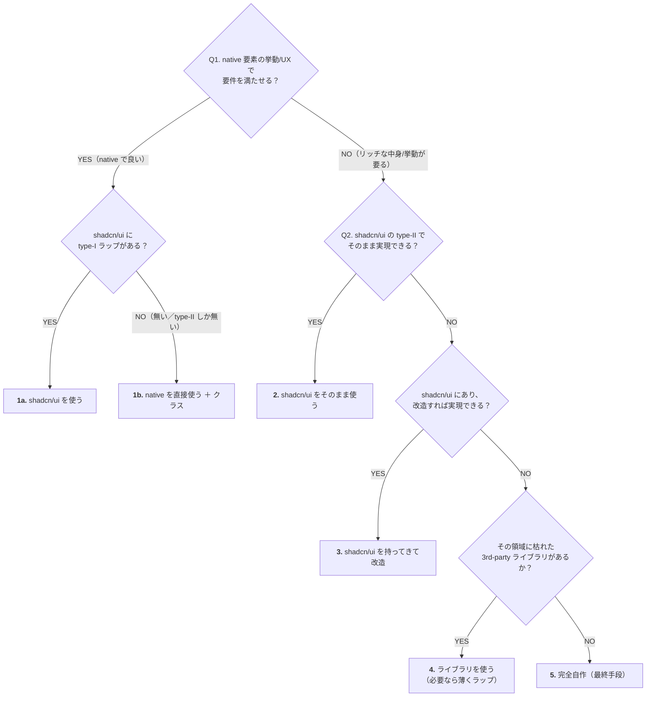
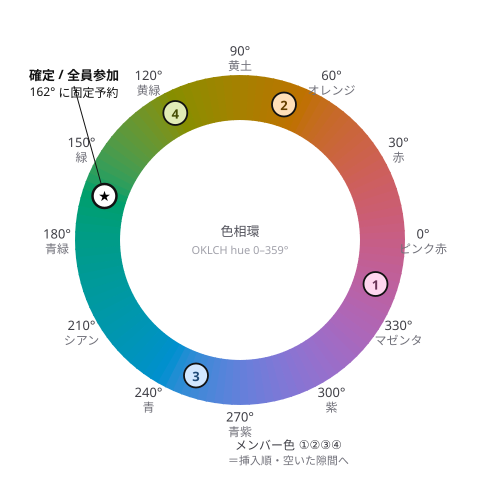

# UI ガイドライン

triplot の UI 規約（テーマ・アイコン・ボタン配色・コピー・インタラクション）。新しい UI を足すときはこれに従う。
（"design" は設計の意味と紛れるので、見た目＋インタラクションの規約はこの名前。システム設計は
[`architecture.md`](./architecture.md)。）
このファイルは `CLAUDE.md` から `@` で読み込まれる（AI エージェントも人も同じ単一の真実を見る）。

スタイリングは **Tailwind CSS v4（utility-first）**。見た目は基本 utility クラス（`className`）で書き、
値は下記の token（余白・サイズ・色）に従う。スタックとしての記載は `CLAUDE.md` の技術スタックにもある。

## このガイドラインとの付き合い方

ここに書いてあることは絶対ではない。**書いた時点の判断であって、正しいとは限らない。**
合わない場面に出会ったときの原則は次のとおり:

1. **まずルール側を疑う。** 「この場面だけ外す」より先に、ルールの書き方が悪い（想定が
   狭い・言い切りすぎ・機構だけ書いて意図を書いていない）可能性を考える。
2. **直せるならルールを直し、従っている状態に戻す。** 例外を1つ足すより、ルールを
   その場面まで含む形に書き直す方が、次に同じ場面が来たときに迷わない。
3. **例外は極力増やさない。** 例外が増えるほどルールは参照されなくなり、結局
   「その都度考える」に戻ってしまう。
4. それでも例外が要るときは、**なぜ外したかをコードのコメントに一言残す**（後から
   見て「揃え忘れ」と区別が付くように）。プラットフォーム間で意図的に揃えないものは
   [design/platform-parity.md](./design/platform-parity.md) に理由ごと集約する。

ルールを直すときは、**意図（何を守りたいか）を先に書き、機構（どう実現するか）は
その下に置く**。機構だけが書いてあると、機構が使えない場面（例: 文言を持たない
アイコンボタン）でルール全体が効かなくなる。

## web とネイティブ（RN）のデザイン整合

ネイティブアプリ（`apps/mobile`）の見た目の決め方。優先順位は2段:

1. **プラットフォームの流儀があるものはそちらを優先**（HIG・OS 標準部品・世の中の iOS アプリの慣行）。
   例: ナビバー/タブバー/日付ピッカー/Alert/共有シートは OS 部品のまま、アプリ名はルート画面の
   ラージタイトルだけ（常時ワードマークは出さない）、一覧への追加は右下 FAB、破壊的確認は
   ActionSheet/Alert、言語・ダークモードは OS 設定に追従（アプリ内に設定を置かない）。
   **少数の排他選択（公開範囲・ステータス等）は RN ではセグメント**（`CompactSegment`/
   `VisibilitySegment`）— ラジオボタンは web の部品で iOS 標準には存在しないため
   （web は native radio のまま＝各プラットフォームの流儀）。
2. **流儀のない自由領域は web と同値・同形に揃える**。実装前に必ず web 側の該当実装
   （クラス・トークン・形）を見てから書く。例: 地図マーカーの形と色、フォーム部品の配色、
   placeholder 文言、アイコン（同じ Lucide / Material Symbols パス）、セマンティック色とその
   ダーク写像。

意図的に片側だけに置いているものは [design/platform-parity.md](./design/platform-parity.md)
に理由ごとまとめてある（そこに無い差分は揃え忘れとして扱う）。

- **色は web トークンと同値の焼き込み値**で書く。単一の真実は `globals.css`、RN 側の対応表は
  `apps/mobile/src/lib/theme.ts`（oklch を sRGB に変換した不透明値）。テキスト/アイコンの中間色を
  `rgba` で書かない — SVG の複数パスが重なる箇所で透明度が二重にかかり黒ずむ。ボーダー・hover 面
  だけは web と同じ「前景色の α 重ね」（`theme.fgAlpha`）。
- ダークモードは `useColorScheme` によるトークン切替（`useTheme`/`useThemedStyles`）。値は
  `.dark {}` と同値。地図はダーク時に夜間スタイル＋マーカーのダーク写像（web の place-map と同じ）。

### RN のシート（ボトムシート）は必ず OS ネイティブのものを使う

**ネイティブアプリのシートは JS で描いた疑似シートを使わず、必ず iOS 標準（UIKit）の
シートを使う。** これは上の「1. プラットフォームの流儀があるものはそちらを優先」の具体形で、
web の `vaul`（DOM で描くボトムシート）を RN に持ち込まない、という意味でもある
（Discord 流＝DOM↔native は越えない）。ネイティブのシートでないと、摺りガラスの質感・
グラバー・detent の吸い付き・キーボード回避・スクロールの手触りが OS 標準からずれ、
画面ごとに手触りが食い違う（実機フィードバックで繰り返し指摘された）。

使う API は2つ。**新しく足すときは原則1番**:

| | 使う場面 |
|---|---|
| **1. react-native-screens の formSheet**（ルートなら `presentation: "formSheet"`、画面内なら `ScreenStack` + `ScreenStackItem` の `stackPresentation="formSheet"`） | 原則こちら。多段 detent（`sheetAllowedDetents`）・グラバー（`sheetGrabberVisible`）を宣言で持てる。タブ画面の中から出すシート（場所タブ・TODO タブ）も `ScreenStack` を入れ子にしてこれを使う |
| **2. RN core の `<Modal presentationStyle="pageSheet">`** | **既に formSheet として開いている画面の中からさらに開くピッカー**だけ（通貨選択・コピー元選択）。これも UIKit の PageSheet を使う実物のネイティブシートだが、formSheet の中にさらに `ScreenStack` を入れ子にすると元の画面と二重露光のように重なる実機不具合があるため、この場面に限ってこちらを使う。**グラバーと見出しの見た目は 1 に揃える必要があるので、器は `PageSheet`（`components/page-sheet.tsx`）に集約**する（各所で書くと片方だけずれる。実際コピー元選択だけグラバーが無く見出しも左寄せになっていた）。この API は detent を持てないので**高さは常に PageSheet 既定**（中身が短くても縮まない）＝ 1 が使えるなら必ず 1 を使う |

**JS 実装のシートライブラリ（`@gorhom/bottom-sheet` 等）は使わない。**
以前は併用していたが 2026-08 に全廃し、依存関係からも削除済み。復活させない。

#### シートのルートは原則いちばん外側に置く

シートは**属したスタックの内側からしか開けない**。旅行のシート（旅行を編集・費用カテゴリ
管理・エクスポート・カレンダーエクスポート）は旅行詳細の入れ子スタックではなく、取り込み・
アカウント設定と同じ**ルート階層のルート**に置き、対象の旅行は `?tripId=` で渡す
（`useTripIdParam`）。

以前これらは入れ子にあり、旅行詳細のヘッダーの歯車からしか開けなかった。アカウントの
シート（ルート階層）から開こうとすると、シートとして重ならず旅行詳細ごと新しい画面が
積まれる。「閉じてから開く」も、閉じ終わる前に開く指示が捨てられて何も起きない
（`InteractionManager`・`dismissTo`＋push・フォーカス復帰での受け渡し、いずれも実機で不発。
外側のシートは下の画面を非アクティブにしないので「フォーカスが戻った」合図自体が出ない）。

**内側に置いてよいのは、開く画面の状態と不可分なシートだけ**（場所タブの場所フォーム・
TODO の優先度ピッカー。ルート遷移すると地図のカメラ位置やスクロール位置が失われる）。

一般には「できるだけ内側に閉じ込める」方が良い設計だが、**オーバーレイだけは逆**。
シートは「今いる文脈の上に被せる」もので性質からして最上位の関心事であり、React Navigation
の公式ドキュメントもモーダルをルートのスタックに置く構成を勧めている（iOS の UIKit に至っては
どの画面からでもモーダルを出せて、この制約自体が無い）。決め手は非対称性で、内側に置いて
得られるもの（スコープ・引数）は外側でもパラメータとガードで安く再現できるのに対し、
外側から開ける性質は内側に置いた時点で手に入れる方法が無くなる。

## テーマ・コピー

- **ダークモードは実装済み**（Light / Dark / System の3択。`NEXT_THEME` cookie → `<html class="dark">` → `globals.css` の `.dark {}` トークン反転）。テーマトークン（`bg-background`・`text-foreground`・`bg-primary` 等）と前景色の α 重ね（hover/ボーダー）で書いた色は自動追従するので `dark:` variant は不要。**セマンティック色（amber/red/blue の面・文字）だけはトークン外**なので、「セマンティック色」節のダーク写像に従い `dark:` を併記する。
- アプリ内コピーは日本語、コメントは日英混在 — 周囲のファイルに合わせる。
- **画面に応じて見た目を変えるときは「何を本質的に切り替えたいか」を見極め、それを決める軸で判定する**。
  脊髄反射で幅やタッチを使い分けず、その表示を本質的に左右している軸を選ぶ:
  - **使える幅で決まること**（要素が画面に対して大きすぎる等）→ **ビューポート幅**で判定。
    **ルール: 一定幅以上の入力フォームは、狭い画面ではボトムシート（web は `vaul`。RN は OS ネイティブのシート）、広い画面ではタップ位置のポップアップ**
    （`FormPopover` の `fullScreenOnNarrow`）。**全画面表示は使わない**＝文脈（元画面＝どこから開いたか）が消えるため。
    ボトムシートは下からせり上がり・ドラッグで閉じ・上に元画面が薄暗く残る（Google マップ等と同じ世の中標準）。
    Base UI にシート部品が無いので vaul を使う（shadcn の Drawer も中身は vaul。直に使う理由は下の「ライブラリを使う」段）。
    要素が自分の入れ物の幅で決まるならコンテナクエリの方が正確。
    - **閾値はマジックナンバーにせず、対象の幅から導く**。例: ポップアップ時のフォームは 352px(`w-[22rem]`)で、
      余白付きで“浮いてるカード”に見える下限が ~640px → それ未満でボトムシート。**フォーム幅を変えたら閾値も見直す**。
    - **同じ大きさの部品は同じ閾値**でよい（現状の入力フォームは全部 352px なので 640px 共通）。幅が違う部品が出たらその幅で導く。
  - **入力モダリティで決まること**（タッチかマウスか）→ **`pointer` クエリ**。
    例: iOS のフォーカス時ズーム防止（16px 強制）は touch ブラウザ固有の挙動なので `any-pointer: coarse` で判定する（幅は無関係）。
  - 段組み程度の幅変化は `flex-wrap` で吸収できることも多い（その場合はメディアクエリ自体が要らない）。

## テキスト入力のラベルと placeholder

**テキスト入力はラベルを置かず、placeholder＝フィールド名**にする（iOS 標準カレンダーの
追加フォームと同じ。「タイトル」「場所」「メモ」…）。ラベル行が無いぶんフォームの縦が詰まる。
web / RN 共通の規約。

- 可視ラベルが無いので、**web は `aria-label`、RN は `accessibilityLabel`** を placeholder と
  同じ文言で必ず付ける（読み上げのアクセシブル名）。
- **必須は `*` でなく「必須が埋まるまで送信ボタンを無効化」で表現**する（iOS 方式。
  `FieldLabel required` の赤 `*` はテキスト入力には使わない）。
- **ラベル（`FieldLabel`）を使うのは placeholder を持てない非テキストコントロールだけ**
  （select・radio・switch・日付/時刻チップ・タイムゾーン等）。値だけで自明なもの
  （通貨セレクトの `JPY` 等）はラベル無しでよい（`aria-label` は付ける）。

例外（placeholder がフィールド名でないもの）:

| フィールド | placeholder | 理由 |
|---|---|---|
| 為替レート | 同旅行の平均レート、無ければ `例: 150`（ラベルも残す） | 入力形式が自明でない |
| フィードバック本文 | `地図でピンが動かせない`（不具合）/ `費用をCSVでエクスポートしたい`（要望）（ラベルも残す） | 例文が「何を書くか」のガイドを兼ねる |
| 招待参加の表示名 | `ゲスト`（ラベルも残す） | 「この旅行内での名前」の説明が要る＋実質のデフォルト値の提示 |
| 旅行作成の表示名 | ラベル「あなたの表示名（旅行内）」を残す | 同上 |
| 新規カレンダー名（エクスポート） | `triplot_<旅行名>` | 空のとき実際に使われる値 |
| 場所の検索窓 | `場所を検索` | フィールドでなく機能の名前 |
| 日程（`DateRangePopover`） | 空文字 | 具体的な日付例は入力済みデータに見える |

## アイコンの 2 ファミリー

役割で使い分け。混ぜない:

| 用途 | ファミリー | ファイル | 形 |
|---|---|---|---|
| **操作系**（保存・追加・削除・編集・閉じる…） | Lucide line（ISC） | `components/icons.tsx` | viewBox `0 0 24 24` / 線画 stroke |
| **ナビゲーション**（タブバー・ヘッダーの行き先） | Lucide line（ISC） | `components/icons.tsx` | 同上。操作系と同じ中立な線画。iOS でも SF Symbols 等の塗りグリフに置き換えず同じ Lucide パスを RN 側で描き、web/iOS で見た目を統一する |
| **場所カテゴリ**（ピンの形） | Material Symbols Rounded FILL | `lib/placeIcons.ts` → `components/place-list.tsx` の `PlaceIcon` | viewBox `0 -960 960 960` / 塗り |
| **費用カテゴリ** | Material Symbols Rounded FILL | `components/expense-category-icon.tsx` | 同上 |

理由: 操作系は中立な線画で「動作を表す」、カテゴリ系は Google Maps の POI と概念を揃えるため Material Symbols（塗り）。新規アイコンを足すときも上の表に従う。SVG は web フォントを使わずパスを inline 埋め込み（依存ゼロ・FOUT 無し）。MS パスの取得は `https://fonts.gstatic.com/s/i/short-term/release/materialsymbolsrounded/{name}/fill1/24px.svg`、Lucide は `https://unpkg.com/lucide-static/icons/{name}.svg` から拾える。

**操作系アイコンは必ず `components/icons.tsx` に置く**（コンポーネント内でインライン SVG を手書きしない）。例: ⋯ メニューは `EllipsisIcon`（Lucide more-horizontal）。

### 地図・Google 連携まわりのビジュアルは Google に合わせる

地図上のマーカーや Google 由来のデータ表示は、Google マップの見た目に寄せる（**Material Symbols 塗り＋必要なら Google ブランド色**）。Lucide 操作アイコンとは別系統で、ここを Lucide の線画に置き換えると Google の塗り表現から浮くので**しない**:

- **評価★**（`place-popups` の Google 評価表示）= Material Symbols `star`（塗り、amber）。Google の星表示と揃える。
- **地図ピン**（`place-map` の `RedPin`＝ドラッグ仮ピン／検索候補ピン）= Material Symbols `location_on` 形を Google 純正マーカー色（赤 `#EA4335`・白縁・影）で描き、ベースマップに溶け込ませる。

これらは「例外」ではなく**この原則に従った正規の実装**。新しく地図/Google 連携のビジュアルを足す時もこの方針に従う。

### OAuth ログインボタン（Google/Apple）はニュートラル配色統一＋ロゴのみブランド

`OAuthSignInButton`（`components/oauth-sign-in-button.tsx`）は triplot の共通 `<Button>` を使わず、
native `<button>` を直接使う。配色は Google/Apple で分けず、**全プロバイダ共通のニュートラルな
枠線ボタン**に統一する（Strava・AllTrails 等の実例と同じ方針。ブランドごとに黒/白を反転させると
むしろ「ダークモードなのに白いボタンが浮く」ような違和感が出るため、triplot 自身のトーンを優先し
ロゴだけでブランドを示す）。

- 配色は元 Google のブランドガイドライン値をニュートラルトーンとして両プロバイダに流用:
  白地/黒文字＋`#747775`枠（ダークは`#131314`地/`#E3E3E3`文字＋`#8E918F`枠）。`dark:` variant で
  切替、JS判定不要。
- ロゴは `components/oauth-brand-icons.tsx`（`AppleGlyph`/`GoogleGlyph`）。Google の "G" は4色固定で
  ボタン地にそのまま直接置く（白いチップ等で個別に囲まない＝ Google 公式のダークテーマボタン
  例示・主要アプリ実例と同じ）。Apple は単色シルエットで `currentColor` 任せにし、ボタンの
  文字色に自動追従させる。
- 角丸は Apple 側が「自分の UI の他のボタンに合わせてよい」としているため、triplot 標準の
  `rounded-md` をそのまま使う（Apple 独自の角丸値は導入しない）。
- フォントは Google 指定の Google Sans を新規導入せず、triplot 標準フォント + `font-medium` で近似する。
- **ネイティブ（RN）も同じカスタムボタンにする**。iOS の Apple 公式ボタン部品
  （`AppleAuthenticationButton`）は白/黒/白枠の固定スタイルしか選べずダークで白地固定になり web と
  ずれるので**使わない**。Apple のガイドラインはガイドライン準拠のカスタムボタンを許容しており
  （Strava 等の実例と同じ）、`sign-in.tsx` で Google と共通の枠線ボタン＋`AppleGlyph`（文字色追従）に
  する。サインインのロジック（`signInAsync`）はボタン部品とは独立なので影響しない。

### アイコンのサイズ — 置かれる文脈で決まる

サイズは「離散的な数段」に絞り、半端値を散らさない。決め方は**何の隣に置くか**で3系統:

| 文脈 | サイズの決め方 | 例 |
|---|---|---|
| **行内**（文字の隣） | 離散スケール **{12, 16, 18, 20, 24}** の中で、**隣接テキスト以上で最小の段**を選ぶ（＝アイコンはテキストと同等〜やや大きい。比例ではなく段階的）。`text-sm`(14)→16 / `text-xs`(12)・`text-[11px]` 等の小さい行→12 / 見出しの隣（現状そういう箇所は無い）→上の段(text-lg→20 目安) | text-sm の行・戻りリンク → 16 / 場所名や凡例の text-xs〜`text-[11px]` → 12 |
| **ボタン内** | ボタンの大きさに合わせる | 密なボタン（×閉じる `h-6`・リスト内）→ 16 / 標準 `h-9` → 18 / 主送信（Primary）→ 20 |
| **徽章**（アバター等に重なる丸の中身） | 丸に対しバランスの良い**偶数**（丸の 55〜65%） | 14px 丸の管理者王冠 → 10 / 20px 丸の編集鉛筆 → 10（丸自体に `borderWidth` の縁取りがあり、55〜65%の目安だけで決めると縁取り込みの実効面積に対して詰まって見える。実機フィードバックで 12→10 に修正） |

- ヘッダーナビ・下部タブバーのアイコンだけ 24（例外）。
- `13` `15` `22` のような半端値は作らない。行内なら隣接文字へ、ボタンなら 16/18/20 へ寄せる。
- **ドロップダウンの選択チェック（末尾）は 16**（shadcn/ui の `h-4 w-4` と同じ。本文 14 でもチェックは 16）。
  同じ行の先頭グリフ（優先度・カテゴリ等）も 16 で揃え、行内の2アイコンを同寸にする。
- **status グリフ（優先度アイコン等、それ自体が状態を表す固定アイコン）はトリガ／ドロップダウンで
  サイズを変えない**（開いた瞬間に縮まない）。PriorityIcon は両所で 16。

## 文言は極力アイコンに寄せる（ローカライズ準備）

説明や操作の文言は、この優先順位で上から検討する:

1. **書かない**（無くても伝わるなら書かない）
2. **アイコンのみ**（動作を表すボタンはアイコン＋`aria-label`/`title`）
3. **短くシンプルに**
4. **長くなるなら `?` ツールチップ**を使えないか考える（[[help-tip]]）

将来の i18n コストを下げるためでもある。テキストラベルは「アイコンだけで意味が確実に伝わらない」場合だけ。例:

- 保存／追加／作成／編集／削除／閉じる／検索 → アイコン
- 「キャンセル」など他に表しようの無いものは現状テキスト可（必要なら後で見直し）
- アクセシビリティ用に `aria-label` + ホバー用に `title` は必ず付ける（読み上げ・hover ツールチップが文言の代わり）

## 部品の作り方：何を使うか（5択を上から）

このプロジェクトは **shadcn/ui プロジェクト**（`components.json` あり・style `base-nova`＝Base UI 製）。
UI 部品が要るときは下のフローで**上から**選ぶ。**「shadcn/ui の見た目を手書きで真似る」はこのフローに無い＝アンチパターン**
（shadcn/ui にあるなら shadcn/ui を使う。手書き再現は a11y を落とすだけ）。

**前提 — shadcn/ui の部品は2タイプ:**

- **type-I＝native 要素にクラスを着せただけ**（Button=`<button>`・Input=`<input>`・Textarea・Label・Badge…）。中身は native そのもの。
- **type-II＝native を捨てて Base UI で作り直したもの**（Select・DropdownMenu・Dialog・Popover・Combobox・Tabs・**Checkbox**・Switch…）。
  見た目の自由と引き換えに、a11y・キーボード操作・フォーカス管理・はみ出し位置決めを**自前で持つ**（native のモバイル UI〔OS ピッカー等〕は失う）。
- **見分け方**: `components/ui/*` の実装が `<button>`/`<input>` を直接返す＝type-I、`@base-ui/react/...` を import＝type-II。

**フロー（上から順に検討。上で済むなら上を採る）:**


```mermaid
flowchart TD
  Q1{"Q1. native 要素の挙動/UX で<br/>要件を満たせる？"}
  Q1 -->|"YES（native で良い）"| Q1a{"shadcn/ui に<br/>type-I ラップがある？"}
  Q1 -->|"NO（リッチな中身/挙動が要る）"| Q2{"Q2. shadcn/ui の type-II で<br/>そのまま実現できる？"}

  Q1a -->|YES| R1a["<b>1a.</b> shadcn/ui を使う"]
  Q1a -->|"NO（無い／type-II しか無い）"| R1b["<b>1b.</b> native を直接使う ＋ クラス"]

  Q2 -->|YES| R2["<b>2.</b> shadcn/ui をそのまま使う"]
  Q2 -->|NO| Q3{"shadcn/ui にあり、<br/>改造すれば実現できる？"}

  Q3 -->|YES| R3["<b>3.</b> shadcn/ui を持ってきて改造"]
  Q3 -->|NO| Q4{"その領域に枯れた<br/>3rd-party ライブラリがあるか？"}

  Q4 -->|YES| R4["<b>4.</b> ライブラリを使う<br/>（必要なら薄くラップ）"]
  Q4 -->|NO| R5["<b>5.</b> 完全自作（最終手段）"]
```

各ステップの勘所（チャートに載せきれない注記）:

- **1a**: 中身は native なので何も失わない。
- **1b**: type-II を取ると native のモバイル UI を無駄に失うので取らない。
- **2**: a11y もタダで付く。
- **3**: source は自分の物なので改変可。
- **4**: ゼロから作らない（カレンダー・地図・チャート・リッチエディタ等）。
- **5**: native も shadcn/ui もライブラリも無い、このアプリ固有のもの。

**順序の理由:** 下へ行くほど「自分で書く量」と「**a11y を落とすリスク**」が増える。だから native → shadcn/ui → shadcn/ui 改造 → ライブラリ → 自作 の順。

**一意に落とす2つのゲート:** ① native の挙動で足りるか（Q1） ② shadcn/ui そのままで欲しい中身を出せるか（Q2）。この2問で枝が決まる。

**このアプリでの当てはめ:**

- type-I → 必ず使う: ボタン `<Button>`、テキスト入力 `<Input>`（`components/ui/input.tsx`＝native `<input>`＋`inputClass`）。
- 1b: プレーンな選択は native `<select>`（通貨・支払者・旅行・ステータス）、checkbox/radio も native、開閉（折りたたみ＝TODO セクション・割り勘対象 全員/custom・参加者 custom）は native `<button aria-expanded>` ＋ 条件レンダー。
  ※ Base UI Collapsible/Accordion は **type-II**（`<button>`＋`<div>` で再構築＝native `<details>` のラッパーではない）。native で足りるので 1a ではなく 1b＝native を直接使う。
- 2（shadcn/ui/Base UI）: メニュー＝Base UI Menu（⋯/アカウント）、ダイアログ＝Base UI Dialog（確認・場所アイコン）、
  リッチな選択＝Base UI Select（費用カテゴリ・TODO 優先度）、フォーム popover＝Base UI Popover、
  オートコンプリート＝Base UI Combobox（`place-picker`/`place-search`）、`?` ヒント＝Base UI Popover の
  `openOnHover`（`HelpTip`）＝ホバー（PC）でもタップ（モバイル）でも開く。Tooltip はタップで開かないので使わない。
- 4（ライブラリ）: 日付＝`react-day-picker`（Base UI Popover 内）、地図＝Google Maps、
  **狭い画面のフォームのボトムシート＝`vaul` を直接使う**（**web 限定**。RN 側は OS ネイティブの
  シートを使う → [[RN のシート（ボトムシート）は必ず OS ネイティブのものを使う]]）。Base UI に
  シート部品が無いため。
  なお **shadcn の Drawer も中身はこの vaul** だが、そのラッパーは modal＋専用 Overlay 前提で、
  我々の要件＝`modal=false`（フォーム内のポータル popover を生かす）・自前 dim（閉じアニメを切らさない）・
  PC ポップオーバー/モバイルシートの 1 コンポーネント切替 と衝突する。なのでラッパーは噛まさず vaul を
  直に使う（部品フローの step3/4＝ラッパーが合わないのでライブラリ直）。`form-popover.tsx` の
  `NarrowSheet` 1 か所に隔離されている。
- 5（完全自作）: 週カレンダー・地図上の独自描画・色相ホイール。
- **逸脱なし（過去の逸脱は解消済み）:** 場所入力のオートコンプリート（`place-picker`/`place-search`）は
  **Base UI Combobox**（step2）に移行済み。殻（候補リスト・開閉・キーボード・はみ出し位置決め・a11y）は
  Combobox に委ね、「保存済み/Google/自由入力」の解決や Google 非同期取得・hidden input 導出だけ自前で持つ。
  ⋯/アカウントメニュー・確認ダイアログ・`CategorySelect`・種別セレクタも Base UI 化・native radio 化で解消済み。

## ボタンの配色

**ボタンは共通の `<Button>` コンポーネント**（`components/ui/button.tsx`）を使う。手書きの `<button className="...">` で
ボタン1個ずつスタイルしない。`variant` で役割を、`size` で大きさを選ぶ:

- `variant`: **`primary`**（黒塗り・送信/追加/保存）／**`destructive`**（赤枠・削除）／**`outline`**（白枠・キャンセル/コピー）／**`ghost`**（枠なし・ツールバー/トグルのアイコン）
- `size`: `default`(h-9 テキスト) / `sm`(h-8) / `icon`(h-9 w-9) / `iconSm`(h-8 w-8) / `iconDense`(h-7 w-7)
- 幅・位置（`w-full`/`flex-1`/`shrink-0`/`rounded-full` 等）は `className` で渡す。角丸は rounded-md（入力欄と揃う）、**フォーカスは `focus-visible:ring`**（キーボード操作時のリング＝a11y）を Button が担保する。
- **× 閉じるボタンは `<CloseButton>`**（`components/close-button.tsx`、subtle 色・rounded-full の独自レシピ。`label`/`iconSize`/`className`/`type` を渡せる）。

**`<Button>` を使う／使わないの境界**（混在は分断ではなく、UIパターンの違い）:

| これは `<Button>` | これは `<Button>` ではない（別パターン） |
|---|---|
| 押すと動作する「ボタンの見た目」の操作子（送信・削除・キャンセル・コピー・追加起動・ツールバー/トグルのアイコン） | メニュー/ドロップダウンの行 → `menuItemClass` |
| × 閉じる/破棄 → `<CloseButton>` | セグメント選択 → セグメントトラック ／ 入力風トリガ → `inputClass` |
| | **クリックできる「領域・タイル・行」**（カレンダーの予定タイル・リスト行・地図マーカー・「全員▼」等の開閉トグル）。これらは `<button>` 要素でも「ボタンの見た目」を持たないので Button にしない |

判断: 「**枠/塗りのある“ボタン”として見せたい**」なら `<Button>`。「クリックできる中身（行・タイル・トグル）」なら各パターンのまま。

下表は variant の意味（役割）の定義。色は Button が実装する:

| 役割 | 色 | 例 |
|---|---|---|
| **Primary**（その UI の主目的を**完了/送信**する1動作） | **`bg-primary text-primary-foreground`**（hover `bg-primary/90`） | 保存 / 追加 / 作成 / 確定 / 検索（送信） |
| **選択・アクティブ**（選択中のタブ/チップ/チェック等） | Primary と同じ `bg-primary text-primary-foreground`（枠は `border-primary`）。柔らかくしたい時は `bg-secondary`/`bg-muted` | 選択中セグメント / オンのトグル / 完了チェック |
| **Destructive**（破壊的・取り消せない） | 赤枠 (`border-red-600/20 text-red-600`)、サイズは小さめキープ | 削除・**ログアウト**（元に戻せる操作だが、世の中一般のアプリの慣例に合わせて例外的に赤にする） |
| **Neutral / Navigate**（補助・移動・取得） | 白枠 or 透明 | **コピー / エクスポート** / × 閉じる / キャンセル / 鉛筆だけの "編集を始める" 系（タブ的） |

- **Primary は「そのUIを開いた主目的を完了/送信する1動作」だけ**。状態を変えない補助操作（**クリップボードへのコピー・エクスポート**）は、たとえそのUIで一番目立っても **Neutral**。
  - 例：**共有リンクのコピーも取り込みアドレスのコピーも Neutral（白）で揃える**（同じ「コピー」を文脈で黒/白と変えない）。Primary は保存・追加・確定など“進める”動作に限る。
- **色はベタ値でなくテーマトークンで書く**：`bg-primary` / `text-primary-foreground` 等（`globals.css` の `--primary` ＋ `.dark`）。これらは**ライトで黒・ダークで自動反転**するので、近く対応するダークモードがそのまま効く。**新規に `bg-black` / `text-white` をベタ書きしない**（選択/アクティブも、暗い浮遊チップ＝トースト・ツールチップ〔HelpTip〕も同じく primary トークン＝`bg-primary text-primary-foreground`）。例外で `text-white` が要るのは、動的な彩度の高い地色（メンバー hue・地図マーカー・カテゴリ色）の上に乗せる文字だけ。

## 余白・サイズ（spacing & sizing）

基準は **4px グリッド**（Tailwind の数値がそのまま 4px 刻み: `1`=4px・`2`=8px・`3`=12px・`4`=16px…）。
値は de facto（4pxグリッド＋shadcn/ui 相当のコントロール寸法）に沿い、種類を絞る。**「迷ったらこの値」**。

| 区分 | 既定 | 補足 |
|---|---|---|
| **コントロール高さ** | `h-9`（36px） | ボタン・入力・セレクト。小さめは `h-8`（32px） |
| **テキストボタン** | `h-9 px-4 text-sm rounded-md` | 小: `h-8 px-3 text-xs`。配色は「ボタンの配色」節 |
| **アイコンボタン** | `h-9 w-9`、アイコンは 18–20px、密なリスト内のみ `h-7 w-7` 可 | 形は用途で決める → **`rounded-full`**＝単独アイコンの操作子（×閉じる・ナビ/ツールバー〔受信箱〕・トグル〔優先度・いいね〕・アバター。枠なし＋円形ホバー）／**`rounded-md`**＝フォーム/リストのアクション（送信・追加・削除・編集・検索。テキストコントロールと角丸を揃える） |
| **入力・セレクト** | 共通定数 **`inputClass`**（中身は `components/input-class.ts`。枠・bg・**固定高 `h-9`**・padding・text・focus を1ソース化） | レイアウト（`mt-1 block w-full`・`min-w-0`・`flex-1`・`pr-9` 等）は呼び出し側が足す。入力風トリガ（カスタムセレクト）も同じ（`flex items-center ${inputClass}`）。**手書きで枠・bg・focus を並べず必ず `inputClass` を使う**。iOS のフォーカス時ズーム防止は **globals.css がタッチ端末（`any-pointer: coarse`）で 16px を強制**するので入力は `text-sm` のままで可 |
| **入力の高さ** | `inputClass` が**固定 `h-9`（36px）を内包**＝全コントロール一律 36px | 以前は `py-2`（可変高）だったが、native `<input>` と `<select>` で実高さがズレる（select が低い）うえ iOS の 16px 強制フォントで膨らんで 36px から外れたため、**固定高に統一**。ボタンと横並びでも縦積みでも `inputClass` だけで高さが揃う（個別 `h-9` の付与は不要）。隣に置くボタンも `h-9`、コンパクト行のみ `h-8` で両者を合わせる |
| **角丸** | 小インライン `rounded`(4px) / コントロール・ドロップダウン `rounded-md`(6px) / カード・枠・ダイアログ・モーダル `rounded-lg`(8px) / 円形 `rounded-full` | `rounded`(4px) はバッジ・カレンダーブロック・小さいメッセージ箱。`rounded-2xl` 等は使わない |
| **gap（要素間）** | 既定 `gap-2`(8px) / ゆとり `gap-3`(12px) | `?` や補助要素があるとき `gap-3` |
| **ページコンテナ** | `mx-auto w-full max-w-2xl px-6 py-10` | AppHeader 配下の全ページ共通。情報量の多い旅行詳細のみ `max-w-3xl`、モーダルは `max-w-md` |
| **セクション縦積み** | `space-y-6` | ページ本文の上は `mt-10` 目安 |
| **文字** | コントロール・本文 `text-sm`(14px) / 補助・注記 `text-xs`(12px) | 下の「テキストサイズの階層」参照 |
| **フォームラベル** | `text-sm`（入力とペアの一級要素なので本文側） | shadcn/ui Label / Primer / Polaris と同じ 14px。`text-xs` は補助・注記専用 |
| **見出しの太さ** | `font-semibold` | 日本語システムフォント（游ゴシック等）はウェイト段階が粗く、500(medium) が 400 と同じ見えになる環境がある。600 は bold にマップされ確実に差が付く。`font-medium` は行内の強調（選択中・項目名）用 |
| **hover 背景** | `hover:bg-foreground/10` | **「その要素の前景色を 10% 重ねる」の1式のみ**（Material の state layer 方式）。半透明オーバーレイなので入れ子でも同じクラスで自動的に一段濃くなり（1段=10%・2段=約19%…）、ダークモードも foreground 反転で自動。色付きコントロール（いいね済み♥= `text-rose-500` 等）は自分の前景色で `hover:bg-rose-500/10`。`hover:bg-zinc-*` のベタ書きはしない |
| **選択中の行の背景** | `bg-accent` | hover（一時的なオーバーレイ）とは別の「状態」なのでベタ塗りトークン。shadcn/ui の accent と同じ |

**ボタンの幅**：

- **全幅 `w-full`** … 狭いコンテナ（ポップアップ／フォーム下部／モバイルのシート）の主動作。タップしやすく主役が明確。
- **内容幅（auto）** … ページ内の補助・インライン・横並びのボタン。
- **避ける**：内容幅のボタンを幅広の枠（カード）に1つだけ入れて右側が余る“中途半端”な形。全幅にするか枠を外す。

逸脱が要るときは個別に上書き可（なぜ外したかをコメントで一言）。将来、共有の `Button`/`Input`
コンポーネントに寄せて強制してもよい（今は utility クラスで上記値を使う運用）。

## テキストサイズの階層

Tailwind の標準スケールに乗る。**`text-[Npx]` の任意指定は、容器に物理的に収める時か高密度グリッドだけ**
（一般の「少し小さい注記」に使わない＝12/11/10 と1px刻みの段を増やさない）。

| 用途 | サイズ |
|---|---|
| LP ヒーロー | `text-4xl`(36) |
| ページ見出し h1（取り込み・設定・メンバー・旅行名…） | `text-2xl`(24) |
| セクション見出し h2・合計の強調・ワードマーク | `text-lg`(18) |
| 本文・コントロール・フォームラベル | `text-sm`(14) |
| 補助・注記・副情報 | `text-xs`(12) |

**このスケールは iOS でも同じ数字を使う**（RN 側は px 値を直接書く）。Apple は HIG で
text style ごとの既定サイズ（Body 17 / Subhead 15 / Footnote 13 / Caption 12・11 等）を
示しているが、そちらは採らない。理由:

- Apple の値は Dynamic Type の**既定値**であって強制ではない（審査対象でもない）。
  Apple 自身、タブバーのラベルに 10pt を使っていて、公開しているスケールの外に出ている。
- 本文 17pt に合わせると、週カレンダー・費用一覧のような情報密度の高い画面が破綻する。
- Apple が実際に求めているのは数字より **Dynamic Type への追従**で、これは RN の
  `<Text>` が既定（`allowFontScaling`）で満たしている。

**例外はナビゲーションバー**（旅行詳細の2行タイトル 17/11、旅行一覧のラージタイトル）。
OS が描く戻るボタンやラージタイトルの隣に並ぶので、iOS の値に合わせる
（「プラットフォームの流儀があるものはそちらを優先」）。

- 見出しの太さは `font-semibold`（「余白・サイズ」節）。`text-xl`(20) は見出し段としては使わない。
- **`text-xs`(12) より小さくしてよいのは2ケースだけ**:
  1. **容器に収める**: アバター頭文字(18px丸→10px)、HelpTip の `?`(16px丸→10px)、バッジ件数(15px丸→9px)
  2. **高密度グリッド**: 週カレンダー。予定タイトルは標準の `text-xs`(12)、時刻・軸ラベル等の副情報のみ
     `text-[10px]`（Tripit 風の密な時間表での「タイトル/時刻」2段。副情報は色・濃さ・等幅でも区別）
- 開閉インジケータ等は文字記号（`▼▲`）でなく ChevronIcon を使う（「アイコンの2ファミリー」節）。

## テキスト色の階層

3段階。Material Design の 87/60/38% 濃度を出発点に、shadcn/ui のセマンティックトークンで
実装する。**`text-zinc-*` の直書きは禁止**。必ず以下のトークンを使う。

| トークン | 役割の濃さ | 用途 |
|---|---|---|
| `text-foreground` | 高（87%相当） | 主要テキスト（本文・見出し・入力済み値・**フォームのフィールドラベル**） |
| `text-muted-foreground` | 中（60%相当） | 補助テキスト（ノート・副情報・メタのラベル〔「メールの転送先」等〕）・非活性/非選択のアイコンや文字 |
| `text-subtle-foreground` | 低（38%相当） | プレースホルダ・最も控えめな非活性表示 |

- **「ラベル」の取り違えに注意**: フォームのフィールドラベル（非テキストコントロールの太字ラベル＝
  公開範囲・カテゴリ・日付…。テキスト入力はラベルを置かない→[[テキスト入力のラベルと placeholder]]）は
  **高濃度（`font-medium`、色指定なし）**。shadcn/ui の `Label` と同じで、入力値と同格の主要素。
  中濃度(muted) にするのは「メールの転送先」「今月の取り込み」のような**注記・メタのラベル**だけ。

`globals.css` の CSS 変数で一元管理しているので、値を変えれば全箇所に即反映する。
ライト/ダークとも `:root {}` / `.dark {}` を1箇所書き換えるだけ。

**実際の値は Material Design の 87/60/38% を単純に適用しない**。特に `muted-foreground`
（タブバーの非選択アイコン・ToggleChip の非選択文字など「非活性/非選択」を示す主役トークン）
は、前景とのコントラストが弱いと活性/非活性の区別がつかない（実機フィードバックでライト・
ダーク両方とも発生）。ライトは前景が暗い（黒に近い）ので muted を明るく（白に近く）、
ダークは前景が明るい（白に近い）ので muted を暗く（黒に近く）——**前景から離す方向は
モードで逆になる**点に注意。実測コントラスト比（WCAG、対前景）:

| トークン | ライト（旧→現在） | ダーク（旧→現在） |
|---|---|---|
| `muted-foreground` | `oklch(0.510)` 2.80:1 → `oklch(0.60)` `#808080` 4.08:1 | `oklch(0.708)` 2.48:1 → `oklch(0.55)` `#717171` 4.65:1 |
| `subtle-foreground` | `oklch(0.699)` 6.00:1（変更なし） | `oklch(0.708)` ＝ muted と同値で無区別 → `oklch(0.38)` `#424242` 9.59:1 |

ダークは旧値が muted と subtle が同値（区別不能）という別のバグも抱えていたため、
2トークンとも見直した。ライトは元から2トークンが分かれていたので muted だけ調整。
新しい非活性表現を追加するときも、この2トークン以外に別の薄さを作らない。

**命名について:** `muted-foreground` は shadcn/ui の命名規則で「補助テキスト兼プレースホルダ」の意。
語源（muted = 抑えた）よりも shadcn/ui の実際の用法に従い、補助テキストに使う。
`subtle-foreground` はプレースホルダ・非活性アイコン専用の 38%（Material Design disabled/hint）。
補助テキスト（60%）とセマンティックを分けることで独立して変更できる。

## ボーダー色（前景色の α 階段）

hover と同じ「**自分の前景色の α 重ね**」で表す。`border-zinc-*` のベタ書きはしない:

| α | 用途 |
|---|---|
| `border-foreground/5` | 最弱の補助線（カレンダーの時間グリッド線・メニュー内の区切り） |
| `border-foreground/10` | 区切り線・カード枠・リストの仕切り。チップの輪郭 `ring-foreground/10`、リスト行の仕切り `divide-y divide-foreground/10` も同段（`divide-zinc-*` は使わない） |
| `border-foreground/20` | コントロール枠（input・select・ボタン枠） |
| `hover:border-foreground/40` | 枠の hover 強調（カード・破線ボタン） |
| `focus:border-primary` | focus は「意味色」なので α 階段の外（全コントロール共通） |

- 半透明なので色付きの面の上でも区切りが見え、ダークモードは foreground 反転で自動（shadcn/ui の
  ダークボーダー `oklch(1 0 0 / 10%)` と同じ手法）。
- **色付きコントロールの枠も同じ式**: 前景色から `枠 = /20`・`hover 背景 = /10` を導出する。
  例: 削除ボタン = `text-red-600 border-red-600/20 hover:bg-red-600/10`（red-600 ひとつから全部決まる）。

## セマンティック色（意味 → 色の対応）

世の中の semantic color 慣例（error=red / warning=amber / info=blue / success=green）に沿って、
**「この意味はこの色」** で決める（「この色はここで使ってよい」という色側のリストにはしない）:

| 意味 | 色・形 | 例 |
|---|---|---|
| **エラー**（操作が失敗した・進めない） | メッセージ面は共通部品 **`<MessageBox kind="error">`**（密な場所＝吹き出し内は `dense` で小さく。中身は `components/message-box.tsx`） | フォーム送信失敗 |
| **警告・注意・要対応**（進めるが知っておくべき／放置すると完了しない保留状態） | amber。メッセージ面は **`<MessageBox kind="warning">`**。シェードは面=50/100・枠=200/400・文字=700〜900（薄い面は黄色く、濃い文字はオレンジっぽく見えるが同じ色相）＝バッジ/行ハイライト/カラウト等の非メッセージ面は個別に書く | 上限到達の知らせ / 取り込みの「要割当」「未確定の取り込み」/「地図未登録」バッジ / ピン設置中の行 |
| **情報**（進行に影響しない・知らせるだけ） | blue（面は `bg-blue-50`、テキスト・アイコンは `text-blue-500`〜`600`） | カレンダーの旅行期間の帯 / TODO 優先度「低」アイコン（高=赤・中=黄・低=青の Jira 慣例。色＋形状で色覚配慮） |
| **リンク・インラインのアクションテキスト** | `text-blue-600 hover:underline`（web 慣例） | 「Googleマップで開く」「ピンを設定」 |
| **追加候補 / 削除候補のプレビューペア** | blue / red | `place-icon-picker`。世の中の慣例は追加=green だが、triplot は green(162°) を「確定/全員」に予約済みのため blue |

- success(green) のステータス枠は作らない: green(162°) は「確定/全員」（「色（メンバー・予定・カテゴリ）」節）に予約済み。
- エラー・警告はトースト（[[フィードバック]]）ではなくフォーム内・該当箇所の近くにインラインで出す（どの入力が問題かが分かるように）。
- destructive なボタンの赤（`border-red-600/20 text-red-600`）は「ボタンの配色」節。同じ red 系でも役割が違う。
- **red は1色。濃さは「役割」でなく「背景」で決まる**（背景が濃いほど文字を濃く＝コントラスト確保。
  Material の `error` / `onError` と同じ考え。shadcn/ui は `--destructive` 1色）。役割ごとに赤を増やさない:

  | 背景 | 赤 | 用途 |
  |---|---|---|
  | 白地 | `text-red-600` | Destructive ボタンの文字／枠・必須 `*`・赤い前景全般 |
  | `bg-red-50`（薄面） | `text-red-700` | エラーボックス（red-600 だと薄赤面でコントラスト不足ぎみ→1段濃く） |
  | `bg-red-100`（塗り） | `text-red-900` | diff の「削除候補」塗りチップ（blue 側 `bg-blue-100 text-blue-900` の対） |

  - **例外**: 優先度アイコンの `text-red-500` は「高=red-500 / 中=amber-500 / 低=blue-500」と
    **同じ鮮やかさ(500)で揃えた三つ組**の一部。赤のコントラストランプとは別系統なので 500 のまま。
- 新しい意味に色を当てるときは、**既に色が決まっている意味と紛れない色**を選ぶ。落とし穴は「選択・アクティブ」
  （= primary、「ボタンの配色」節）を blue にしてしまうこと — メンバー色が任意 hue なので blue(≒220°) の
  メンバーと識別不能になる（過去に実バグ）。カレンダー上の予定ブロックの選択も、別色を乗せず**地色と同じ
  hue の濃い枠を太く**して示す（`eventSelectedBorder`、実質 2px。Google Calendar と同方式）。
- **ダーク写像**: セマンティック色はテーマトークン外なので、白地前提の面・文字には `dark:` を併記する。
  写像は「同色相の α 重ね」（hover/ボーダーの α 階段と同じ考え方。Tailwind のダークアラート慣例）:

  | ライト | ダーク | 例 |
  |---|---|---|
  | 薄い面 `bg-<色>-50` | `dark:bg-<色>-400/10` | 未確定の取り込みボックス・エラー行・旅行期間の帯 |
  | 塗り `bg-<色>-100` | `dark:bg-<色>-400/20` | diff チップ・「地図未登録」バッジ |
  | 枠 `border-<色>-200`〜`600/20` | `dark:border-<色>-400/20` | 同ボックスの枠 |
  | 面上の濃い文字 700〜900 | `dark:text-<色>-200`〜`300` | エラーボックスの文字・見出し |
  | ページ地の文字 600〜700 | `dark:text-<色>-400` | 「要割当」・地図の注記 |

  ライト面の上にトークン文字（`text-foreground` 等）を乗せる構図は、ダークで文字だけ反転して
  読めなくなる（実バグ）— 面をダーク写像しておけばトークン文字がそのまま効く。
  アクセント（`border-amber-400` の縦棒・500 の三つ組アイコン・★等の vivid な前景）は両モードで
  見えるので写像不要。

## レイヤーと影

重なりの「重さ」を z-index・影・背景の3点セットで揃える:

| レイヤー | z | 影 | 角丸 | 背景の遮り |
|---|---|---|---|---|
| インラインドロップダウン／メニュー（入力直下のサジェスト・セレクト・⋯/アバターメニュー） | `z-20`〜`z-50` | `shadow-lg` | `rounded-md` | なし（クリックで閉じる） |
| ポップオーバー（`FormPopover`） | 背景 `z-40` ＋ 本体 `z-50` | `shadow-xl` | `rounded-lg` | 透明（クリックで閉じる） |
| モーダル（`place-icon-picker`・`confirmDialog` 等、選択を強制する） | `z-50` | `shadow-xl` | `rounded-lg` | `bg-black/40` |
| トースト | `z-50` | `shadow-lg` | `rounded-md` | なし |

背景の暗さはユーザを拘束する度合い: ドロップダウン＝作業の続き（遮らない）、モーダル＝決めるまで戻れない（暗くする）。中間のポップオーバーは透明オーバーレイで「外をクリックしたら閉じる」だけ提供する。

**スクロールするリストの最大高さ**: 入力直下の候補・選択肢リスト（オートコンプリート・セレクト・チェックリスト）は
`max-h-64`（256px）＋ `overflow-y-auto` で統一。モーダル/ポップオーバーの器自体は vh 基準（`max-h-[80vh]` 等）で別管理。

**ボトムシートは中身の高さに合わせて開く（fit-to-contents）。** 中身が短いのに上端まで
開くと、無駄に画面を覆う（地図ピンの編集で後ろの地図が全部隠れる、等）。実装は
web が `NarrowSheet`（中身を `ResizeObserver` で実測）、iOS が formSheet の
`sheetAllowedDetents: "fitToContents"`。

**入り切らない時の上限は「画面高からの引き算」で決める。割合を勘で決め打ちしない**:
展開時に見せたい位置は大抵「何か（ヘッダー帯・入力欄・タブバー等）の端」なので、その高さを画面高から
引き算して求める。`0.7` のような割合をその場の見た目だけで決めると、画面が低い端末ほど実際の余白が
減り、狙った位置で止まらなくなる（`useMobileChromeMargins`〔`components/use-mobile-chrome-margins.ts`〕
が対象要素の実測値を提供する。新しくボトムシートを足す時もこれに乗る）。割合表記そのものが悪いわけ
ではない——「ヘッダーが画面の10%なら90%まで開く」も、結局は「画面高からヘッダー高を引く」の割合表現
であれば妥当。避けたいのは、対象を特定せず数値だけを目視で調整すること。

**閉じる経路は3つ揃える**（オーバーレイ全般）: `Esc` キー・背景クリック・キャンセル/×ボタン。WAI-ARIA の
dialog パターンに沿う。どれか1つだけにしない。

**モーダルの ARIA**: `role="dialog"` ＋ `aria-modal="true"` ＋ アクセシブル名（`aria-label` か見出しへの
`aria-labelledby`）の3点セットを必ず付ける。`FormPopover` は `label` prop を渡すと dialog として公開する
（メニュー用途〔⋯〕は dialog ではないので label を省略）。ドロップダウンは `role="listbox"`、⋯ は `role="menu"`。

## 確認ダイアログ（破壊的操作）

**取り消せない操作の前には必ず確認を挟む**。素の `window.confirm()` は使わない（スタイル不能・
同期ブロック・モバイルで URL が出る）。共通の `confirmDialog()`（`components/confirm-dialog.tsx`）を使う:

```ts
if (!(await confirmDialog({ title: "この予定を削除しますか？" }))) return;
```

- 確定ボタンは既定で **Destructive（赤枠）**。非破壊な確認だけ `destructive: false`（Primary）にする。
- 文言の型: 軽い削除は `title` だけ（「この◯◯を削除しますか？」）。影響が広い・不可逆なものは
  `body` に影響範囲を書く（「予定・場所・費用…も消え、元に戻せません。」）。`confirmLabel` は動詞
  （「削除」「外す」「退出」「再生成」）。
- `<ConfirmDialogHost />` を root layout に1つ（`<Toaster />` と同じ imperative パターン）。

## 定型部品（de facto パターン）

繰り返し使う小さい部品の標準形。新しく似たものを作るときはこれをコピーする。
**「使う部品・クラス」列のものを必ず使い、手書きの span / 独自クラスで再現しない**（単一の真実）。

| パターン | 使う部品・クラス・関数 | レシピ・ルール・注意 |
|---|---|---|
| **× 閉じるボタン**（フォーム・ポップアップ右上） | `<CloseButton>`（`components/close-button.tsx`） | subtle 色・rounded-full・h-6 ＋ `aria-label`/`title`（既定「閉じる」）を内包。**専用行を作らず form 右上角に重ねる**＝ form を `relative`、`<CloseButton className="absolute right-2 top-2 z-10" />`（`flex justify-end` の独立行は使わない＝縦を 1 行ぶん詰める）。**先頭要素が × の下に潜るとき（全幅のセグメントトラック等）だけ、その要素に右クリアランス `mr-7` を足す**。先頭が「短いラベル＋全幅入力」なら × はラベル行の空いた右側に乗るだけなのでクリアランス不要 |
| **インラインバッジ**（件数・状態の小さな添え物） | 素のクラス／private 可視性は `<PrivateBadge>`（`components/private-badge.tsx`） | バッジ地は `rounded bg-muted px-1.5 text-xs text-muted-foreground`。**private 可視性は鍵アイコン**（`LockIcon` 16・muted）＝モバイルで面積を取らず世界的に通じる（「文言は極力アイコンに寄せる」）。意味は `title`/`aria-label` で担保。場所/費用/予定/TODO 名の隣に出すのは `PrivateBadge` で1ソース化 |
| **破線ボーダー＝「ここに追加できる」** | `border border-dashed border-foreground/20` | 控えめな追加アクション（割り勘の行追加・地図への登録）。実線ボタンより一段弱い「空きスロット」の表現 |
| **横並び要素の区切り（縦棒）** | `<InlineDivider>`（`components/inline-divider.tsx`） | 横に並ぶ複数要素を区切る縦棒は **`/`・`・` のテキスト区切りでなく `<InlineDivider>`**（1px 幅・`bg-foreground/10`＝ボーダーの仕切り段。アイコンではない）。`flex items-center gap-2` の要素間に挟む。例: 旅行ヘッダの「日程 ｜ 精算通貨」、取り込み行の「金額 ｜ 日付 ｜ カテゴリ」、公開範囲 ｜ 要予約。**ただし分数（`3 / 10 件`）やパス・URL の `/` は区切りではないので変えない** |
| **トグルチップ**（参加者・割り勘対象・支払者などメンバー選択） | `<ToggleChip on=... hue?=...>`（`components/toggle-chip.tsx`） | 非選択＝muted+ring。選択は2系統: **`hue`（メンバー hue）を渡すとそのメンバー色**（`chipStyle`＝アバター/メンバーチップと同じ薄い面＝誰を選んでいるか色で分かる）／hue 無しは primary 塗り（中立トグル）。`aria-pressed` を内包。メンバーを選ぶ用途では hue を渡す |
| **フォームフッター**（ポップオーバーフォーム下部） | `flex gap-2` レイアウト | ［削除 `h-9 w-9` Destructive（編集時のみ）］＋［送信 `h-9 flex-1` Primary・アイコン］。送信が flex-1 で主役、削除は正方形で控えめ |
| **空状態** | `text-sm text-muted-foreground` のプレーン文 | 枠・イラストは作らない。「まだ〜ありません。」＋可能なら次のアクションへの誘導を一文（例:「上の転送先アドレスにレシートを転送してみてください」） |
| **hover を持つ要素** | 素の `transition` | `transition-colors` 等のプロパティ限定は使わない（短い汎用トランジションで統一） |
| **金額表示** | `formatAmount`（`lib/formatAmount.ts`） | `Intl.NumberFormat("ja-JP", { style: "currency" })`。JPY は小数なし・USD は2桁。`¥${n}` の手書き整形・各所での再定義はしない |
| **「誰が」**（作成者・支払者・参加者） | `MemberAvatar`（`sm`=18px / `md`=24px） | 色丸＋表示名の先頭1文字。人を示す箇所は必ずこれ（色トーンはメンバーチップと統一、[[色（メンバー・予定・カテゴリ）]]） |
| **フォームのフィールドラベル**（非テキストコントロール用） | `<FieldLabel>`（`components/field-label.tsx`） | `font-medium`（foreground 87%）の最小プリミティブ。**テキスト入力には使わない**（ラベル無し＋placeholder＝フィールド名→[[テキスト入力のラベルと placeholder]]）。select・radio・日付チップ等 placeholder を持てないコントロールに付ける。必須は `<FieldLabel required>` で赤 `*`（直書きしない） |
| **切り詰め** | 1行 `truncate` ／ 複数行 `line-clamp-2` | リスト内の可変長テキスト（名前・タイトル・候補行）は必ずどちらかで止める。親に `min-w-0` が無いと truncate が効かない |
| **「1つ選ぶ」コントロールの配色レシピ**（セグメント・選択ピル・トグルボタン等） | 配色レシピ（クラス） | 選択中 = `border-primary bg-primary text-primary-foreground`／非選択 = `border-foreground/20 text-muted-foreground hover:bg-foreground/10`。「選択・アクティブ = primary」の具体形 |
| **メニュー/ドロップダウンの選択行**（アカウント/⋯メニュー・セレクト・候補・チェックリスト等の浮遊パネルの行） | `menuItemClass`（`components/menu-item.ts`） | 幅・padding・hover・focus リングを内包。各行は display（単一行 `flex items-center gap-2` / 候補2行 `block`）・文字色（補助は `text-muted-foreground`）・選択状態（`bg-accent font-medium`）だけ足す。padding は統一（独自に作らない）。器の幅だけ中身依存（`w-24`〜`w-full`）。destructive な行は hover 色が違う（`hover:bg-red-600/10`）ので定数を使わず個別に書く |
| **セグメントトラック**（横並びで1つ選ぶ標準構造） | `sr-only` の native radio group ＋装飾した `<label>` | 器 = `flex gap-1 rounded-md border border-foreground/10 p-1`、各セグメント = `flex-1 rounded px-2 py-1.5 text-xs font-medium`（セグメント自身に枠は付けない）。選択色は上の配色レシピ。独立ボタン型は使わずトラック型に寄せる。native radio を敷くと radiogroup セマンティクス・矢印キー移動・フォーカスが native のまま効く（種別 通常/終日/時差移動・新規/コピー）。素の `<button>` 並べは a11y が弱いので使わない |
| **数字の揃え** | `tabular-nums` | 桁がガタつくと困る数字（時刻・件数・金額の縦並び）に付ける |
| **セクション見出し** | `<h2 className="text-lg font-semibold">` | 右に操作（追加ボタン・HelpTip 等）を置くときは `<div className="flex items-center justify-between gap-2">` で両端に並べる。操作が無ければ素の h2 |
| **アバター画像** | 丸い容器＋`` ／ 自分は `selfAvatarClass`（`components/self-avatar.ts`） | 画像が無いときは頭文字フォールバック。自分（ログインユーザ）のアバターは中立 zinc（`selfAvatarClass`）＝メンバー色 hue とは別系統。`MemberAvatar` の hue 丸は旅行内で誰かを色で識別する用途、アカウント自身（`account-menu` / `avatar-upload`）は識別不要なので中立。自分のアバターに hue を当てない |
| **フォームの外枠**（FormPopover/NarrowSheet に載せるフォームの `<form>` 直下） | `relative space-y-3 p-4`＋ポップアップ時のみ `rounded-md border border-foreground/10 bg-background`（`useInSheet()` で分岐）。**幅・最大高・スクロールは器が持つので中身は指定しない**（指定するとボトムシートの中で左寄せになり右に余白が残る） | `p-4` はポップアップ／ボトムシートどちらでも共通（シート側は vaul 自身が左右余白を持たないため、これが無いと中身が画面端まで詰まる）。枠線・背景はボトムシートでは不要（Drawer.Content 自身が持つ）。event-form/expense-form/create-trip-form/edit-trip-form/feedback-form で共通のクラス文字列 |
| **フォームのフィールド構造** | テキスト入力＝素の `<Input placeholder aria-label>`（ラベル行なし）／非テキスト＝`<label className="block text-sm">` に `<FieldLabel>` ＋コントロール `mt-1` | フィールド間 `space-y-3`。テキスト入力の規約は[[テキスト入力のラベルと placeholder]] |
| **日時の表示整形** | `lib/schedule.ts`（`formatDayLabel`・`formatMinutes` 等）／ローカル日付は `lib/ymd.ts`（`parseYmd`/`formatYmd`） | 手書きしない。日付 = `M/D`（年なし・ゼロ埋めなし）／曜日付き `M/D(曜)`／時刻 `HH:MM`（24h・時もゼロ埋め〔`9:00` でなく `09:00`〕、`00:00`＝未設定は出さない）／期間 `M/D(曜) → M/D(曜)`。0時からの通算分→時刻は `formatMinutes(min)`（`Math.floor(min/60)` を手書きしない）。例外: 高密度な週カレンダーは時の先頭ゼロを落とす `formatMinutes(min, false)`（`9:00`）。react-day-picker のローカル `Date` ↔ `"YYYY-MM-DD"` は ymd.ts（schedule.ts は UTC 専用） |

## 薄くする手段：色トークン vs opacity

「薄く見せる／de-emphasize する」手段は2つ。**2つの軸**で決める（混ぜない）:

**軸1 — 色付き/複合の要素か？** → なら **opacity 一択**（機械的必然）。
member 色の地のブロック・hue 地色・primary 塗りのボタン・画像アバター等は「単一の文字色」が無いので、要素を丸ごと薄くするしかない。色トークンは当てられない。これには **hue から作った文字色** も含む — 予定ブロック内の時刻・場所名を「タイトルより一段控えめ」に下げたいが、文字色が人ごとの hue 由来で固定の灰色トークン（muted-foreground）を当てられないので、**状態の切り替えではなくても** opacity で薄くしてよい。

**軸2 — 中立のテキスト/アイコン単体なら、その薄さは…**
| 種類 | 手段 | 例 |
|---|---|---|
| **恒常的な強調階層**（ずっと薄いインク） | **色トークン**（`text-subtle-foreground` 38% / `text-muted-foreground` 60%） | プレースホルダ・補助テキスト・控えめなアイコン |
| **状態としての ON/OFF 切り替え**（有効↔無効・確定↔未確定で、要素を丸ごと dim/明にする） | **opacity** | disabled（中立なテキストボタンでも opacity）・地図ピンの未確定↔確定 |
| **状態としての選択/非選択**（アイコンの形自体で判別できる） | **塗り⇔アウトライン + 色トークン**（[[アイコンの状態表現：塗り優先、判別できないときだけアウトライン]]） | 場所ピン追加ピッカーの追加済み⇔未追加、ToggleChip の選択⇔非選択 |

判断基準: **「ずっと薄いインク」なら色トークン。「色付きで灰色トークンを当てられない」なら opacity。アイコンの形で選択/非選択を判別できるなら塗り⇔アウトライン**（opacity の dim だけだと「押せる/押せない」「選んだ/選んでない」の区別が弱いという実機フィードバックを受けて追加。disabled が中立テキストでも opacity なのは同じ理由で状態切り替えだから。shadcn/ui・Material と同じ）。

## アイコンの状態表現：塗り優先、判別できないときだけアウトライン

アクティブ（選択中・追加済み・有効）と非アクティブ（非選択・未追加・無効）をアイコンで
示すときは、**アクティブ＝塗り、非アクティブ＝アウトライン**を基本にする（場所ピン
追加ピッカーの「追加済み=塗り／未追加=アウトライン」、ToggleChip の「選択中=色を塗る」
と同じ考え方）。色トークンだけ・opacity の dim だけより、**形状＋色トークンの両方**で
差がつくぶん一目で分かる。色は[[テキスト色の階層]]の `text-foreground`（塗り）/
`text-muted-foreground`（アウトライン）を使う（opacity での追加の dim はしない —
色トークン差と形状差だけで十分区別がつくため、重ねると過剰）。

**前提: 塗りにしても意味が伝わる場合に限る**。塗ると輪郭が潰れて何のアイコンか
分からなくなるもの（下部タブバーの「予定/場所/費用/TODO」等、線の交差・重なりで
意味を作っている線画アイコン）はこの方式の対象外。その場合は**グリフを塗る代わりに
背後にカプセル（`bg-accent` の `rounded-full`）を敷き、色トークンの濃淡
（`text-foreground` vs `text-muted-foreground`）と併せて示す**。
色の濃淡だけだと選択中がどれか分かりにくい（実機フィードバック）。iOS の
タブバーも OS が同じくカプセルを敷いている。
迷ったら「塗った状態を実際に見て、形が分かるか」で判断する。

**opacity の値は2つに絞る**:
- **`opacity-50` = 状態 dim**（disabled・未確定・不参加・追加済）。`disabled:opacity-50` で統一、`opacity-40/60` は使わない。状態をホバーで明るく戻すときは opacity を上下させず標準の `hover:bg-foreground/10`（[[薄くする手段：色トークン vs opacity]] と「定型部品」の hover ルール）。
- **`opacity-70` = 色付きブロック内の脇役 fade**（hue 文字の時刻・場所名・チェックをタイトルより控えめに）。
- 例外: 画像アバターの `hover:opacity-90`（写真は bg 重ねが効かないので軽い減光でホバー）、ツールチップの `opacity-0↔100`（出現フェード＝薄さの話でなくアニメーション）。

## HelpTip の使いどころ

インラインに置いたら UI が長くなる・読みにくくなる説明を逃がす先。判断基準:

- ラベルや見出しと同じ行に説明テキストを並べたくない → HelpTip
- 操作方法のヒント（「スワイプで削除できます」等、なくても使えるが知ると便利な情報）→ HelpTip
- エラーや必須の注意事項（無視できない情報）→ インライン表示（HelpTip に入れない）

HelpTip の隣にボタンを並べる時は `gap-3` を使う（`gap-2` だとタップ領域が被りやすい）。

## 色（メンバー・予定・カテゴリ）

色は「意味」を運ぶ。ルールと意味はここが持ち、値はコード（`colorRoles.ts` /
`memberColors.ts` / `eventColor.ts` / SQL `pick_member_color`）が持つ。

### 色が付いた面は「役割 × テーマ」の1枚の表で決める

**守りたいこと**は3つ。①読めること ②ダークで眩しくないこと ③色ごとに手で
調整しないこと。

**機構**: 色を持つものが自分で持つのは**色相（hue）だけ**。明度・彩度は
`packages/shared/src/colorRoles.ts` の表が役割ごとに決める。呼び出し側で
`hsl(...)` や hex を手書きしない。

| 役割 | 何に使うか |
|---|---|
| `surface` / `surfaceHover` | 色付きの面（メンバーチップ・予定ブロック・費用カテゴリバッジの地） |
| `onSurface` | その面に乗る文字・アイコン |
| `outline` | 面の輪郭・選択強調の枠 |
| `solid` | 単色で塗る小さな図形（参加者ドット・地図マーカー） |

**満たすべき数値**（`colorRoles.test.ts` が全 360 色相 × 両テーマで検証する）:

| | 基準 | 出どころ |
|---|---|---|
| 面の上の文字 | **4.5:1 以上** | WCAG 2.2 SC 1.4.3 |
| 単色の図形 vs ページ地 | **3:1 以上** | WCAG 2.2 SC 1.4.11 |
| 輪郭・選択枠 vs 面 | **3:1 以上** | WCAG 2.2 SC 1.4.11 |
| ダークの面 vs ページ地 | **3:1 以下** | 規格に上限が無いので自分たちで決めた。根拠は Material Design 3 のダークスキーム（コンテナがページ地に対しおよそ 1.5〜3.5:1） |

明るさ・濃さを変えたくなったら、**個々の呼び出し側ではなくこの表を触る**。
表を壊すとテストが落ちる。

### 色空間は OKLCH（HSL は使わない）

HSL の `L` は知覚的な明るさではない。`hsl(h, 70%, 50%)` は黄(50°)で白に対し
1.9:1、青(230°)で 7.2:1 と、**同じ指定なのに色相で 3.8 倍ぶれる**ので「どの色相でも
同じ読みやすさ」が原理的に作れない。OKLCH の `L` は知覚的な明度なので、`L` を
固定すればコントラストがほぼ色相非依存になる（実測で 1.3 倍以内）。

### メンバー色
- `trip_members.color` に **色相 hue（0–359 の整数）** で保存。プリセットは持たない。
- 割り当ては `pick_member_color`（SQL）が「**使用済み hue ＋ 確定色（162°）からの距離が最大**」に
  なる hue を都度計算 → メンバー同士・確定色と被らないよう散らす。
- 描画は上の役割表に通す。**チップ/アバター** = `chipStyle` / `avatarStyle`（面＋文字＋輪郭）、
  **ドット/マーカー**（小さな点で人を示す＝参加者ドット・地図の仮ピン）= `dotStyle` / `pinColors`。
- hue が NULL/範囲外のとき: **チップ/アバターは色を付けない**（zinc 等の fallback はしない＝QA で気付くため）。ただし**ドット/マーカーだけは中立グレーにフォールバック**（空だと点が消えてしまうため）。

### 費用カテゴリの色
- ユーザーが色相ホイールで選んだ色を hex で持つが、**使うのは色相だけ**。面と文字は
  上の役割表が決める（`ColorBadge` / `ColorDisc`）。
- **既定の12色は色相環に均等に配る（最小 30° 間隔）。** 明度・彩度はラダーが揃えるので
  残る違いは色相だけ。以前は「灰色と青」のように明度差で区別していたぶん色相が密集して
  いて（12色中7組が 25°以内・その他と未分類は同一）、ラダー導入後に見分けが付かなく
  なった。カテゴリを増やす時も既存の色相から 30° 以上離す。
- **「未分類」だけ無彩色**（`#808080`）。「分類していない」ことを色で主張しない。
  ラダーは無彩色を検出して中立グレーで描く。
- 以前は選んだ色をそのまま地にして白文字を乗せていた。それだと地色次第でコントラストが
  **2.15:1**（カジノの amber）まで落ち、既定12色中10色が WCAG 1.4.3 未達だった。
  「ユーザーが選べる色 × 固定の文字色」は原理的に破綻するので、**選べるのは色相まで**にする。

### テーマの解決はプラットフォーム側
共有層が返すのは**ライト/ダークの対**（`ColorPair`）で、どちらを使うかは各プラットフォームが決める。
web は `<html class="dark">` でテーマを切り替えるので、描画時に JS でテーマを選ぶとサーバー描画と
ズレる（ちらつき・hydration 不一致）。だから web は CSS の `light-dark()` に解決させ（`lib/themeColor.ts`）、
RN は `useColorScheme()` の値を引数で渡す（`lib/themeColor.ts`・同じ関数名）。

### 色相環での決め方（イメージ）

hue は色相環上の角度（**OKLCH**, 0–359°）。円周上の等間隔＝見た目の等間隔なので、
下の farthest-point 配置がそのまま「区別しやすさが均等」になる（HSL の環は緑に広い弧を
割き黄〜橙を圧縮するため、90° 離しても見た目の差が 2.85 倍ばらついていた）。



- **確定色＝全員参加 = 162°（緑）に固定予約**（★）。「確定／全員」を表す特等席。
- **メンバー色 = 円周上で“一番空いている方角”を選ぶ**。新メンバーには、「既に使われている
  メンバーの hue」＋「予約済みの ★162°」の**全部から角度距離が最大**になる hue を割り当てる
  （farthest-point 配置）。
- 実際の出力（図の ①②③④ ＝挿入順）:
  - ① = ★162° の正反対 **342°**
  - ② = 残った半円の中点（**72° か 252°**・両方同距離でタイ）／ ③ = もう片方 → ここまでで
    **{162, 342, 72, 252} が約90°間隔に均等**。
  - ④ = 90°ギャップ4箇所のどれか（**4方向タイ・45°**）の中点。その隙間を二分する（図では 117°）。
  - 増えるほど「残った一番広い隙間」に挿し続ける。片側に寄らない。
- 実際の計算は SQL `pick_member_color`（毎回算出・プリセット無し）。タイの取り方は実装依存。

### 予定（イベント）の色 — 閲覧者（自分）視点で変わる

| 参加構成 | 色 |
|---|---|
| private | `bg-foreground/α`（無彩色の中立。ダークモード自動追従） |
| **全員参加** | **green（hue 162°）＝確定色と同じ** |
| 1人だけ | そのメンバーの hue |
| 複数〜全員未満（mixed）・**自分が参加** | **自分の hue**（各自の画面で違って見える） |
| 複数〜全員未満（mixed）・自分は不参加 | `bg-foreground/α` + `opacity-50` dim（ガイドライン「不参加=opacity-50」に従う） |

- mixed はどちらも**右肩に参加者ドット**を出す（自分のドットは除外）。
- 「全員参加」のシュガー: `participantMemberIds` が**空配列** か、全 active member を明示、どちらも全員扱い
  （フォームの "all" は空配列で送る）。
- **落とし穴**: green(162°) は「確定／全員」の予約色。だからメンバー色は green から離して割り当てる
  （メンバー個人色と「全員/確定」を混同させないため）。mixed の地色が**見る人によって違う**点にも注意。

## フィードバック（保存・操作の結果）

通知は**結果が画面に出ない時だけ**出す。

| 状況 | 伝え方 |
|---|---|
| 結果が画面に出る（一覧が変わる／ポップアップが閉じる／画面遷移／値が見て分かる） | それ自体がフィードバック（追加なし） |
| 結果が見えない成功（その場編集で見た目が変わらない＝設定の表示名、クリップボードコピー等） | トースト（「保存しました」「コピーしました」） |
| エラー | トースト |

### トースト
挙動（表示時間・重ね・ホバー一時停止・スワイプ/×・live region）は **Base UI Toast の既定に乗る**。
既定値はここに書かない — 書くと陳腐化するし、「ドキュメントが言うから」と明示固定して既定に乗る利点を潰す。
唯一のルールは **`timeout`/`limit` 等を上書きしてカスタムしない**こと（旧「2.5秒・単発・差し替え」のような手書き化に戻さない）。
ここに書くのは「Base UI 既定では決まらない＝我々が決めた差分」だけ:

- 位置：画面下中央（`fixed bottom-6 left-1/2 -translate-x-1/2 z-50`）。Base UI は位置を決めないので明示。
- 見た目：`bg-primary text-primary-foreground rounded-md px-4 py-2 text-sm shadow-lg`。
- 実装：root layout に `<Toaster />` を1つ。どこからでも `toast("…")`（`components/toast.tsx`、React 外からも呼べる standalone manager）。サーバアクションは呼んだクライアント側で `await` 後に `toast()`。

### その場保存フォーム
- **変更がある時だけ保存ボタンを有効**にする（無駄押し防止のユーザビリティ）。これは状態表示が目的ではないので、**成功トーストは別途出す**（有効/無効 ＋ トーストの両方）。

### 処理中（ローディング）

**意図**: 待ちは「その操作を起こした場所」で示し、**速い処理には何も出さない**。
画面や領域を覆う汎用の待ち表示は、何が起きているか伝えないわりに視線を奪う。

**まず閾値。** 処理が `BUSY_INDICATOR_DELAY_MS`（`@triplot/shared/loading`）より速く
終わるなら**何も出さない**。ほとんどの操作はここで終わる（Supabase 直叩きは速い）。
一瞬だけ出て消える表示は、出さない場合より遅く感じさせるだけ。

閾値を超えたときの見せ方は、上から順に検討する:

1. **ボタン内インジケータ（第一選択）** — 押したボタンの中身を、同じ寸法のインジケータに
   差し替え＋`disabled`。アイコンボタンでも文言ボタンでも使えて、翻訳も要らない
   （[[文言は極力アイコンに寄せる（ローカライズ準備）]] と同じ向き）。
2. **文言差し替え** — 文言を持つボタンなら「○○中...」でもよい。何の操作かまで伝わる
   ぶん親切だが、翻訳が要るぶん第一選択ではない。
   - **末尾は ASCII ピリオド3つ `...`**（三点リーダ `…`〔U+2026〕は使わない）。
3. **スケルトン** — ボタン1つより広い範囲がまとめて入れ替わるとき（一覧・カード群）。
   来る中身の形を先に見せるので、待ち時間が短く感じられる。
4. **短い注記テキスト** — ボタンも一覧も無い待ち（地図ロード等）は「地図を読み込み中...」。

**汎用スピナー（領域の中央で回るだけのもの）は使わない。** 置ける範囲では
スケルトンの方が情報量が多く、狭い範囲ではボタン内インジケータで足りる＝
スピナーが最適な場面が無い。

実装: 送信ボタンは web/RN とも `submit-button.tsx` に集約し、閾値の判定は
`useDelayedBusy`（最低表示時間まで込み）。各フォームは `busy` を渡すだけでよく、
見た目と閾値を持たない。閾値の値は両プラットフォームで共有（`@triplot/shared/loading`）、
フック自体は React 依存なので shared には置かず対で持つ。

## ナビ / メニューの使い分け

| コントロール | 形 | 意味 |
|---|---|---|
| **アバター**（右上） | 写真 or 頭文字の丸 | アカウント（email / 設定 / ログアウト）。Google は写真を引ける、Apple は写真が無いので頭文字フォールバック |
| **ハンバーガー** | ☰ | グローバルナビ（行き先）。行き先が複数ある時に使う |
| **ミートボール / ケバブ** | ⋯ / ⋮ | その対象への**コンテキスト操作**（編集・削除・共有…の overflow）。旅行内の操作はこれ |

「同じ目的には同じコントロール」。グローバルナビに ⋯ を使う等の用途違いをしない。

## タイムゾーンピッカーの命名ルール

`TimezonePicker`（`components/timezone-picker.tsx`）の `name`・`sub` フィールドの決め方。
**ルールは一律**。「有名だから例外」はしない。

### 収録方針

- **基準ソース**: `zone.tab`（IANA tzdata）を単一の真実とする。UN 加盟国リストでも raw エイリアスリストでもない。香港・台湾・グアム等の非国家地域が自然に含まれる点が UN リストとの違い。
- **スコープ**: 有人の全地域。除外するのは南極（AQ）と完全無人島（BV=ブーベ島・HM=ハード島等）のみ。
- **同一オフセット国の統合**: 同じ国の複数ゾーンが全て同じ UTC オフセット・DST ルールなら 1 エントリに統合する。
- **異なるオフセットを持つ多ゾーン国**: オフセットが違う場合は複数エントリに分ける（インドネシア西部/中部/東部 等）。ただし US・CA・RU・BR・MX・AU は歴史的な郡レベルの分割まで全収録せず、**主要ゾーンのみキュレーション**する（例: US の Indiana 各郡の歴史的分割は東部時間に統合）。
- **別国が同じ IANA ゾーンを共有するケース**: zone.tab に別行で載っていれば別エントリにする。i18n で国名を独立管理するため。

### 構造（3段ネスト）

エントリ数が多いため 3 段構成:  
**大陸グループ**（アジア・ヨーロッパ・アメリカ・アフリカ・太平洋） →  
**UN サブ地域**（東アジア・カリブ海 等） →  
**国/ゾーン**

### 命名ルール

| ケース | `name`（トリガー・一覧に出る） | `sub`（ドロップダウン2行目） |
|---|---|---|
| **1か国・1ゾーン** | **国名**（日本・フランス・アルゼンチン） | **なし** |
| **複数国・1ゾーン** | **ゾーン/地域名**（東アフリカ・ロシア西部） | 代表都市を列挙 |
| **1か国・複数ゾーン** | **ゾーン/地域名**（東部時間・オーストラリア東部） | 代表都市を列挙 |

**subなし（「全土」= subは書かない）**: 国名を `name` にした場合、都市を `sub` に列挙しない。
「日本（東京・大阪）」と書くと「北海道は？」になる。

**「時間」は省略可能なら省く**: 「ハワイ時間」→「ハワイ」。
例外: 「東部」「中部」だけだと日本の地域と紛れるため、US 本土のゾーン名は「東部時間・中部時間…」のまま。

**国ごとに別エントリ**: 同じゾーンでも国が違えば別エントリにする（i18n で国名を独立管理するため）。
例: UAE（Asia/Dubai）とオマーン（Asia/Muscat）は同じ UTC+4 だが別エントリ。

**並び順**: グループ内は **UTC オフセット昇順（西→東）**。同一オフセット内は**表示名の五十音順**（ローマ字名は読みで判定: UAE = ユーエーイー ≒ ヤ行）。グループ間の順序（アジア → 太平洋・オセアニア → ヨーロッパ → アメリカ → アフリカ・中東）は固定。

**グループ帰属は UN 地域分類（M49）に従う**: どのグループに入れるかは UN Statistics Division の地域区分を単一の真実とする。迷ったら M49 を参照。例: Russia = Eastern Europe → ヨーロッパ、Maldives = Southern Asia → アジア、Iceland = Northern Europe → ヨーロッパ。

## ナビ：ヘッダー / 戻り / パン屑

URL/IA の前提: `/` = LP（公開）、`/trips` = アプリのホーム（旅行一覧）、`/trips/[id]` = 旅行詳細。

- **固定ヘッダーは1ページにつき1本**（`components/app-header.tsx`）。薄い常時表示バー
  （`sticky top-0`・auto-hide しない）で、アプリ内全ページ（`/trips` 配下・`/settings`）に出す。
  **右＝受信箱＋アバター**は全ページ共通、**左は文脈で変わる**:

  | ページ | 左 |
  |---|---|
  | 通常のページ | ワードマーク（→ `/trips`） |
  | 旅行詳細 | 戻る＋旅行名/日程 ｜ 精算通貨の2行タイトル |

  **帯を2本積まない。** 旅行詳細はかつてこのバーの下にもう1本ヘッダーを敷いていて、狭い画面で
  92px を固定 chrome に取られていた。iOS がナビバー1本で済ませているのに合わせ、旅行の文脈を
  このバーに畳んでいる。新しく「そのページ専用のヘッダー」が要ると思ったら、まずこのバーに
  載せられないか考える。
- **ヘッダーから開くものはページ遷移でなくオーバーレイ**（受信箱＝`ImportSheetButton`、
  アカウント＝`AccountMenu`）。狭い画面はボトムシート、広い画面はタップ位置のポップアップで、
  **閉じれば元の画面に戻る**。以前 受信箱は `/import` へのページ遷移だったが、旅行詳細から
  開くと戻る道が無く旅行一覧から入り直す必要があった（「全画面表示は使わない＝文脈が消えるため」
  に反していた）。`/import` のページは廃止した（そこへ誘導する導線がアプリ内にもメールにも
  無く、入口を2つ持つ理由が無いため）。
- **旅行の操作はアカウントメニュー/シートの中の「旅行を編集」1行**。開くと旅行の設定が
  1枚に出る（名前・日程・精算通貨・メンバー・共有・費用カテゴリ管理›・エクスポート›・削除。
  web は `TripSettings`、iOS は旅行を編集シート）。以前は6項目を並列に並べ、メンバーと
  カテゴリは別ページだったが、**入口を1つに畳んだ**（項目を増やすときもこのシートの中に
  足す。メニューに項目を戻さない）。1本のバーに
  アカウントと旅行の入口が隣り合うので、別々のメニューボタンを2つ並べず片方に吸収した。
  ただし**アカウント（自分）と旅行（対象）は意味が違うので同じ一覧には混ぜない**
  （「旅行を削除」と「ログアウト」が地続きに並ばないように）。広い画面はサブメニューで
  1段階挟み、シートは入れ子のポップアップを避けて節見出しで区切る。共有だけは頻度が高いので
  バーに直接アイコンで出す。**iOS も同じ形**: 旅行詳細のナビバーは
  「戻る・2行タイトル・共有・受信箱・アバター」で、旧・歯車アイコン（旅行の設定）は
  アバターのシートの「この旅行」に吸収した。
- **ワードマークの行き先は文脈依存**: アプリ内 → `/trips`（ロゴ＝主要コレクション。Gmail→受信箱と同じ）、
  LP 上 → `/`。LP はヘッダー構成が違うので共有ヘッダーは使わない。
- **「←」戻りリンクは本物の親階層にだけ**出す: `/trips/[id]` → `/trips`（ヘッダーの戻る）、
  `/trips/[id]/members` → 旅行詳細。ホームへの戻りはワードマークが担うので「← ホーム」は置かない。
- **パン屑**は階層が3層を超えて使い勝手に響くまで導入しない。
